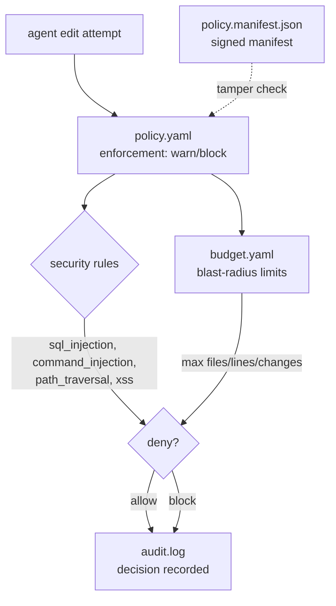

# Code Scalpel configuration

  

> Policy as code for the repo: security rules, change budgets, and signed tamper-evident governance — enforced on every agent edit, audited to a log.

This directory holds the Code Scalpel policy engine configuration: what the agent is allowed to change, how much it may change at once, and a cryptographic trail proving the rules themselves weren't tampered with.



## Quick Start

```bash
code-scalpel policy validate
code-scalpel policy verify
code-scalpel policy test --category architecture
```

## Files

| File | Purpose |
|---|---|
| `policy.yaml` | Main policy configuration — enforcement mode (`warn`/`block`/`disabled`), security rules (SQL injection, command injection, path traversal, XSS), change budgeting, audit trail |
| `budget.yaml` | Change budget limits (blast-radius control) |
| `config.json` | Governance and enforcement settings |
| `dev-governance.yaml` | Development governance rules |
| `project-structure.yaml` | Project layout conventions (consumed by `policies/project/structure.rego`) |
| `ide-extension.json` | IDE extension settings |
| `response_config.json` | Response configuration (+ `response_config.schema.json`) |
| `policy.manifest.json` | Signed manifest for tamper detection (optional — generated by `code-scalpel policy sign`) |
| `audit.log` | Audit trail of policy decisions (auto-generated) |
| `autonomy_audit/` | Autonomy engine audit logs (auto-generated) |
| `policies/` | Rego policy templates by category — see [`policies/README.md`](policies/README.md) |

## Environment variables

Set these in your shell environment (never commit secrets to this directory):

- **`SCALPEL_MANIFEST_SECRET`** — required for cryptographic policy verification (`code-scalpel policy sign` / `verify`)
- **`SCALPEL_TOTP_SECRET`** — optional, for TOTP-based human verification

```bash
export SCALPEL_MANIFEST_SECRET="$(openssl rand -hex 32)"
```

## Configuration

`policy.yaml` (v1.0.0) ships with `enforcement: "warn"`, the four core security rules enabled, budgeting disabled by default (limits staged at 10 files / 500 lines per file / 1000 total changes per session), and the audit trail writing to `.code-scalpel/audit.log`. Flip `enforcement` to `"block"` when you're ready for hard enforcement.

## Cryptographic verification (optional)

Tamper-resistant policies — prove the rules on disk are the rules you signed:

```bash
# Generate signed manifest
code-scalpel policy sign

# Verify integrity
code-scalpel policy verify
```

## Documentation

- [Policy Engine Guide](https://github.com/3D-Tech-Solutions/code-scalpel/blob/main/docs/policy_engine_guide.md)
- [Change Budgeting Guide](https://github.com/3D-Tech-Solutions/code-scalpel/blob/main/docs/guides/change_budgeting.md)
- [Tamper Resistance](https://github.com/3D-Tech-Solutions/code-scalpel/blob/main/docs/security/tamper_resistance.md)

## License and security

The Code Scalpel engine is built by [3D-Tech-Solutions](https://github.com/3D-Tech-Solutions/code-scalpel) — see their repo for engine licensing. The configuration in this directory is yours.

Security notes:

- `SCALPEL_MANIFEST_SECRET` and `SCALPEL_TOTP_SECRET` are the crown jewels: env-only, never in YAML, never committed.
- `audit.log` records policy decisions — it can contain file paths and rule hits; treat it as operational data.
- The signed manifest (`policy.manifest.json`) detects tampering but doesn't prevent it — verification belongs in your CI gate, not just on the box.
