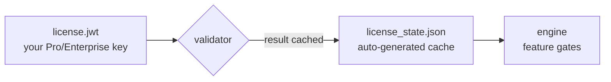

# Code Scalpel license directory

 

> Where Code Scalpel keeps its license key and the cached validation state — two files, one rule: keys never get committed.



## Quick Start

```bash
cp /path/to/your-license.jwt .code-scalpel/license/license.jwt
chmod 600 .code-scalpel/license/license.jwt
code-scalpel license verify
```

## Files

| File | Purpose |
|---|---|
| `license.jwt` | Your Pro/Enterprise license key — drop the issued JWT here |
| `license_state.json` | Automatically generated cache of license validation results (safe to delete; regenerated on next check) |

## License and security

**Do not commit `license.jwt` to version control.** It's a bearer credential for your Pro/Enterprise entitlement: keep it at `0600`, out of git, out of screenshots, out of chat logs. `license_state.json` is a local cache only — deleting it just forces a fresh validation.
