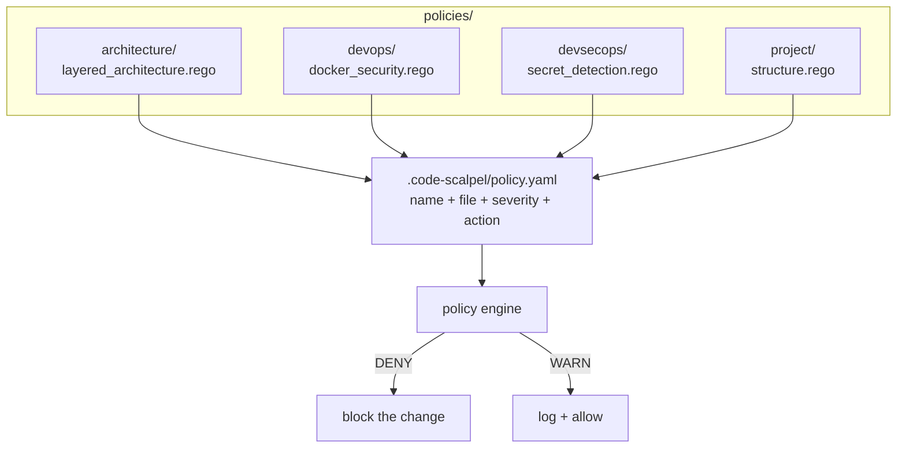

# Policy templates

  

> Production-ready Rego policy templates — architecture, DevOps, DevSecOps, and project structure — wired into `.code-scalpel/policy.yaml` with severity and allow/deny actions.



## Quick Start

```bash
code-scalpel policy validate
code-scalpel policy test --category architecture
code-scalpel policy test --category devsecops
```

## Directory structure

```
policies/
├── architecture/          # architecture management
│   ├── README.md
│   └── layered_architecture.rego
├── devops/                # DevOps best practices
│   ├── README.md
│   └── docker_security.rego
├── devsecops/             # DevSecOps automation
│   ├── README.md
│   └── secret_detection.rego
└── project/               # project structure
    ├── README.md
    └── structure.rego
```

## Enable policies

Edit `.code-scalpel/policy.yaml`:

```yaml
policies:
  architecture:
    - name: layered-architecture
      file: policies/architecture/layered_architecture.rego
      severity: HIGH
      action: DENY

  devops:
    - name: docker-security
      file: policies/devops/docker_security.rego
      severity: HIGH
      action: WARN

  devsecops:
    - name: secret-detection
      file: policies/devsecops/secret_detection.rego
      severity: CRITICAL
      action: DENY

  project:
    - name: structure
      file: policies/project/structure.rego
      severity: HIGH
      action: DENY
```

`severity` drives how loudly a violation is reported (`CRITICAL` > `HIGH` > `MEDIUM` > `LOW`); `action` decides the outcome — `DENY` blocks the change, `WARN` logs it and lets it through.

## Customize

Copy a template `.rego` file, adjust the rules to your project, and point `policy.yaml` at your copy. Keep the originals pristine as reference.

## Categories

| Directory | Enforces |
|---|---|
| [`architecture/`](architecture/README.md) | Layered architecture — presentation → application → domain separation |
| [`devops/`](devops/README.md) | Dockerfile security best practices |
| [`devsecops/`](devsecops/README.md) | Hardcoded secret detection (AWS keys, GitHub tokens, API keys, private keys) |
| [`project/`](project/README.md) | Consistent file placement and project layout conventions |

## License and security

Rego templates are configuration, not code execution — but they *decide* what code gets written, so treat them accordingly: review template changes like code review, and sign the set with `code-scalpel policy sign` (see the [parent README](../README.md)) so tampering is detectable. Part of Code Scalpel v3.1+ Policy Engine.
