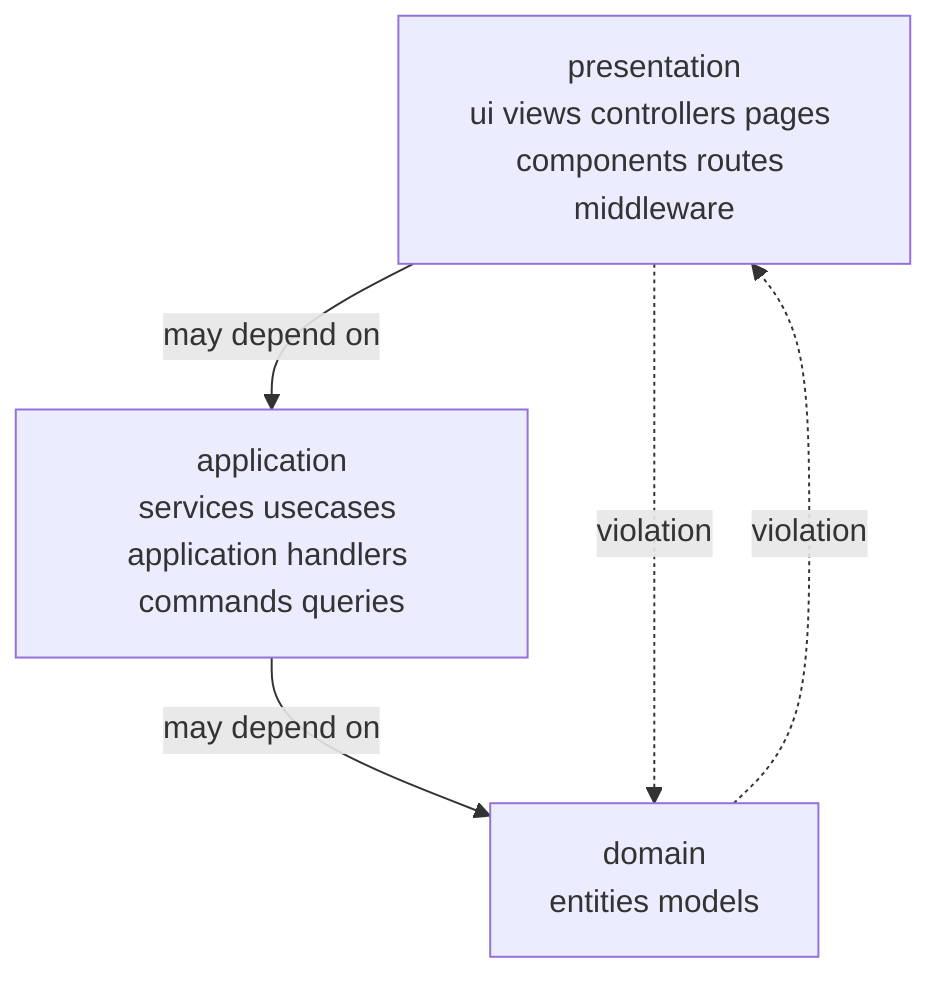

# Architecture policies

  

> Keep the layers honest: presentation talks to application, application talks to domain — never the other way around, never skipping.



## Quick Start

```bash
code-scalpel policy validate
code-scalpel policy test --category architecture
```

## Policies

### `layered_architecture.rego`

Enforces clean separation between presentation, application, and domain layers using path patterns:

- **presentation** — `*/ui/*`, `*/views/*`, `*/controllers/*`, `*/pages/*`, `*/components/*`, `*/routes/*`, `*/middleware/*`
- **application** — `*/services/*`, `*/usecases/*`, `*/application/*`, `*/handlers/*`, `*/commands/*`, `*/queries/*`
- **domain** — the core; nothing above it may reach past its own layer

A dependency that skips a layer (presentation → domain) or flows upward (domain → presentation) is flagged. Rego package: `code_scalpel.architecture`.

## Enable

In `.code-scalpel/policy.yaml`:

```yaml
policies:
  architecture:
    - name: layered-architecture
      file: policies/architecture/layered_architecture.rego
      severity: HIGH
      action: DENY
```

Use `action: WARN` while rolling out to an existing codebase, then tighten to `DENY` once the violations are burned down.

## License and security

Part of Code Scalpel v3.1+ Policy Engine. Layer rules are only as good as your directory naming — if a new top-level area doesn't match the layer patterns, extend the pattern sets in the `.rego` file rather than letting it slip through unclassified.
