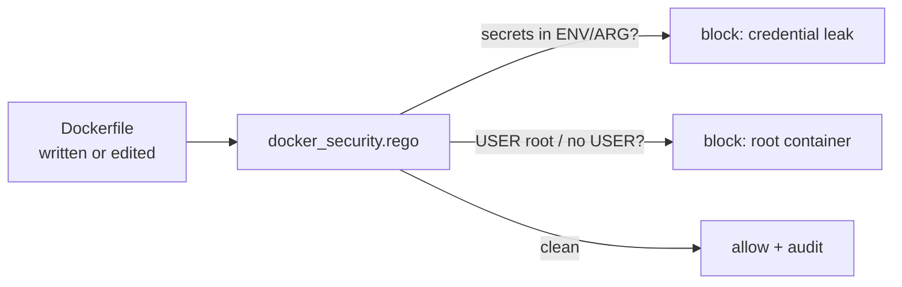

# DevOps policies

  

> Dockerfiles that don't leak secrets and containers that don't run as root — enforced at write time, not discovered in the audit.



## Quick Start

```bash
code-scalpel policy validate
code-scalpel policy test --category devops
```

## Policies

### `docker_security.rego`

Dockerfile security best practices. Flags, among others:

- **secrets baked into the image** — `password` / `api_key` / `secret` / `token` / `credential` assignments in Dockerfile instructions
- **running as root** — missing or root `USER` directives

Rego package: `code_scalpel.devops`.

## Enable

In `.code-scalpel/policy.yaml`:

```yaml
policies:
  devops:
    - name: docker-security
      file: policies/devops/docker_security.rego
      severity: HIGH
      action: WARN
```

Start with `WARN` — Dockerfiles accumulate legacy sins; burn the list down, then flip to `DENY`.

## License and security

Part of Code Scalpel v3.1+ Policy Engine. This policy catches the classic Dockerfile mistakes; it is not a substitute for image scanning (vulnerabilities in base layers) or runtime policy (seccomp, capabilities) — layer your defenses.
