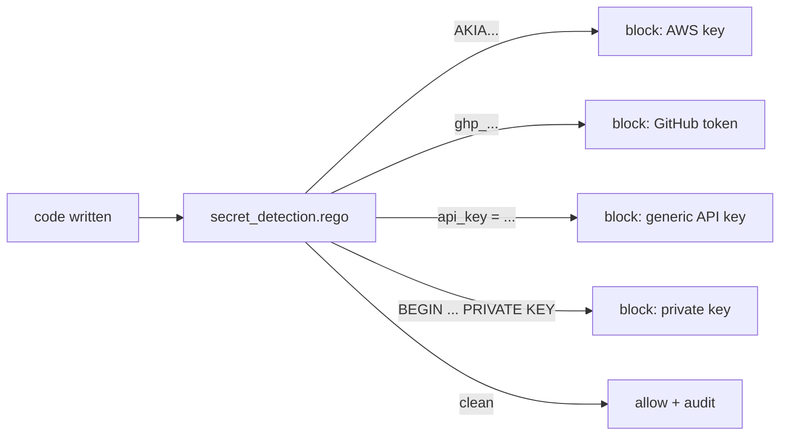

# DevSecOps policies

  

> Secrets don't belong in source, full stop — this policy catches them the moment they're written, before the commit, before the push, before the incident.



## Quick Start

```bash
code-scalpel policy validate
code-scalpel policy test --category devsecops
```

## Policies

### `secret_detection.rego`

Detects hardcoded secrets, API keys, tokens, and credentials in written content:

- **AWS access keys** — `AKIA[0-9A-Z]{16}` pattern
- **GitHub tokens** — `ghp_[A-Za-z0-9]{36}` pattern
- **Generic API keys** — `api_key`/`api-key` assignments with quoted values ≥ 20 chars
- **Private keys** — `BEGIN RSA PRIVATE KEY` / `BEGIN PRIVATE KEY` blocks

Rego package: `code_scalpel.devsecops`.

## Enable

In `.code-scalpel/policy.yaml`:

```yaml
policies:
  devsecops:
    - name: secret-detection
      file: policies/devsecops/secret_detection.rego
      severity: CRITICAL
      action: DENY
```

`CRITICAL` + `DENY` is the recommended starting posture for this one — a committed secret is an incident, and prevention is the only cheap moment.

## License and security

Part of Code Scalpel v3.1+ Policy Engine. Pattern matching is a safety net, not a vault: it catches the common shapes, not every encoding. Pair it with a proper secret manager, pre-commit scanning on the human side, and key rotation runbooks for the day something slips through. If this policy fires on a real secret, rotate the credential — don't just reword the line.
