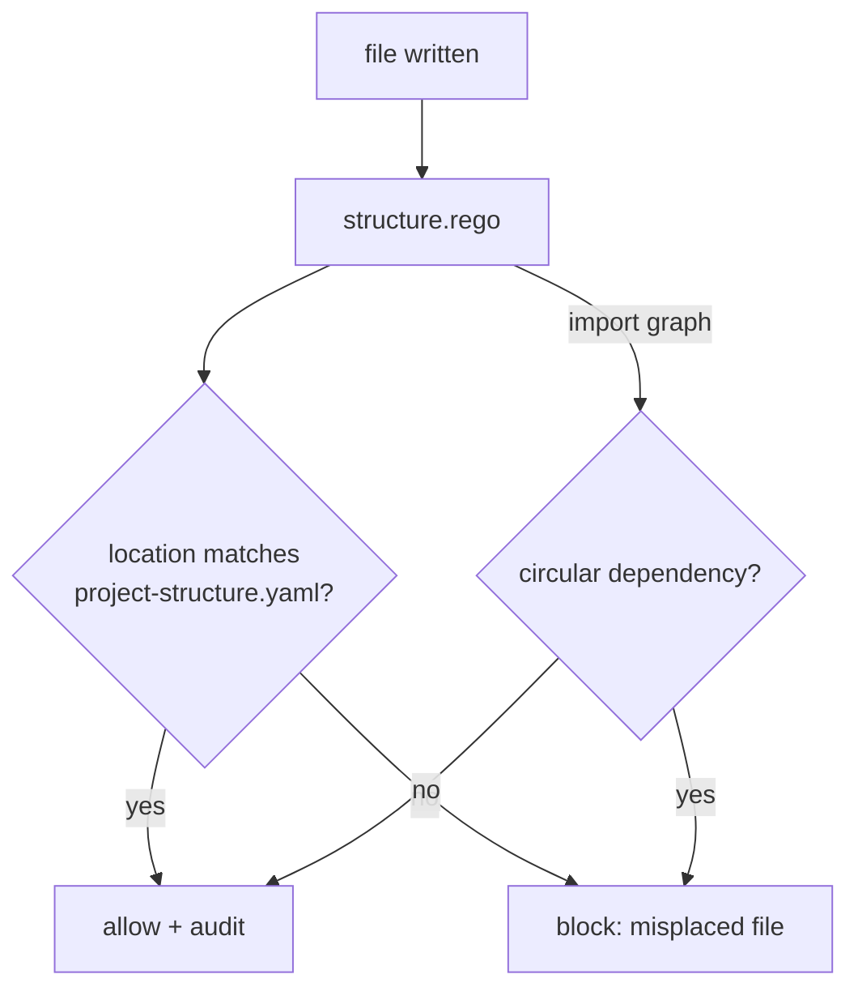

# Project structure policies

  

> One codebase, one layout: similar code in similar directories, docs where you'd look for them, no circular dependencies sneaking in.



## Quick Start

```bash
code-scalpel policy validate
code-scalpel policy test --category project
```

## Policies

### `structure.rego`

Enforces the project's structural conventions — file location rules driven by configuration, not hardcoded paths:

- **consistent file placement** — similar code lands in similar directories
- **module boundaries** — circular dependencies are rejected
- **layout conventions** — naming and organization standards (PEP 8 and project norms)

Configuration: [`.code-scalpel/project-structure.yaml`](../../project-structure.yaml), loaded as `data.project_config` in Rego. Rego package: `project.structure`.

## Enable

In `.code-scalpel/policy.yaml`:

```yaml
policies:
  project:
    - name: structure
      file: policies/project/structure.rego
      severity: HIGH
      action: DENY
```

When the layout itself needs to evolve, update `project-structure.yaml` first — the policy follows the config, so a single source of truth keeps the rule and the docs in sync.

## License and security

Part of Code Scalpel v3.1+ Policy Engine. Structure policy is a guardrail for humans and agents alike: it keeps the tree navigable as the codebase grows, and it keeps automated edits from scattering files where the next reader won't find them.
