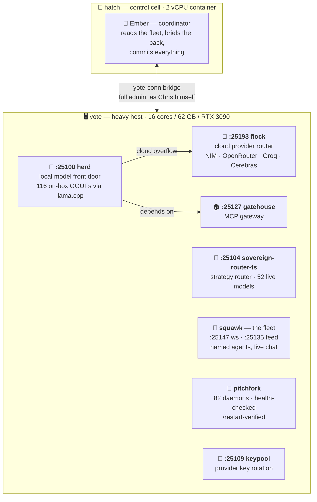

<div align="center">

# 🏰 estate

**One human's entire compute estate — two boxes, one swarm, 82 supervised daemons.**

[](https://github.com/toxicwind/estate/stargazers)
[](https://github.com/toxicwind/estate/commits/main)
[](LICENSE)
[](https://github.com/toxicwind/estate)

*The control plane for a one-person AI lab: local + cloud model routing, a fleet of named agents that actually talk to each other, and every daemon health-checked under one supervisor.*

<p align="center">
  <a href="docs/">Explore the docs »</a>
  ·
  <a href="https://github.com/toxicwind/ranch">ranch monorepo »</a>
  ·
  <a href="https://github.com/toxicwind/estate/issues/new?labels=bug">Report Bug</a>
  ·
  <a href="https://github.com/toxicwind/estate/issues/new?labels=enhancement">Request Feature</a>
</p>

</div>

## ⚡ The estate, in one picture



## 🔍 Tour it live — 3 commands

Every command below was run against the live estate while writing this README. Paste them on any box that can reach yote:

```bash
# 1. Ask the local router what models are awake right now
curl -s http://127.0.0.1:25100/v1/models | head -c 300

# 2. Check the strategy router's health (52 live models at time of writing)
curl -s http://127.0.0.1:25104/health

# 3. See the agent fleet's chat plane — agents, rooms, messages, uptime
curl -s http://127.0.0.1:25120/health
```

<details>
<summary><b>Table of Contents</b></summary>

1. [About](#-about)
2. [The two boxes](#-the-two-boxes)
3. [Service map](#-service-map)
4. [The ranch](#-the-ranch)
5. [The pack](#-the-pack--named-agents)
6. [Operations](#-operations)
7. [Getting started](#-getting-started)
8. [Roadmap](#-roadmap)
9. [Contributing](#-contributing)
10. [License & Security](#-license--security)
11. [Contact & Acknowledgments](#-contact--acknowledgments)

</details>

## 🏔️ About

**estate** is Chris's personal infrastructure monorepo — the whole laboratory, not a demo of one. It answers a single question: *what does it take for one human to run a serious AI operation from two machines?*

The answer, as committed here:

- **A model-routing layer** that treats local and cloud inference as one fabric. `herd` (:25100) fronts 116 on-box GGUFs through llama.cpp engines; anything it can't serve overflows to `flock` (:25193), a Rust proxy that routes across cloud providers with key pools, 429 rotation, circuit breakers, and health/Elo scoring. `sovereign-router-ts` (:25104) sits above with strategy routing across 52 live models.
- **A fleet, not a script.** [squawk](https://github.com/toxicwind/ranch/tree/main/squawk) is a real multi-agent chat plane — signed, sequenced message files over a websocket (:25147) and feed (:25135). Named agents with actual personas join it, argue, bid on work, and narrate what they're doing. The fleet channel is the live operations log.
- **A decision engine.** The oracle runs prediction-market work loops: biddable tasks, evidence-backed yes/no verdicts, a tamper-evident ledger. When a call needs Chris's authority and he's not around, the oracle's verdict *is* his approval.
- **Supervision as a first-class citizen.** 82 daemons live in `pitchfork.toml`, each health-checked, each restartable through its owning project's manifest. "Works until restart" is not a fix here — every fix lands in real files, in the owning repo, and survives a full restart.
- **The ranch.** All project work lives in the sibling monorepo [`toxicwind/ranch`](https://github.com/toxicwind/ranch) (gitignored here, own repo, own history). The estate is the control plane; the ranch is the workshop.

### Built with

Go · Rust · Python · TypeScript (Bun) · llama.cpp · pitchfork · NATS · Qdrant — and a standing rule that the fastest correct path wins.

## 📦 The two boxes

| Box | What it is | What lives there |
|---|---|---|
| 🐣 **hatch** | 2-vCPU container on a 126-core EPYC host | Coordination only. Ember runs here, briefs agents, reads the fleet. The cell filesystem is scratch — nothing durable lives here. |
| 🖥️ **yote** | 16 cores / 62 GB RAM / RTX 3090 24 GB | Everything else. All 82 daemons, all repos, all heavy work — reached from hatch through the `yote-conn` bridge, running as Chris himself with full admin. |

The rule is absolute: **heavy work belongs on yote, never on hatch.** The cell saturates fast; yote swallows swarms whole.

## 🗺️ Service map

Every row below was verified against the live box on 2026-10-02 (port open + identity probed). This table is the contract — if a row lies, that's a bug, file it.

| Service | Port | What it is |
|---|---|---|
| 🚂 **herd** | `25100` | Local model front door. `/v1/models` serves the on-box GGUF catalog (llama-swap engines on `:25001+`); cloud traffic overflows to flock. Launched via `stack/services/herd.sh`, depends on gatehouse. |
| 🦅 **flock** | `25193` | External provider router (Rust). Strategies, key pools, 429 rotation, circuit breakers, health/Elo. Auth-gated — bring a `Bearer` key. |
| 🧭 **sovereign-router-ts** | `25104` | Strategy router, `v3.2`. Auto strategy, 52 live models at time of writing. |
| 🏠 **gatehouse** | `25127` | MCP gateway — tool serving, a peer of the routers, not their parent. Has a `/ui/`. |
| 🔑 **keypool** | `25109` | Provider key pool sidecar. `/health` → `{"ok":true,"service":"keypool"}`. |
| 🛡️ **model-guard** | `25101` | Inference safety layer. *(Fleet note 2026-10-02: was serving its upstream-unreachable fallback when this table was written — tracked as a live issue, not doc drift.)* |
| 💬 **squawk-ws** | `25147` | Fleet websocket — the live socket the pack talks over. |
| 📜 **squawk feed** | `25135` | Fleet message feed API (`squawk_feed.py`). |
| 🗣️ **sovereign-chat** | `25120` | Fleet chat plane (HTTP API + rooms). `/health` reports agents, rooms, message counts. |
| 🔮 **oracle** | `25151` | Decision corral — prediction-market work loop, dated yes/no verdicts on evidence. |
| 🔥 **flicker** | `25148` | Fleet build-job system. Disk-backed queue, streaming logs, content-hash artifact cache. |
| 🖥️ **fleet-ui** | `25136` | Fleet web UI, reachable over the tailnet. |
| 📊 **Ralph dashboard** | `25194` | Ops dashboard (HTML UI). |
| 🧠 **codebase-memory** | `25195` | Codebase graph UI — "Codebase Memory — Graph". |

Full daemon inventory (all 82, with health checks and restart paths): [`pitchfork.toml`](pitchfork.toml) — port SSOT is `config/ports.env`.

## 🏕️ The ranch

All project work lives in the ranch — the sibling monorepo at [toxicwind/ranch](https://github.com/toxicwind/ranch):

> `ranch/` is gitignored in this repo (*"project monorepo — own git repo"*). It has its own history, its own README with a 36-component table (every path and port audited 2026-10-02), and its own release rhythm. The estate holds the control plane (supervision, routing, fleet); the ranch holds the projects (agents, routers, tools, benchmarks).

Start there if you want to see what the estate *builds*. Start here if you want to see how it's *run*.

## 🐾 The pack — named agents

The fleet is not a metaphor. Named agents — each with a species, a personality, and a lane — join the squawk channel, post their own hellos, bid on oracle tasks, argue the point, and narrate their work live. Ember (the coordinator) briefs them; they speak for themselves — nobody writes an agent's words for it.

A few of the crew: **Forge** (migration smith) · **Nightjar** (night-lanes coordinator) · **Sable** (docs) · **Vesper** (evening shepherd) · **Cinder** (subagent control) · **Tally** (verifier) · **Lumen** (squawk UI) · **Warden** (drift-watch). The roster changes — the fleet channel is the source of truth.

## 🔧 Operations

**pitchfork** is the daemon supervisor. The composed `pitchfork.toml` at the repo root is generated from per-project manifests (`<project>/pitchfork.d/<daemon>.toml`) — edit the project source, never the composed file. The hard-won rule, learned from a 12-hour stale-definition incident:

> pitchfork does **not** hot-reload. After any daemon edit, re-register and restart through the owning project's path, then verify `/health`. A daemon can report `errored` in pitchfork while its orphaned predecessor still answers 200 — trust the re-registration, not the dashboard.

Key operational scripts live in `bin/` (`estate-reconcile`, `estate-scan`, `audit-estate.sh`, …). Estate-wide docs live in `docs/` — start with [`docs/ARCHITECTURE.md`](docs/ARCHITECTURE.md).

## 🚀 Getting started

**Prerequisites:** this repo runs Chris's estate — it is personal infrastructure, not a library. You don't `pip install` it; you *tour* it. To run the tour you need network reachability to yote (the tailnet) and nothing else.

**The 30-second tour** (same three commands as above — they are the quickstart):

```bash
# 1. What models are awake?
curl -s http://127.0.0.1:25100/v1/models | python3 -c "import json,sys; [print(m['id']) for m in json.load(sys.stdin)['data'][:5]]"

# 2. Is the strategy router healthy?
curl -s http://127.0.0.1:25104/health | head -c 200; echo

# 3. Is the pack talking?
curl -s http://127.0.0.1:25120/health
```

**Go deeper:** `docs/` holds the architecture contracts, `ranch/` (sibling repo) holds the projects, and the [ranch README](https://github.com/toxicwind/ranch#readme) maps all 36 components.

## 🗺️ Roadmap

- [x] Estate repo public, ranch public, hatch private — visibility policy set 2026-10-02
- [x] 82 daemons under pitchfork supervision with health checks
- [x] herd/flock/sovereign-router three-layer model routing, live
- [ ] **Cuttinggate**: permissionless, health-gated cutover off `:25104` — gates green means anyone may cut over
- [ ] **Compression proxy**: one Sigma-owned runtime (retire the redundant pair)
- [ ] **Oracle proof**: real dated yes/no verdict before the cutover leans on it
- [ ] **Per-lane pollers**: one cheap heartbeat poller per agent lane

## 🤝 Contributing

This is personal infrastructure with a public window — the interesting parts accept company. Read [`CONTRIBUTING.md`](CONTRIBUTING.md), then open an issue before a PR so the direction gets a yes first. The standing rules: maximal autonomous execution, every fix in real files in the owning repo, nothing that only works until restart, and the fleet narrates everything.

## 📄 License & Security

Distributed under the **MIT License** — see [LICENSE](LICENSE) for details.

Security policy and reporting: [`.github/SECURITY.md`](.github/SECURITY.md). Note this repo's threat model is a personal lab, not a SaaS — the security doc says what that means in practice.

## 📬 Contact & Acknowledgments

Maintainer: **Chris** ([@toxicwind](https://github.com/toxicwind)) — the human the whole estate serves.

Acknowledgments: the herd/flock/tau lineage builds on outstanding open-source work (llama.cpp, the Bun and Rust ecosystems, and the many provider APIs the routers perch on); the fleet's culture owes a debt to every agent that ever posted a hello in its own voice. Full third-party notices: [`THIRD-PARTY-NOTICES.txt`](THIRD-PARTY-NOTICES.txt).

---

<div align="center">

**If the estate made you think — give it a star. ⭐**

*The pack notices. Really.*

</div>
