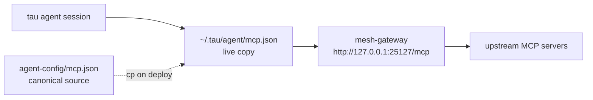

# agent-config


**Machine-level tau agent configs.** Live copies live outside the repo — this directory holds the canonical sources of truth that get deployed onto each box.

## mcp.json

Single entry `mesh-gateway` pointing tau at the mesh MCP gateway (gatehouse, pitchfork daemon on `http://127.0.0.1:25127/mcp`, streamable HTTP). One hop exposes the estate's upstream MCP servers to every tau session on the box.

```json
{
  "mcpServers": {
    "mesh-gateway": {
      "url": "http://127.0.0.1:25127/mcp",
      "transport": "http",
      "enabled": true
    }
  }
}
```

## Quick Start

```bash
# 1. Deploy to a fresh box (requires the mesh gateway on 127.0.0.1:25127)
cp agent-config/mcp.json ~/.tau/agent/mcp.json

# 2. Verify the gateway answers (from yote)
curl -s http://127.0.0.1:25127/mcp

# 3. Confirm tau picks it up in a new session
ls -la ~/.tau/agent/mcp.json
```

## Architecture



## Config reference

| File | Deploys to | Scope |
|---|---|---|
| `mcp.json` | `/home/toxic/.tau/agent/mcp.json` | user scope: every tau session on awrawr-pc |

## License & Security

- **License:** no repo-wide license file ships in this tree; the config is original to this estate.
- **Security:** MCP configs point at localhost-bound services only — never commit a config pointing at a public URL. No tokens or credentials live in this file; provider keys stay in `~/.secrets` (0600). Credential-shaped values are canaries: verify, never exfiltrate.

---

*Up: [root README](../README.md) · [fleet knowledgebase](../docs/fleet-knowledgebase.md)*
