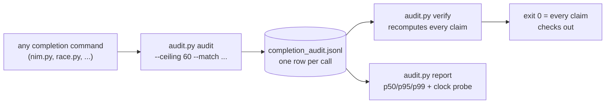

# completion-audit

<div align="right">
  
</div>

*A **checkable** completions auditor. Wrap any completion call — model inference CLI, code-race run, transport attempt — and get one JSONL row per call with **nanosecond-captured** timestamps, content hashes, ceiling enforcement, and winner/loser attribution. Then `verify` replays the ledger and **recomputes every claim**. Artifacts, not vibes.*

Built for the HFT-latency program (Chris's doctrine: latency is a correctness criterion; race redundant approaches; measure everything; keep the fast path hot). It is the missing piece under the `hft-latency` skill: that skill owns `bin/race.py` (the racer) and `bin/measure.py` (the microsecond timing helper) — this harness is what makes a *completion* auditable and its numbers checkable.

## Features

- **Nanosecond timestamps** — `time.perf_counter_ns()` (monotonic) captures start, first-byte, and end; reported at microsecond resolution
- **Ceiling enforcement** — attempts exceeding `--ceiling` seconds are killed and flagged `ceiling_breached`
- **Content hashes** — `sha256` of stdout, stderr, prompt, and the command itself; tampering is detectable
- **Winner attribution as a claim** — `winner` is null at write time; `report`/`verify` recompute the winner per `--race-id` (min `elapsed_us` among valid) and `verify` **fails** if a stored winner flag disagrees
- **Clock-resolution proof** — every `report` includes a `clock_probe`: `min_nonzero_delta_ns` of `perf_counter_ns` over 200k samples (151ns measured 2026-09-14), so microsecond claims rest on a measured nanosecond source
- **Percentiles, never bare averages** — `report` prints p50/p95/p99 per tag
- **Schema mirrors the live HFT ledger** — rows align with `~/.cache/shingle/latency_race_winners.jsonl`, adding the checkable fields (ns timestamps, hashes, ceilings)

## Architecture



## Quick Start

```bash
audit.py audit --tag smoke --ceiling 60 --prompt prompt.txt -- ./my-model-cli "2+2=?"
audit.py verify ~/.cache/shingle/completion_audit.jsonl
audit.py report ~/.cache/shingle/completion_audit.jsonl --out rep.json
```

## What it measures

Per call:

- `t_ns.start` — just before spawn
- `t_ns.first_byte` — first non-empty stdout chunk (TTFB; null if no output)
- `t_ns.end` — after process reaped (or after kill on ceiling breach)
- `elapsed_us`, `ttfb_us` — derived, recomputed by verify
- `sha256(stdout)`, `sha256(stderr)`, `sha256(prompt)` — content hashes
- `exit_code`, `valid` (exit 0 AND optional `--match` regex on stdout)
- `ceiling_breached` — the attempt exceeded `--ceiling` seconds and was killed
- `winner` — null at write; attribution is recomputed, never trusted

Exit code of `audit`: 0 iff valid and not ceiling-breached. A one-line `audited` NDJSON event goes to stderr (borrowed from `hft-latency` `measure.py`); the wrapped command's stdout is captured into the row, not passed through.

## Ledger format

JSONL, one row per call. Default ledger `~/.cache/shingle/completion_audit.jsonl` (cell and awrawr-pc both). Schema `v:1`:

```json
{"v":1,"ts":"2026-09-14T18:20:00Z","tag":"nim-gpt-oss-20b","race_id":"r1",
 "strategy":"nim.py chat","cmd":[...],"cmd_sha256":"...","prompt_len":42,
 "prompt_sha256":"...","match":null,"ceiling_s":60.0,
 "t_ns":{"start":123456789,"first_byte":123458000,"end":125000000},
 "elapsed_us":1543211,"ttfb_us":700123,
 "exit_code":0,"valid":true,"ceiling_breached":false,
 "stdout":{"full":true,"len":312,"sha256":"..."},
 "stderr":{"full":true,"len":0,"sha256":"..."},
 "winner":null}
```

Outputs over 1 MiB store head/tail (8 KiB each) + hashes instead of full bytes; `verify` checks the stored parts and flags anything it cannot recompute. stderr truncates at 64 KiB.

## How to audit a completion

```bash
# one NIM completion, 60s ceiling, must contain "answer" in stdout
audit.py audit --tag nim-gpt-oss-20b --ceiling 60 --match answer \
    --prompt prompt.txt --ledger ~/.cache/shingle/completion_audit.jsonl \
    -- nim.py chat --model openai/gpt-oss-20b "$(cat prompt.txt)"

# a two-strategy race: same tag + race_id, winner recomputed at report time
audit.py audit --tag model-race --race-id r1 --strategy gpt-oss-20b --ceiling 60 -- \
    nim.py chat --model openai/gpt-oss-20b "2+2=?"
audit.py audit --tag model-race --race-id r1 --strategy kimi-k3 --ceiling 60 -- \
    nim.py chat --model kimi-k3 "2+2=?"

# a code-race run (audits the whole race as one completion)
audit.py audit --tag code-race --ceiling 120 -- \
    race.py --ident RelayManager --lang python
```

## How to verify

```bash
audit.py verify ~/.cache/shingle/completion_audit.jsonl            # all rows
audit.py report ~/.cache/shingle/completion_audit.jsonl --out rep.json
audit.py verify ~/.cache/shingle/completion_audit.jsonl --report rep.json
```

`verify` recomputes: timestamp ordering, `elapsed_us`, `ttfb_us`, `cmd_sha256`, stdout/stderr hashes (full) or head/tail hashes (truncated), `valid`, `ceiling_breached`, winner attribution per race_id — and with `--report`, every percentile the report wrote. Exit 0 = every claim checks out; any tampering (e.g. edited `elapsed_us`, swapped hash) fails with the row named.

## Borrowed, not invented

- ns timing + NDJSON-on-stderr + per-attempt ceilings: `hft-latency/bin/measure.py`
- race-first-wins + winners-log shape: `hft-latency/bin/race.py` (itself borrowed from `code-race/bin/race.py`)
- row schema fields: live `~/.cache/shingle/latency_race_winners.jsonl` (HFT workstream races: `race_a_bridge_transport`, `race_b_herd_free_routes`)
- per-run JSONL ledger + aggregate audit command: `emergent-enrich/papers.py --audit`
- content-hash dedup for attribution: squawk-feed transport `race-borrow`
- bench-pattern context: `hft-latency/patterns/bench-borrowing.md`

## Configuration

| flag | scope | purpose |
|---|---|---|
| `--tag` | audit | groups rows for percentile reports |
| `--race-id` | audit | links rows into one race; winner recomputed per id |
| `--strategy` | audit | labels the contender within a race |
| `--ceiling` | audit | seconds before the attempt is killed |
| `--match` | audit | regex stdout must satisfy for `valid` |
| `--prompt` | audit | prompt file (hashed into the row) |
| `--ledger` | audit | JSONL ledger path (default `~/.cache/shingle/completion_audit.jsonl`) |
| `--report` | verify | cross-checks a report file's percentiles against the ledger |
| `--out` | report | writes the percentile report JSON |

## Dev & contributing

Single-file Python (`completion-audit/audit.py`, plus `proof/` with worked examples). The design contract: **nothing is trusted, everything is recomputed** — any new field added to a row must also be recomputed by `verify`, or it doesn't ship.

## License & Security

Internal estate measurement tooling — part of the sovereign projects, not published for external use. Ledger rows contain prompt text (or its hash) and stdout bytes: treat the ledger as sensitive, keep it on local disk (`~/.cache/shingle/`), and don't paste raw rows into shared channels.
