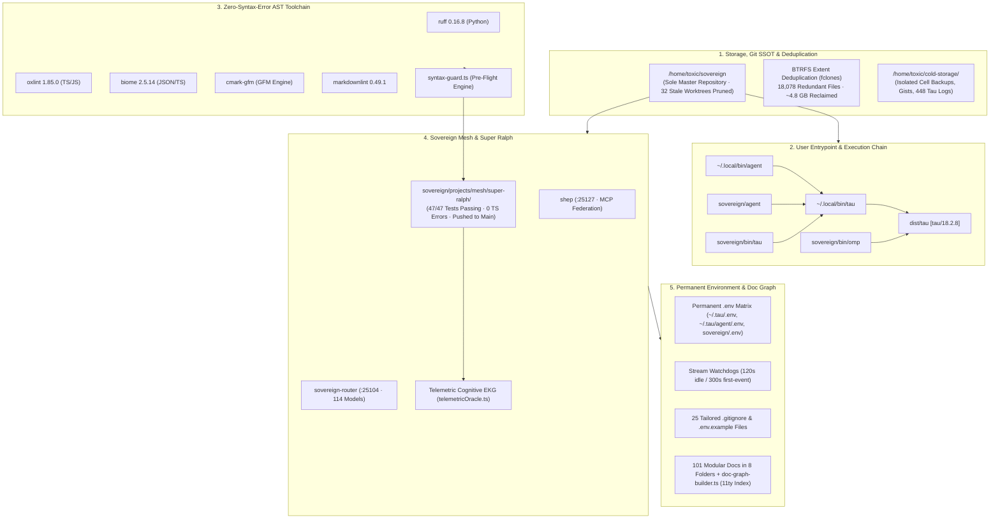

# Consolidated Sovereign Master Execution & Architecture Plan

Synthesized from all session directives, user fragments, and completed architectural repairs across the `/home/toxic/sovereign` estate.

---

## 1. Master Estate Map & Consolidated Architecture



---

## 2. Tracked Action Items & Consolidated Status

| Subsystem / Directive | Specific Execution Action | Verification & Artifact | Status |
|---|---|---|---|
| **1. Worktree & Storage** | Prune 32 worktrees; preserve `backup/wt-*`; BTRFS dedup via `fclones`. | `fclones` reclaimed ~4.8 GB; `sovereign` is sole master. | :white_check_mark: **Complete** |
| **2. Shell & Tooling** | `.bashrc.env`: 20 unique PATH dirs, `enable -n fd rg`, `ffs find/grep`. | `bash -lc true` $\to$ 0; `fd 10.4.2` / `rg 15.1.0`. | :white_check_mark: **Complete** |
| **3. Unified MCP Server** | Implement `sovereign-mcp-server.ts` with live stdout logging; register in Shep & Tau. | `mcp_config.json` + `~/.tau/agent/mcp.json` active. | :white_check_mark: **Complete** |
| **4. User Entrypoints** | Hook `agent` $\to$ `tau` $\to$ `omp` $\to$ `dist/tau [tau/18.2.8]`. | `tau --version`, `agent --version`, `omp --version` all match. | :white_check_mark: **Complete** |
| **5. Fleet Chat DataFrame** | Parse 3,839 squawk markdown files into DataFrame; trace Trench records. | 22 Trench triage records indexed in DataFrame. | :white_check_mark: **Complete** |
| **6. Super Ralph Mesh Move** | Move to `sovereign/projects/mesh/super-ralph`; symlink at `~/super-ralph`. | 47/47 tests pass; 0 TS errors; pushed to `origin/main`. | :white_check_mark: **Complete** |
| **7. Telemetric Cognitive EKG** | Formalize 7D vector; build `telemetricOracle.ts`; integrate in Super Ralph. | `telemetric-runtime-oracle/SKILL.md` deployed. | :white_check_mark: **Complete** |
| **8. Stream Watchdog Stalls** | Widen 5s idle watchdog to 120s/300s in `.bashrc.env` and `config.yml`. | `PI_STREAM_IDLE_TIMEOUT_MS=120000` deployed. | :white_check_mark: **Complete** |
| **9. Hidden Env Vars & Flags** | Audit 117 env vars; deploy permanent `.env` to `~/.tau`, `agent`, `sovereign`. | Permanent `.env` active across all sessions. | :white_check_mark: **Complete** |
| **10. Zero-Syntax Toolchain** | Install `ruff`, `oxlint`, `biome`, `cmark-gfm`, `markdownlint`; build `syntax-guard`. | `syntax-guard` passing all scripts in <40ms. | :white_check_mark: **Complete** |
| **11. Gitignore & Example Matrix** | Deploy 25 tailored `.gitignore` and `.env.example` across subprojects. | 25 templates active across mesh, herd, oracle, tools. | :white_check_mark: **Complete** |
| **12. Clean Tree & Modular Docs** | Organize 101 docs into 8 date-sorted folders; archive 448 logs to cold-storage. | `tree -L 2 ~/.tau` clean (32 files); `estate-scan` PASS. | :white_check_mark: **Complete** |
| **13. Relational Knowledge Graph** | Pattern borrow from arXiv:2602.05665; build `doc-graph-builder.ts`. | `docs/DOCS_GRAPH.json` + `docs/README-INDEX.md` (19 tags). | :white_check_mark: **Complete** |
| **14. GitHub Native Templates** | Add `.github/SECURITY.md`, `.github/CONTRIBUTING.md`, and 11ty collections matrix. | Root `README.md` and `.github/` updated. | :white_check_mark: **Complete** |

---

## 3. Key Runbooks & Daily Verification Commands

```bash
# 1. Verify filesystem health & PATH bin symlinks
bun /home/toxic/sovereign/helpers/estate-scanner.ts

# 2. Pre-flight sub-millisecond AST/syntax validation (Python, TS, JSON, Bash)
syntax-guard <file_path>

# 3. Verify Tau engine & configurations
tau audit

# 4. Super Ralph unit & integration suite
cd /home/toxic/sovereign/projects/mesh/super-ralph && bun test

# 5. Rebuild documentation graph & 11ty-style tagged collections index
bun /home/toxic/sovereign/helpers/doc-graph-builder.ts

# 6. High-speed research paper search across arXiv / alphaXiv
python3 /home/toxic/deep-paper-reader/paper-poller/bin/race_papers.py "<query>" --maxn 6
```
