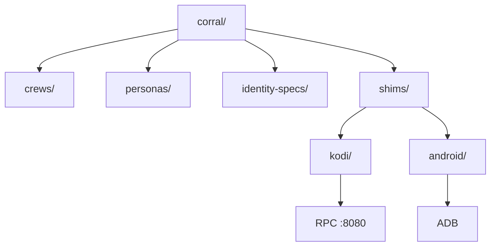

<div align="center">

# 🤖 Fleet

**Sovereign agent + device fleet management — crews, personas, shims, and dispatch.**

[](https://github.com/toxicwind/estate)
[](https://github.com/toxicwind/estate#license)

</div>

<p align="center">
  <a href="#about">About</a> ·
  <a href="#structure">Structure</a> ·
  <a href="#shims">Shims</a> ·
  <a href="#crews">Crews</a>
</p>



## About

The fleet folder is the home of everything "fleet" in the estate — both the **agent fleet**
(crews of AI agents with personas and identities) and the **device fleet**
(Kodi media boxes and Android devices managed via platform shims).

Two kinds of fleet, one folder. Agents talk to devices through shims;
shims abstract the platform so agents don't care if it's CoreELEC or Android TV.

## Structure

```
corral/
├── README.md              # this file
├── crews/                 # agent crew definitions + status
├── personas/              # agent persona specs (species, voice, role)
├── identity-specs/        # identity anchoring specs
├── shims/                 # device platform shims + tools
│   ├── README.md
│   ├── kodi/              # Kodi fleet (RPC shim, :8080 JSON-RPC)
│   │   ├── bin/           # kodi-audit, kodi-handoff, kodi-resume
│   │   ├── docs/          # box inventory, latency notes
│   │   └── addons/        # lasso, manifold-upstream
│   └── android/           # Android fleet (ADB shim)
│       ├── bin/           # pixel-adb-keepalive.sh
│       ├── docs/          # device inventory
│       └── phone-backup/
├── wedge.py               # fleet wedge utility
└── dispatch_fallback.py   # dispatch fallback handler
```

## Shims

Platform shims live in [`shims/`](shims/). Each platform folder is self-contained:
shim + tools + docs together, no cross-folder imports.

| Platform | Shim type | Access | Devices |
|----------|-----------|--------|---------|
| Kodi (CoreELEC) | JSON-RPC `:8080` | HTTP, no auth | 10.0.0.246 (living room) |
| Kodi (Android TV) | JSON-RPC `:8080` | HTTP, no auth | 10.0.0.225 (bedroom, APK) |
| Android | ADB | Wireless debugging | Pixel, etc. |

See [`shims/README.md`](shims/README.md) for the full shim documentation.

## Crews

Agent crews are defined in [`crews/`](crews/) with personas in [`personas/`](personas/).
Each crew has a status file tracking whether it's active, stalled, or done.

## License

Part of the estate. See the estate repo for license info.
