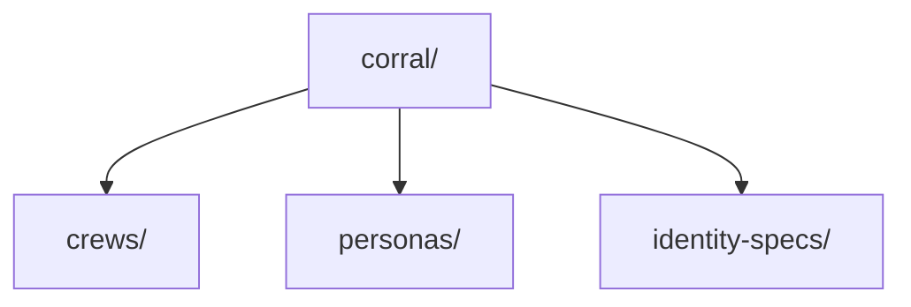

<div align="center">

# 🤖 Corral

**Sovereign agent fleet management — crews, personas, and dispatch.**

[](https://github.com/toxicwind/estate)
[](https://github.com/toxicwind/estate#license)

</div>

<p align="center">
  <a href="#about">About</a> ·
  <a href="#structure">Structure</a> ·
  <a href="#crews">Crews</a>
</p>



## About

The corral is the home of the **agent fleet** — crews of AI agents with
personas and identities, plus the dispatch machinery that runs them.

Device management (Kodi boxes, Android devices) lives in its own project:
[`../devices/`](../devices/) — platform shims, one per device type.

## Structure

```
corral/
├── README.md              # this file
├── crews/                 # agent crew definitions + status
├── personas/              # agent persona specs (species, voice, role)
├── identity-specs/        # identity anchoring specs
├── wedge.py               # fleet wedge utility
└── dispatch_fallback.py   # dispatch fallback handler
```

## Devices

Device fleet tooling moved to [`../devices/`](../devices/) — see its README
for the platform shims (Kodi JSON-RPC `:8080`, Android ADB) and box inventory.

## Crews

Agent crews are defined in [`crews/`](crews/) with personas in [`personas/`](personas/).
Each crew has a status file tracking whether it's active, stalled, or done.

## License

Part of the estate. See the estate repo for license info.
