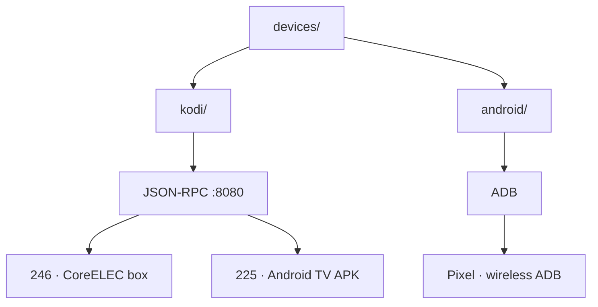

<div align="center">

# 📱 Devices

**Device fleet management — Kodi boxes and Android devices, one shim per platform.**

[](https://github.com/toxicwind/estate)
[](https://github.com/toxicwind/estate#license)

</div>

<p align="center">
  <a href="#about">About</a> ·
  <a href="#structure">Structure</a> ·
  <a href="#platforms">Platforms</a>
</p>



## About

Every physical device Chris owns that isn't yote or hatch lives here.
Two platforms, two shims, zero shared code: each platform folder is
self-contained — shim + tools + docs together. If you need something from
another platform folder, the abstraction is leaking.

- **Kodi** — media boxes, driven over HTTP JSON-RPC on `:8080`. No SSH needed.
  Covers the CoreELEC living-room box *and* the Kodi APK on the bedroom Android TV.
- **Android** — phones and tablets, driven over ADB (wireless debugging).
  APK installs, shell, file pull/push all go through the ADB shim.

## Structure

```
devices/
├── README.md          # this file
├── kodi/              # Kodi fleet: RPC-based tooling for both boxes
│   ├── README.md      # box inventory (246=CoreELEC, 225=APK on Android TV)
│   ├── bin/           # kodi-audit, kodi-handoff, kodi-resume
│   ├── docs/          # box-inventory, menu-latency
│   ├── addons/        # lasso, manifold-upstream
│   ├── forensics/
│   └── tests/
└── android/           # Android fleet: ADB-based tooling
    ├── bin/           # pixel-adb-keepalive.sh
    ├── docs/          # devices.md
    └── phone-backup/  # backup tooling (SKILL.md, ts-src, bin)
```

## Platforms

| Platform | Shim type | Access | Devices |
|----------|-----------|--------|---------|
| Kodi (CoreELEC) | JSON-RPC `:8080` | HTTP, no auth | `10.0.0.246` — living room box |
| Kodi (Android TV) | JSON-RPC `:8080` | HTTP, no auth | `10.0.0.225` — bedroom, Kodi APK (not a physical box) |
| Android | ADB | Wireless debugging | Pixel (`10.0.0.77`), etc. |

Notes:
- CoreELEC boxes *also* expose SSH (`root:coreelec`), but the shell is not bash —
  shims must use POSIX sh or another available shell.
- Box 225 is **not a physical box** — it's the Kodi APK running on Android TV.

## Usage

```bash
# Audit a Kodi box
devices/kodi/bin/kodi-audit 10.0.0.246

# Hand off playback 246 -> 225
devices/kodi/bin/kodi-handoff 10.0.0.246 10.0.0.225 --play

# Keep the Pixel's ADB session alive
devices/android/bin/pixel-adb-keepalive.sh
```

See `kodi/README.md` for the full Kodi box inventory and `android/docs/devices.md`
for the Android device inventory.

## License

Part of the estate. See the estate repo for license info.
