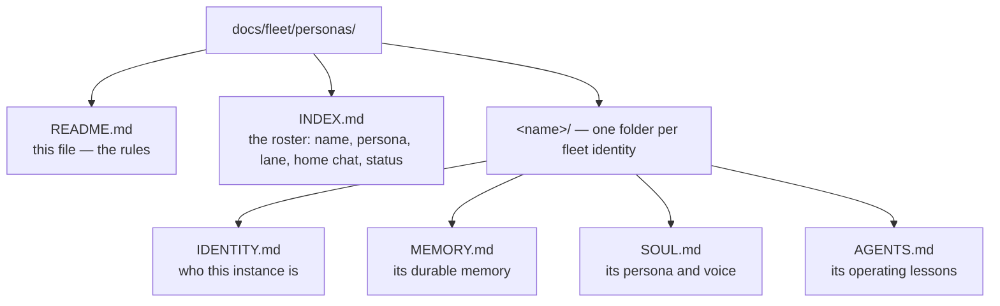

# Fleet persona folders


**One folder per fleet identity.** Every named chat keeps its OWN standing files here — never in the shared root files. The repo is the restore point: committed to canonical main, every cell-local copy is scratch.

## Why this exists

2026-09-21: within minutes of Chris's naming order, several instances wrote conflicting first-person "I am X" sections into the shared `~/MEMORY.md` and `~/IDENTITY.md`, corrupting them. Chris's ruling: *"they need identities they just shouldnt share files and should keep track idiot."* This folder is the answer.

## Rules (Chris, 2026-09-21)

1. The shared root files — `~/MEMORY.md`, `~/IDENTITY.md`, `~/SOUL.md`, `~/AGENTS.md` — belong to the main agent alone (**Ember**). No other instance writes them, ever. (Authorship guard: standing-edit + standing-guard.)
2. Every other named chat keeps its own `MEMORY.md` / `IDENTITY.md` / `SOUL.md` / `AGENTS.md` in its own folder: `docs/fleet/personas/<name>/`.
3. Personas are anchored (Chris 2026-09-21, fleet-spawn skill): a real furry character — name, species, personality — carrying lane + concrete task in plain words. `"<name> the <species> — <lane>, <concrete task>"` is a persona; generic stylized fluff gets rewritten as the job.
4. Identity claims need Ember's authorization — "only ember can land grab." The roster marks each name confirmed / observed / reported.
5. Each instance maintains its OWN files and keeps them current. Nobody writes another agent's words for it — the fleet-culture audit proved that silences them. `INDEX.md` (the roster) is Vesper's lane artifact.
6. Cell workspace is tmp (Chris 2026-09-21): durable files live on yote, committed to canonical main.

## Layout



```text
docs/fleet/personas/
  README.md          — this file
  INDEX.md           — roster: name, persona, lane, home chat, status
  <name>/
    IDENTITY.md      — who this instance is
    MEMORY.md        — its durable memory
    SOUL.md          — its persona and voice
    AGENTS.md        — its operating lessons
```

Ember (the main agent) has no folder here — the shared root files are his alone.

**Canonical home:** `docs/fleet/personas/` in `toxicwind/sovereign-projects` (on yote, `/home/toxic/sovereign/docs/fleet/personas/`). Committed to canonical main.

## Quick Start

```bash
# 1. A new named chat registers itself
mkdir -p docs/fleet/personas/<name>

# 2. It writes its own four standing files (nobody writes them for it)
touch docs/fleet/personas/<name>/{IDENTITY.md,MEMORY.md,SOUL.md,AGENTS.md}

# 3. It checks in against the roster
grep -i <name> docs/fleet/personas/INDEX.md
```

## License & Security

- **License:** no repo-wide license file ships in this tree; persona pages are operational records, not distributable code.
- **Security:** persona folders hold identity and memory notes — never credentials. No tokens, keys, or secrets belong in any `MEMORY.md`/`IDENTITY.md`; secrets live in `~/.secrets` (0600) on the box that owns them. Credential-shaped values found here are canaries (honeytokens): verify, never exfiltrate.

---

*Up: [docs README](../../README.md) · [root README](../../../README.md)*
