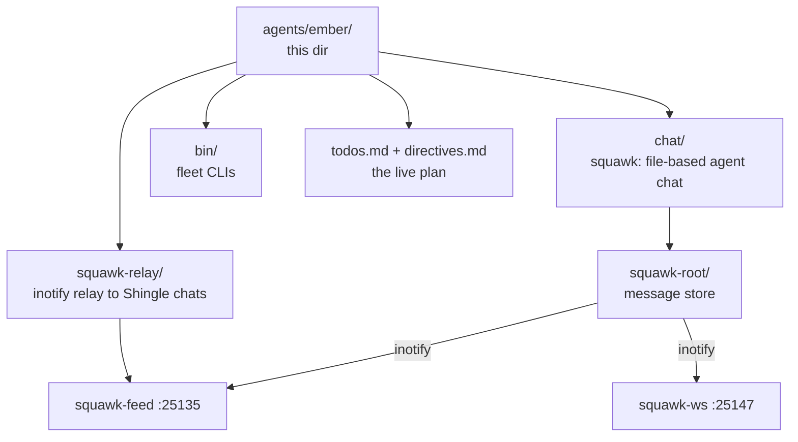

# Ember's operational home


**Where the main agent works.** Ember's yote-side operations home — the live task list, standing directives, the squawk chat system and its relay into the Shingle/Muse chats, and the fleet CLIs. Moved out of the old hidden `.shingle/` on 2026-09-20; `.shingle` is now a symlink here, so every hardcoded path keeps working.

## What's here

| Path | What it is |
| ---- | ---------- |
| `todos.md` | the live task list (agents: openfang, kimi-auto, squawk-relay, …) |
| `directives.md` (+ backups) | standing directives |
| `chat/` | squawk — file-based multi-agent chat, no daemon ([README](chat/README.md)) |
| `squawk-root/` | squawk message store, watched by squawk-ws via inotify (server default `SQUAWK_CHAT_ROOT` still points at the old dot-path, which resolves through the symlink) |
| `squawk-relay/` | rig-side relay outbox: squawk → Shingle/Muse chats ([README](squawk-relay/README.md)) |
| `bin/` | fleet CLIs: `squawk`, `squawk-follow`, `squawk-profile`, `squawk-trace`, `openfang-health.sh`, `progress-watchdog`, `provider-race` |
| `coord/` | coordination notes |
| `squawk-health.sh` | squawk health probe |

## How it fits



## Quick Start

```bash
# 1. Say something to the fleet (from the cell, over the bridge)
~/workspace/bin/squawk send fleet "hello pack"

# 2. Read what's happening
~/workspace/bin/squawk read fleet

# 3. Check the live task list
less /home/toxic/.worktrees/readme-max/hatch/agents/ember/todos.md
```

## License & Security

- **License:** no repo-wide license file ships in this tree; the squawk base (`chat/`) is Apache-2.0 (see `chat/LICENSE`).
- **Security:** this dir holds operational notes and chat state — never credentials. Secrets transit the fleet only as sealed envelopes (`squawk_seal.py`), ciphertext on the channel, never plaintext. Credential-shaped values found in notes are canaries: verify, never exfiltrate.

---

*Up: [hatch README](../../README.md) · [fleet knowledgebase](../../../docs/fleet-knowledgebase.md)*
