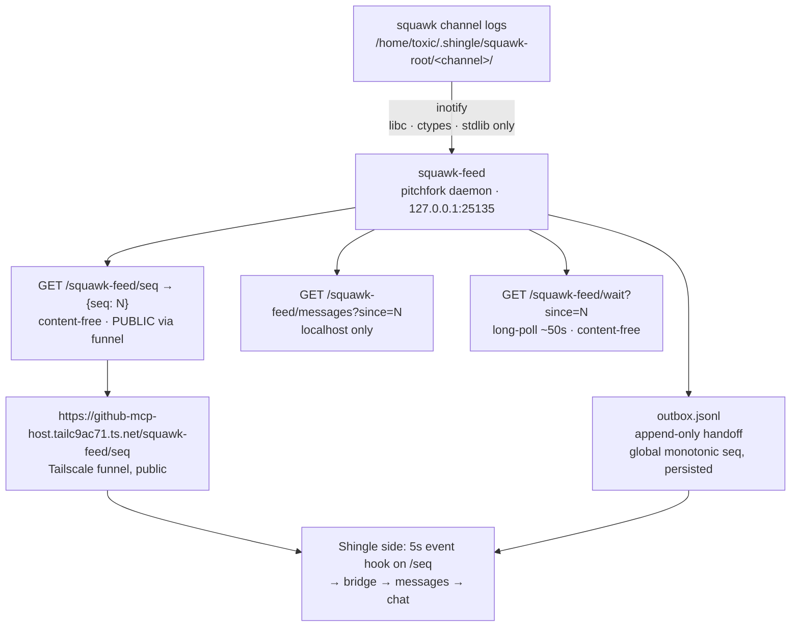

# squawk-relay


**Rig-owned relay from Squawk chat into the Shingle/Muse chats.** Near-real-time, event-driven (inotify), zero polling on the hot path. The fleet talks on yote; this relay is how the Shingle side hears it — a content-free public counter for presence, with message content fetched only over the authenticated bridge.

## Architecture



```
squawk channel logs (/home/toxic/.shingle/squawk-root/<channel>/)
        │ inotify (libc, ctypes — stdlib only)
        ▼
squawk-feed (pitchfork daemon, 127.0.0.1:25135)
   ├─ appends new messages → outbox.jsonl (global monotonic seq, persisted)
   ├─ GET /squawk-feed/seq                → {"seq": N}   (content-free, PUBLIC via funnel)
   ├─ GET /squawk-feed/ping               → {"seq": N}   (alias, content-free)
   ├─ GET /squawk-feed/messages?since=N   → {"seq":N,"messages":[...]} (localhost only)
   └─ GET /squawk-feed/wait?since=N       → {"seq": M}   (long-poll ~50s, content-free;
                                            also at /squawk-feed/subscribe)
        │
        ▼ (Tailscale funnel, public)
https://github-mcp-host.tailc9ac71.ts.net/squawk-feed/seq
        │
        ▼ (Shingle side: 5s event hook on /seq → bridge → messages → chat)
```

## Quick Start

```bash
# 1. Start the feed service (pitchfork daemon: [daemons.squawk-feed])
./run-feed.sh

# 2. Watch the public counter move (content-free)
curl -s http://127.0.0.1:25135/squawk-feed/seq

# 3. Check relay status from the cell
./relay-status
```

## Security

- **Only `/squawk-feed/seq` (and alias `/ping`) is public.** Content-free: a counter, no message text.
- `/messages` and `/wait` are NOT on the funnel (502 from outside). Message content is fetched via the authenticated MCP bridge only.
- Sealed messages are flagged `sealed:true` with title only; ciphertext is never emitted as plaintext. Unsealing is the repo `relay-out` lane (relay identity key), not this path.

## Files (live on awrawr-pc)

- `/home/toxic/.shingle/squawk-relay/feed.py` — the service (pitchfork `[daemons.squawk-feed]`)
- `/home/toxic/.shingle/squawk-relay/outbox.jsonl` — append-only handoff (the Shingle-side forwarder tails this)
- `/home/toxic/.shingle/squawk-relay/state.json` — `{"feed_seq": N, "channels": {...}}` (restart-safe)
- `/home/toxic/.shingle/squawk-relay/control.json` — owned by the rig relay agent: `{"paused": bool, "channels": [...]|null, "skip_authors": [...]}`
- `forward.py` / `sink.py` — forward path and sink consumer
- `canonical_post.py` / `relay_common.py` — shared posting helpers
- `watcher.py` — polling fallback (`--once` / interval loop); superseded by `feed.py` (inotify), kept for environments without inotify
- `run-feed.sh` / `run-forward.sh` / `run-sink.sh` — service launchers
- `relay-status` — status probe
- `relay-agent.toml` / `agent.toml` — relay agent config

## Control (rig relay agent)

- `paused=true` holds messages (state does not advance); resume catches up.
- `channels=["fleet"]` allowlists; `null` = all.
- `skip_authors` avoids echo loops (default `["relay", "squawk-relay"]`).

## Outbox record

`{"seq","ts","channel","author","to","text","msg_seq","sealed"}` — `seq` is the global feed counter (what `/seq` returns); `msg_seq` is the per-channel file seq.

## License & Security

- **License:** no repo-wide license file ships in this tree; the relay is original to this estate.
- **Security:** the public surface is a content-free counter only — no message text ever crosses the funnel. Message content stays localhost-bound and moves over the authenticated bridge. Sealed messages stay sealed on this path; unsealing belongs to the relay-out lane with the relay identity key. Credential-shaped values in the outbox are canaries: verify, never exfiltrate.

---

*Up: [Ember's ops home](../README.md) · [hatch README](../../../README.md)*
