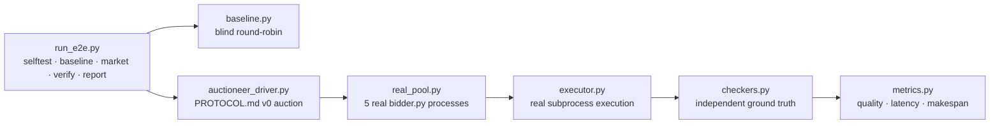

# bid-market e2e harness (T2-E2E)

End-to-end testing for the squawk bid-marketplace. **E2E-REAL: no mocks.** Real `bidder.py` OS processes, real HMAC-signed squawk messages per PROTOCOL.md v0, real task execution, independent ground-truth verification of every result.

- **16 real tasks** (4 categories × 4), seeded fixture generators.
- **Independent checkers** — pure-Python recompute from fixtures, not the bidders' own word.
- **Real pool** — 5 real `bidder.py` daemons (flash ×2, mule, specialist ×2) + oracle.
- **Baseline vs market** — naive blind round-robin dispatcher for comparison.
- **Full metrics** — allocation quality, p50/p95 latencies, completion/false-completion, makespan.



## Quick start (on yote)

```bash
cd /home/toxic/sovereign/killer-features/bid-market/e2e
python3 run_e2e.py selftest --run-dir /tmp/e2e-selftest
```

```bash
python3 run_e2e.py market --run-dir /tmp/e2e-market --batch e2e1
python3 run_e2e.py report --market /tmp/e2e-market/ledger.json \
    --baseline /tmp/e2e-baseline-real/ledger.json --out E2E-REPORT.md
```

## Layout

| File | Role |
|---|---|
| `tasks.py` | 16 real tasks (4 categories × 4), seeded fixture generators |
| `checkers.py` | INDEPENDENT ground-truth checkers (pure-Python recompute from fixtures) |
| `profiles.py` | e2e bidder profiles + oracle (first baseline iteration) |
| `real_pool.py` | the REAL pool: flash/mule/specialist mapping + oracle |
| `executor.py` | real task execution (subprocess) + capability gate + speed/failure model |
| `worker.py` | baseline worker: real process, event-driven FIFO wake, atomic claims |
| `baseline.py` | naive blind round-robin dispatcher (`--pool e2e\|real`) |
| `auctioneer_driver.py` | test-harness auctioneer: implements PROTOCOL.md v0 auction exactly (bid window + deterministic tie-break); retires when the real auctioneer lands |
| `market_adapter.py` | seam to the real marketplace (WIRED=True, PROTOCOL.md v0) |
| `bidder_launcher.py` | spawns the 5 REAL bidder.py processes |
| `metrics.py` | allocation quality, p50/p95 latencies, completion/false-completion, makespan |
| `run_e2e.py` | driver: selftest / baseline / market / verify / report |

## Bidder pool (real)

`bidder-flash`, `bidder-flash-2`, `bidder-mule`, `bidder-specialist`, `bidder-specialist-2` — real `bidder.py` daemons with the team's flash/mule/specialist profiles and bid heuristics.

Oracle (from the market's own model: max capability_match, tie → min cost): shell tasks → flash, python tasks → specialist.

## Metrics

- **allocation quality** — % assigned to the oracle-best bidder
- **assign latency p50/p95** — task_post → assign (includes the bid window)
- **completion latency p50/p95** — task_post → verified result
- **completion rate** — checker-passing / total
- **false-completion rate** — claimed-ok but checker-failed / claimed-ok
- **makespan** — first post → last verified completion

All IPC is event-driven (FIFOs, inotify); no poll loops.

## Dev / contributing

- `auctioneer_driver.py` is a **test harness** — it implements the PROTOCOL.md v0 auction exactly and retires when the real auctioneer lands. Don't promote it to production by accident.
- Adding a task category: extend `tasks.py` (seeded fixtures) + `checkers.py` (independent recompute) together — a task without a checker is unverifiable.
- Run artifacts live in `--run-dir`; keep them out of the tree.

## License + security

Stack glue: MIT where marked. The harness spawns real bidder processes that execute real task payloads — run it on yote only, in a scratch `--run-dir`, and treat e2e task fixtures like any executed code: only fixtures you wrote or reviewed.
