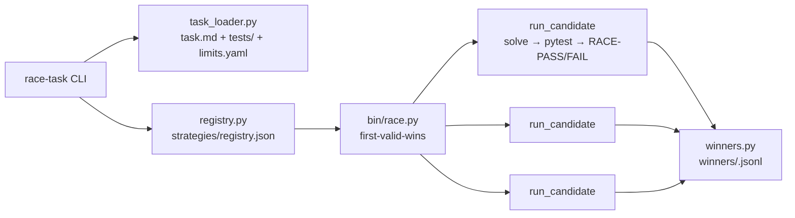

# code-racer — race candidate code strategies against each other

First solution **passing the task's real acceptance tests** wins. No mocks: strategies are real subprocesses, acceptance tests are real pytest runs in isolated testbeds. Slow is a kind of wrong — per-hop latency is measured everywhere and the first *valid* solution takes the race.

- **E2E real** — strategies run as real subprocesses; validity = pytest exit 0 on the produced solution.
- **HFT racer core** — `bin/race.py`: first-valid-wins, fail-fast, ported from the hft-latency skill.
- **Frozen harness contract** — `INTERFACE.md`: strategies write `<outdir>/solution.py`, that's the whole API.
- **Per-task winners ledger** — `winners/<task>.jsonl` (fsync'd audit trail) + a global HFT winners log for the race-optimizer daemon.
- **Per-strategy timeouts** — a registry-level `timeout_s` can override the task solve cap.



## Quick start

```bash
cd /home/toxic/sovereign/killer-features/code-racer
./race-task tasks/smoke-two-sum --strategies all
```

Expected: `demo-fast` wins (~1s), `demo-slow` valid but slower, `demo-broken` invalid (tests fail) — the winner is always a *passing* solution.

```bash
./race-task tasks/smoke-two-sum --strategies demo-fast,demo-slow --timeout 30
```

## Layout

```
race-task            # CLI: race-task <task-dir> --strategies all|a,b --timeout N
task_loader.py      # task-spec loader (task.md + tests/ + limits.yaml)
registry.py         # candidate registry (strategies/registry.json)
run_candidate.py    # one contestant: solve -> pytest -> RACE-PASS/RACE-FAIL
winners.py          # JSONL winners ledger
bin/race.py         # HFT racer (first-valid-wins, fail-fast)
bin/measure.py      # latency measurement helper (from the hft-latency skill)
strategies/registry.json   # registered strategies
strategies/demo/    # demo strategies (smoke test)
tasks/smoke-two-sum/# smoke task with real pytest acceptance tests
winners/            # per-task JSONL ledgers
runs/               # generated strategies.json per race (audit trail)
INTERFACE.md        # frozen contract between harness and strategy adapters
```

## Add a strategy

Append to `strategies/registry.json`:

```json
{"name": "my-solver",
 "cmd": ["python3", "/abs/path/my_solver.py", "{outdir}"]}
```

Your solver must write `<outdir>/solution.py`. See INTERFACE.md for the full frozen contract.

## Add a task

```
tasks/<name>/task.md      # problem statement
tasks/<name>/tests/       # pytest tests; `import solution` must work
tasks/<name>/limits.yaml  # solve_timeout_s / test_timeout_s / workers
```

## Design notes

- E2E real: no mocks. Strategies are real subprocesses; acceptance tests are real pytest runs in isolated testbed dirs.
- Validity = exit 0 AND stdout match `RACE-PASS` in race.py; run_candidate only emits that when pytest passes on the produced solution.
- Per-hop latency measured everywhere: solve_s, test_s, total_s, wall_s.
- Ledger at `winners/code-racer-<task>.jsonl` (fsync'd); race.py also logs to the global HFT winners log for the race-optimizer daemon.
- Per-strategy `timeout_s` in the registry overrides the task solve cap — slow is a kind of wrong.

## Config

| File | Knobs |
|---|---|
| `tasks/<name>/limits.yaml` | `solve_timeout_s`, `test_timeout_s`, `workers` |
| `strategies/registry.json` | per-strategy `cmd`, optional `timeout_s` |

## Dev / contributing

- The task corpus lives in `tasks/` (see `tasks/README.md`) — v2 format conforming to `INTERFACE.md` v1.
- Keep `INTERFACE.md` frozen: adapters are written against it; changing it breaks every strategy.
- Demo strategies in `strategies/demo/` are the smoke test — run `./race-task tasks/smoke-two-sum --strategies all` after any harness change.

## License + security

Stack glue: MIT where marked. Strategies execute as real subprocesses on the box — treat strategy code as fully trusted input: only race strategies you wrote or reviewed, and never point the harness at a task dir you don't control.
