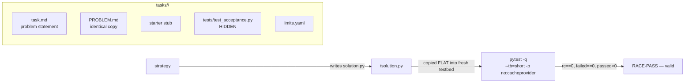

# code-racer task corpus (v2) — 4 real coding tasks for the universal racer

Four real coding tasks built by t1-e2e, conforming to the frozen harness contract `code-racer/INTERFACE.md` v1 (t1-impl-core). Designed for both: (a) code-racer strategy racing, (b) t3-e2e debate-vs-single-shot A/B (same prompt/acceptance format).



## The tasks

| Task | Type | What makes it hard |
|---|---|---|
| `task-1-duration-parser` | Implement a utility to spec (edge-case heavy) | ~45 assertions; traps: `µs` (U+00B5), case-insensitivity, sign only at start, strict number grammar (rejects `inf`/`nan`/`1e`), `ValueError` on ~20 malformed inputs, float return type |
| `task-2-bugfix-rate-limiter` | Fix a planted bug (tests FAIL before, PASS after) | The ONLY failing behavior is sub-second refill; smoke tests pass on the buggy code. Fix is one line but finding it requires reading `_refill` |
| `task-3-wordfreq-cli` | Implement a CLI to spec (subprocess-tested) | Exact stdout bytes (`"b 3\na 2\n"`), tie-break ordering, exit codes 0/2, stderr on missing file, stdin-vs-file, `--top 0`, `--min-len` |
| `task-4-lru-cache` | Implement LRU cache (eviction-order + perf test) | `__contains__` must NOT touch recency, `put`-update refreshes recency, `None` values distinguishable from misses, MRU-first `keys()`, randomized differential test vs OrderedDict model, 50k ops < 5s (kills O(n) impls) |

## Quick start

```bash
cd /home/toxic/sovereign/killer-features/code-racer
./race-task tasks/task-4-lru-cache --strategies all
```

## Layout (per INTERFACE.md v1)

```
tasks/
  task-1-duration-parser/     implement a utility to spec (edge-case heavy)
  task-2-bugfix-rate-limiter/ fix a planted bug (tests FAIL before, PASS after)
  task-3-wordfreq-cli/        implement a CLI to spec (subprocess-tested)
  task-4-lru-cache/           implement LRU cache (eviction-order + perf test)
    task.md                   problem statement (harness reads this)
    PROBLEM.md                identical copy (shared name w/ debate-oracle corpus)
    solution.py               starter stub (task-2: buggy module is rate_limiter.py,
                              candidate writes the FIXED code as solution.py)
    tests/test_acceptance.py  HIDDEN acceptance tests (`from solution import ...`;
                              task-3 runs solution.py as a subprocess CLI)
    limits.yaml               solve_timeout_s / test_timeout_s / workers (harness)
    limits.json               e2e supplement (solution_files, test_command, caps)
  CONTRACT.md                 e2e addendum: independent-verification protocol
  README.md                   this file
```

## How the harness consumes a task

1. Strategy writes `<outdir>/solution.py`.
2. Harness copies `solution.py` + `tests/*` FLAT into a fresh testbed dir.
3. Runs `python -m pytest -q --tb=short -p no:cacheprovider` with cwd=testbed.
4. Valid = solution.py exists AND pytest rc==0 AND failed==0 AND passed>0.

## Rules for adapters

- `tests/` is HIDDEN: strategies must never read `tests/`. (E2E spot-checks this by grepping winner outputs for test-unique strings like `FakeClock`.)
- Candidates see only `task.md`/`PROBLEM.md` + starter/buggy file(s).
- Deliverable is ALWAYS `solution.py`.

## Sibling corpora

- `killer-features/debate-oracle/tasks/` (t3-e2e): 5 tasks (token-bucket, toposort, lru-cache, expr-eval, bloom-filter), PROBLEM.md + hidden pytest, validated 39/39.
- `code-racer/tasks/{fizzbuzz-01,smoke-two-sum}`: harness smoke tasks (other authors, different format) — left untouched.

## Validation status

- [x] Reference solutions (t1-e2e local only, NOT in this tree): all 4 suites pass.
- [x] Negative controls: task-1/3/4 starters fail (NotImplementedError); task-2 buggy module fails (sub-second refill tests).
- [ ] Full harness e2e run (pending t1-impl-core harness + t1-impl-strategies adapters landing) → E2E-REPORT.md at code-racer/ root.

## Dev / contributing

- New tasks follow the v2 layout above and conform to `code-racer/INTERFACE.md` v1 — don't invent a new test convention.
- Keep `tests/` genuinely hidden: no test-unique strings in `task.md`, stubs, or starter files.
- `CONTRACT.md` documents the independent-verification protocol for e2e runs.

## License + security

Stack glue: MIT where marked. Task starters and acceptance tests execute as real subprocesses under the racer — only add tasks you wrote or reviewed, and keep the hidden tests out of any corpus a strategy could train on.
