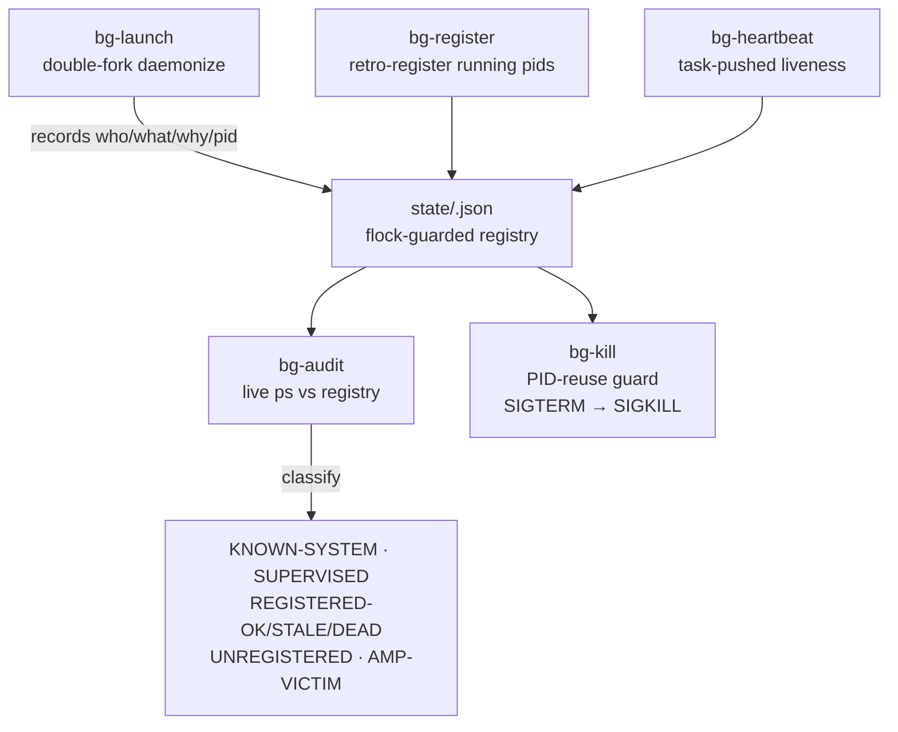

# bg-tracker 🛰️


> **The background-task registry for the estate.** Detached processes go
> blind: nobody knows who spawned what, why it's still alive, or whether
> it's safe to touch. Every backgrounded task is launched (or
> retro-registered) through this suite, which records who/what/why/pid in
> a durable per-box registry and audits live processes against it.

**Problem (Chris, 2026-09-20):** backgrounding/multitasking happens with no
registry. Stale execution quiet for 12+ hours is extremely bad.

**Fix:** event-driven — nothing here polls on a timer. `bg-audit` runs on
demand (or from an inotify/systemd-path trigger); tasks push their own
heartbeats.

## Features

- 🚀 **`bg-launch` is the ONE correct launcher** — double-fork daemonize in Python: no `&` to mis-scope (cf. AGENTS.md "Daemon-start `&` scoping"); records the REAL daemon pid, verifies PPID 1 + own SID before registering
- 📝 **Retro-registration** (`bg-register`) — already-running pids get entries too; known daemons seeded once so the audit stops flagging them
- 💓 **Task-pushed heartbeats** (`bg-heartbeat`) — event-driven, no polling daemon
- 🔍 **Read-only audit** (`bg-audit`) — live `ps` vs registry; classifies every detached proc (KNOWN-SYSTEM / SUPERVISED / REGISTERED-OK / REGISTERED-STALE / REGISTERED-DEAD / UNREGISTERED / AMP-VICTIM); exit 1 when anything needs attention; **never kills**
- ☠️ **PID-reuse-guarded kill** (`bg-kill`) — refuses when the live cmdline no longer matches; SIGTERM → `--force` SIGKILL; no bulk kills
- 💾 **Survives restarts** — state is real files on disk (`state/`), not committed hopes; flock-guarded registry I/O, append-only event log

## Architecture



## Quick Start

```bash
BG_OWNER=bg-tracker ../bin/bg-launch --name my-task --purpose "why it exists" \
  --workdir /path/to/dir --ttl 3600 -- ./run.sh --flag
../bin/bg-heartbeat <id>
../bin/bg-audit
```

## Usage

```bash
# Launch (replaces: cd dir && setsid nohup cmd >>log 2>&1 &)
BG_OWNER=bg-tracker ../bin/bg-launch --name my-task \
  --purpose "why it exists" --workdir /path/to/dir --ttl 3600 \
  -- ./run.sh --flag

# Heartbeat from the task itself
../bin/bg-heartbeat <id>

# Audit (read-only)
../bin/bg-audit
../bin/bg-audit --json

# Retire a task
../bin/bg-kill <id>            # SIGTERM, refuses on PID reuse
../bin/bg-kill <id> --force    # escalate to SIGKILL
```

Kill policy (standing): a kill needs positive orphan confirmation — no
heartbeat, no parent task, no fleet registration — plus a fleet note with
the evidence at kill time. When in doubt, leave it running and flag it.

## Layout

- `../bin/bg-launch` — the ONE correct launcher. Double-fork daemonize in Python: records the REAL daemon pid, verifies own SID + PPID 1 (or the user-session subreaper `systemd --user`, which adopts orphans on systemd boxes) before registering.
- `../bin/bg-register` — retro-register an already-running pid.
- `../bin/bg-heartbeat` — push a liveness heartbeat for a registry id.
- `../bin/bg-audit` — read-only audit: live `ps` vs registry. Exit 1 when anything needs attention. Never kills.
- `../bin/bg-kill` — terminate by registry id only, with PID-reuse guard (refuses when the live cmdline no longer matches), SIGTERM → `--force` SIGKILL, marks retired, logs the event. No bulk kills.
- `lib/bgcommon.py` — shared: flock-guarded registry I/O, box detection, ps scan, append-only event log.
- `state/` — **gitignored runtime state**: `<box>.json` registry, `<box>.events.jsonl` log, `<name>.log` daemon logs. Survives restart because it is a real file on disk, not because it is committed.

## Seeding

Known daemons get retro-registered so the audit stops flagging them:

```bash
../bin/bg-register --pid <pid> --name yote-connector \
  --purpose "hatch<->yote bridge exec lane" --owner bg-tracker
```

Pitchfork-supervised daemons are auto-classified SUPERVISED by `bg-audit`
(descendant check against the pitchfork supervisor pid) and need no entries.

## Config (event-driven hook, opt-in)

No polling daemon ships with this. If you want push-on-change, add a
systemd path unit watching `state/` that runs `bg-audit`:

```ini
# /etc/systemd/system/bg-tracker.path
[Path]
PathChanged=/home/toxic/sovereign/ops/bg-tracker/bg-tracker/state
[Install]
WantedBy=multi-user.target
```

## Deep links

- Estate ops conventions: [`projects/ops/README.md`](../../../projects/ops/README.md)
- Sibling suite doc: [`projects/ops/bg-tracker/README.md`](../../../projects/ops/bg-tracker/README.md)
- Master README: [`README.md`](../../../README.md)
- Fleet knowledgebase: `docs/fleet-knowledgebase.md`
- Standing rules: no monkeypatching, permanence, durability across bridge restart + yote power-cycle. **The script is the deliverable.**

## License & Security

Part of the sovereign estate (see repo root). **Security posture:** `bg-audit`
is read-only — it never kills. `bg-kill` works by registry id only and
refuses on PID reuse (the live cmdline must still match the registered one),
so a recycled PID can't be killed by mistake. No bulk kills, ever. Registry
state is gitignored runtime data — operational truth on disk, not in the
repo.
