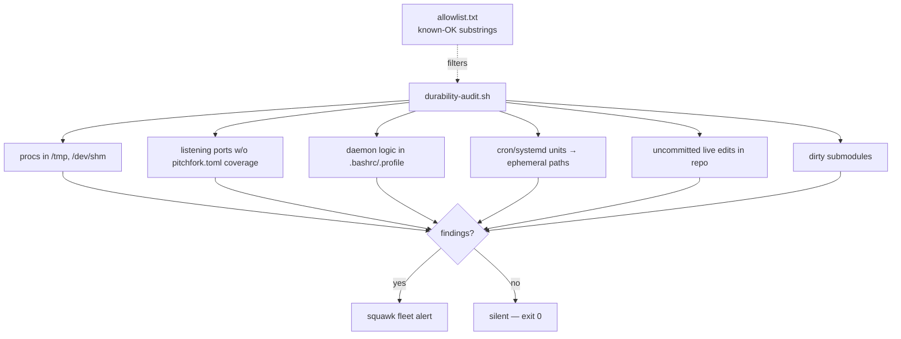

# ops/durability 🛡️


> **The estate durability guard — the permanent mechanism behind "no
> monkeypatching".** `durability-audit.sh` hunts the recurring
> monkey-patch classes on this box and alerts to the squawk `fleet`
> channel **only when findings exist** (alert on conditions, not on a
> timer). Exit 0 = clean, 2 = findings.

## Features

- 🔍 **Six monkey-patch classes**, one audit: processes anchored in ephemeral paths, uncovered listening ports, daemon logic in shell profiles, cron/systemd units pointing at ephemeral paths, uncommitted live edits in the repo, dirty submodules
- 🔇 **Silent when clean** — alerts to squawk `fleet` only on findings, never timer-noise
- 📋 **`allowlist.txt`** — cmdline substrings known-OK in ephemeral paths (session tooling, not services); kept tight
- 🖥️ **Host-agnostic** — `SOVEREIGN_REPO` env overrides the repo path
- ⏰ **Daily systemd timer** (04:30, `Persistent=true`), installed as symlinks so the repo stays the source of truth

## Architecture



## Quick Start

```bash
/home/toxic/sovereign/ops/durability/durability-audit.sh           # print only
/home/toxic/sovereign/ops/durability/durability-audit.sh --alert   # print + fleet alert
systemctl --user start durability-audit.service                     # prove the unit works
```

## What it checks

`durability-audit.sh` hunts the recurring monkey-patch classes on this box:

1. processes anchored in ephemeral paths (`/tmp`, `/dev/shm`) doing real jobs
2. listening TCP ports with no `pitchfork.toml` daemon coverage
3. shell profiles (`.bashrc`/`.profile`) containing daemon logic
4. cron files / systemd units referencing ephemeral paths
5. uncommitted live edits in `/home/toxic/sovereign` (state paths excluded)
6. dirty submodules (bulk ops must be submodule-aware)

## Layout

- `durability-audit.sh` — the audit (host-agnostic; `SOVEREIGN_REPO` env overrides repo path)
- `allowlist.txt` — cmdline substrings known-OK in ephemeral paths (session tooling, not services). Keep tight.
- `systemd/` — `durability-audit.service` + `durability-audit.timer`; installed as symlinks in `~/.config/systemd/user/` so the repo stays the source of truth. Runs daily at 04:30, `Persistent=true`.

## Install / reinstall

```bash
mkdir -p ~/.config/systemd/user
ln -sf /home/toxic/sovereign/ops/durability/systemd/durability-audit.service \
       ~/.config/systemd/user/durability-audit.service
ln -sf /home/toxic/sovereign/ops/durability/systemd/durability-audit.timer \
       ~/.config/systemd/user/durability-audit.timer
systemctl --user daemon-reload
systemctl --user enable --now durability-audit.timer
# prove it works:
systemctl --user start durability-audit.service
journalctl --user -u durability-audit.service -n 20
```

## History

- 2026-09-20 (anvil): created during the estate durability sweep. First findings: retired a vestigial nginx on :8901 (config in /tmp, served a nonexistent kodi-fleet/releases root, zero legitimate traffic) and killed a leftover inotify diagnostic (`/tmp/dir-trap.py`).

## License & Security

Part of the sovereign estate (see repo root). **Security posture:** the
audit is read-only — it reports findings and exits 2, never remediates on
its own; every alert names the offending process/path so a human decides the
disposition. The allowlist is deliberately tight: anything in an ephemeral
path doing a real job is guilty until allowlisted. State lives in the repo
(the timer is a symlink), so the guard itself is as durable as the rule it
enforces.
