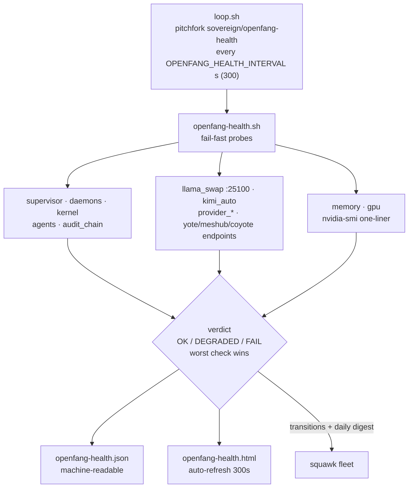

# openfang-health 💓


> **Live liveness + provider audit for openfang/coyote on yote.**
> `openfang-health.sh` probes the whole stack with fail-fast timeouts and
> writes three artifacts: a machine-readable JSON, an auto-refreshing
> status page, and a squawk `fleet` note — **posted only on status
> transitions or the daily digest**, never timer-noise. `loop.sh` runs the
> check every `OPENFANG_HEALTH_INTERVAL` seconds (default 300) under the
> pitchfork daemon `sovereign/openfang-health`.

## Features

- ⚡ **Fail-fast timeouts** — every probe has a ceiling; a hung check is data, not a hang
- 🎯 **Ten check classes** — supervisor, daemons, kernel, agents, audit-chain integrity, llama-swap, kimi resolver, per-provider auth posture, endpoints, memory/GPU
- 📊 **Three artifacts** — `openfang-health.json` (machine), `openfang-health.html` (human, auto-refresh 300s), squawk `fleet` (transitions + daily digest only)
- 🧮 **One verdict**: OK / DEGRADED / FAIL — worst check wins; the script exits 1 only when the *checker itself* errors (a check failure is data, not a crash)
- 🔑 **Provider posture, never key values** — live/dead auth per cloud provider, names only
- 📚 **Paper-grounded**: AgentSight (eBPF agent observability), AgentCgroup (memory is the concurrency bottleneck), HarnessAudit (boundary compliance over full trajectories)

## Architecture



## Quick Start

```bash
./openfang-health.sh                        # one probe run, prints the verdict
OPENFANG_HEALTH_INTERVAL=300 ./loop.sh      # the pitchfork loop body
curl -s 127.0.0.1:25102/health              # one of the probed endpoints, by hand
```

## Checks

| check | what it verifies |
|---|---|
| supervisor | pitchfork.service active, pid + RSS |
| daemons | every daemon in `pitchfork list` is `running` |
| openfang_kernel | `openfang status` boots, audit trail entry count |
| agents | coyote, shingle-pilot, squawk-relay, assistant all Running |
| audit_chain | openfang audit log chain integrity OK |
| llama_swap | `:25100/v1/models` answers, model count |
| kimi_auto | resolver state.json fresh (<30 min) and healthy |
| provider_* | live/dead auth posture per cloud provider (names only, never key values) |
| yote_ep / meshub_ep / coyote_ep | `:25102/health`, `:25115` tcp, `:25143/health` |
| memory / gpu | free RAM, nvidia-smi one-liner |

Overall = OK / DEGRADED / FAIL (worst check wins). The script itself exits 1
only when the *checker* errors — a check failure is data, not a crash.

## Config

| Env / file | What |
|---|---|
| `OPENFANG_HEALTH_INTERVAL` | seconds between loop runs (default 300) |
| `/home/toxic/shingle/var/openfang-health/openfang-health.json` | machine-readable artifact |
| `/home/toxic/shingle/var/openfang-health/openfang-health.html` | status page (auto-refresh 300s) |

## Dev

The check is plain bash with fail-fast ceilings per probe. Conventions:
worst-check-wins verdict, exit 1 only on checker error, provider names never
key values, fleet posts only on transitions or the daily digest.

## Research lineage

- **AgentSight** (arXiv:2508.02736) — *System-Level Observability for AI Agents Using eBPF.* Closes the semantic gap between agent intent and low-level behavior; zero-SDK `top`/`strace`-like observability. Here: we link the agent registry (intent) to OS truth (pitchfork procs, ports, RSS) without touching the agent SDK.
- **AgentCgroup** (arXiv:2602.09345) — *Understanding and Controlling OS Resources of AI Agents.* 144 SWE tasks: OS-level execution is 56–74% of end-to-end latency; **memory, not CPU, is the concurrency bottleneck**; tool-call-driven spikes hit 15.4× peak-to-average; cgroup hierarchies aligned to tool-call boundaries + sched_ext/memcg_bpf_ops enforcement. Here: we monitor supervisor RSS and box memory pressure as first-class signals, and the daemon placement follows the paper's granularity lesson (per-service pitchfork supervision).
- **HarnessAudit** (arXiv:2605.14271) — *Auditing Agent Harness Safety.* Output-level eval can't see mid-trajectory violations; audits boundary compliance, execution fidelity, system stability across full trajectories. Here: we verify the audit-trail chain integrity and registry state, not just "process alive".

Code: AgentSight https://github.com/eunomia-bpf/agentsight ·
AgentCgroup https://github.com/eunomia-bpf/agentcgroup

## License & Security

Part of the sovereign estate (see repo root). **Security posture:** probes
are read-only — `openfang status`, HTTP health endpoints, `nvidia-smi`,
audit-chain verification. Provider checks report live/dead auth posture by
name only; key values are never touched, printed, or posted. The fleet
channel gets status transitions and the daily digest, not a per-run dump.
