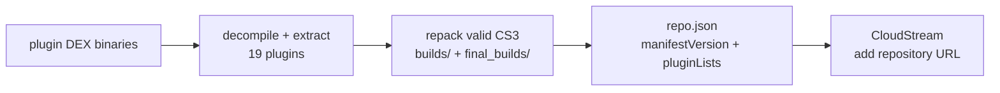

# gayxxx-sovereign

<div align="right">
  
</div>

*A fixed CloudStream repository — 19 CS3 plugins decompiled, extracted, and repacked from valid DEX (full extraction report dated 2026-05-25), published as `repo.json` for one-tap install.*

CloudStream reads a repository manifest and offers every plugin in it. This repo's manifest (`repo.json`: `name`, `description`, `manifestVersion`, `pluginLists`) points at the repacked builds — add the URL once and the plugins show up.

## Contents

| Path | What it is |
|---|---|
| `repo.json` | CloudStream repository manifest (name, description, manifestVersion, pluginLists) |
| `plugins.json` | plugin inventory |
| `cs3_inspector.py` | inspect CS3 plugin packages |
| `EXTRACTION_REPORT.md` | full decompilation & extraction report — 19 plugins processed |
| `builds/` · `final_builds/` | repacked plugin builds |
| `extracted/` | extraction working output |

## Build pipeline



## Quick Start

Add the repository in CloudStream (Settings → Repositories):

```
https://raw.githubusercontent.com/toxicwind/gayxxx-sovereign/main/repo.json
```

Verify the manifest locally before trusting it:

```bash
python3 -c "import json; d=json.load(open('packages/gayxxx-sovereign/repo.json')); print(d['manifestVersion'], len(d['pluginLists']))"
```

## Configuration

The only configuration is the repository URL above. `repo.json` is a static manifest — no server to run, no ports, no secrets. Rebuilding plugins goes through the decompile → extract → repack flow documented in `EXTRACTION_REPORT.md`, with `cs3_inspector.py` for inspecting packages.

## Dev & contributing

Plugin work happens in `builds/` / `final_builds/` / `extracted/`; the report in `EXTRACTION_REPORT.md` is the record of what was processed and how. Keep `repo.json` and `plugins.json` consistent with the actual builds — a manifest entry pointing at a missing build is a broken install.

## License & Security

Community plugin repository — part of the sovereign projects' packaging work, not an official CloudStream source. These are **third-party streaming plugins targeting adult-oriented video sites**; the manifest only describes them, it doesn't vet them. Install at your own discretion, verify `repo.json`/`plugins.json` against the builds before adding the URL, and expect the content to be explicit. No credentials are involved anywhere in this pipeline.
