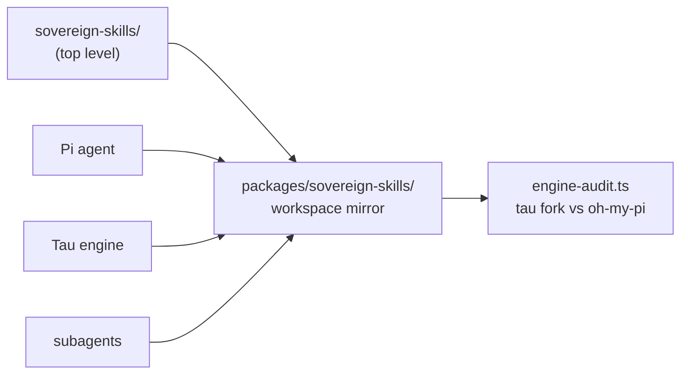

# sovereign-skills (packages mirror)

<div align="right">
  
</div>

*Workspace mirror of the `sovereign-skills` agent-skill definitions — skill recipes and behavioral conventions consumed by Pi, Tau, and subagents. Same contents as the top-level `sovereign-skills/` directory (verified identical); the full story lives in [the canonical README](../../sovereign-skills/README.md).*

## Contents

| Path | What it is |
|---|---|
| `engine-audit.ts` | Audits the Tau engine fork against upstream oh-my-pi; emits structured diff dataframes |
| `AGENTS.md` | Contributor rules for this repo |

Repo rules: verify live before claiming, fail loud (never silence errors), prefer `fd`/`rg` over `find`/`grep`.

```bash
# Audit the Tau engine vs upstream
bun run packages/sovereign-skills/engine-audit.ts
```

## Mirror relationship



Skills flow one way: definitions here, consumers everywhere. This mirror exists so workspace consumers resolve skills under `packages/`; keep it in sync with the top-level directory — don't let the two drift.

## Quick Start

```bash
bun run packages/sovereign-skills/engine-audit.ts
ls packages/sovereign-skills/
sed -n '1,40p' packages/sovereign-skills/AGENTS.md
```

## Adding a skill

1. Create `skills/<name>/SKILL.md` — atomic, self-contained, deterministic
2. Add `references/` for routing tables

Write it so a fresh subagent with no context can execute it cold — if it asks a clarifying question, the skill is incomplete.

## Configuration

Skills are markdown + references, not services — no port, no daemon, no env. The one executable here is `engine-audit.ts`, run directly with bun.

## Dev & contributing

Keep definitions atomic (one skill, one job), self-contained, and deterministic. Mirror discipline: this directory tracks the top-level `sovereign-skills/` — change one, carry it to the other.

## License & Security

Internal agent-behavior definitions — part of the sovereign projects, not published for external use. Skills shape what agents do, so they get the same scrutiny as code: review additions, keep them deterministic, and never encode credentials or bearer tokens in a SKILL.md.
