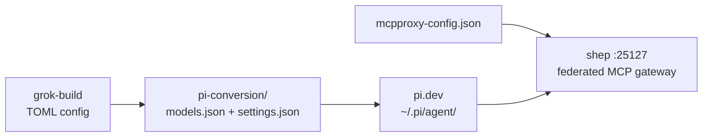

# pi-conversion — grok-build → pi.dev migration (archived)

<div align="right">
   
</div>

*One-shot migration package from **July 2026** that converted the grok-build stack to [pi.dev](https://pi.dev) (open-source agent framework, MIT). The migration is complete — this directory is kept as the **config-mapping reference** for how every grok-build model, setting, and MCP hook became its pi.dev equivalent.*

If you're wondering "what did `groq-compound` become?" or "where did the TOML `mcp_servers` block go?" — the answers are below.

## Contents

```text
pi-conversion/
├── models.json            →  ~/.pi/agent/models.json
├── settings.json          →  ~/.pi/agent/settings.json
├── project-settings.json  →  /home/toxic/.pi/settings.json
├── mcpproxy-config.json   →  ~/.mcpproxy/mcp_config.json
└── install.sh             →  one-shot installer (bash, non-interactive)
```

## Migration map



## Quick Start (reference)

```bash
curl -fsSL https://pi.dev/install.sh | sh
cp models.json ~/.pi/agent/models.json && cp settings.json ~/.pi/agent/settings.json
cd /home/toxic && pi
```

Then in pi: `/model` lists converted models, `/model groq` selects Groq. For MCP, prefer the **shep** service on `:25127` over a local mcpproxy (see below). Export keys or use `/login` in pi:

```bash
export NVIDIA_API_KEY=<redacted>
```

## Model reference

grok-build model → pi.dev provider / model ID:

| grok-build | pi.dev provider | Model ID | Context |
| ---------- | --------------- | -------- | ------- |
| `groq-compound` | groq | `groq/compound` | 131K |
| `groq-120b` / `groq-70b` | groq | `openai/gpt-oss-120b` | 131K |
| `groq-20b` / `groq-scout` | groq | `openai/gpt-oss-20b` | 131K |
| `groq-qwen` | groq | `qwen/qwen3.6-27b` | 131K |
| `openrouter-nemotron-ultra` | openrouter | `nvidia/nemotron-3-ultra-550b-a55b:free` | 1M |
| `openrouter-nemotron-super` | openrouter | `nvidia/nemotron-3-super-120b-a12b:free` | 1M |
| `openrouter-nemotron-nano` | openrouter | `nvidia/nemotron-3-nano-30b-a3b:free` | 256K |
| `openrouter-laguna-m1` | openrouter | `poolside/laguna-m.1:free` | 262K |
| `openrouter-hy3` | openrouter | `tencent/hy3:free` | 262K |
| `openrouter-gemma-31b` | openrouter | `google/gemma-4-31b-it:free` | 262K |
| `openrouter-llama-33-70b` | openrouter | `meta-llama/llama-3.3-70b-instruct:free` | 131K |
| `openrouter-gpt-oss-120b` | openrouter | `openai/gpt-oss-120b:free` | 131K |
| `openrouter-hermes-405b` | openrouter | `nousresearch/hermes-3-llama-3.1-405b:free` | 131K |
| `mistral` | mistral | `mistral-large-latest` | 131K |
| `glm-flash` | glm | `glm-4.7-flash` | 200K |
| `cerebras` | cerebras | `gpt-oss-120b` | 128K |
| `google-gemini` | google | `gemini-2.5-flash` | 1M |
| `sov-25100` / `local-llama` | sov-25100 | `beellama/qwen-flash-64k` | 64K |

## grok-build → pi.dev differences

| | grok-build | pi.dev |
|---|---|---|
| Config format | TOML | JSON (`models.json`, `settings.json`) |
| Config locations | `~/.grok/config.toml` | `~/.pi/agent/`, `.pi/settings.json` (project) |
| API keys | inline `env_key` | `auth.json` (encrypted), env vars, or `/login` |
| MCP servers | TOML `mcp_servers` block | external MCPProxy / shep, or `mcp-remote` |
| Permission mode | `permission_mode = "always-approve"` | `defaultProjectTrust: "always"` + `/trust` |
| Raw visibility | none — payloads blinded | full — every request/response in the TUI |
| Thinking levels | not supported | `/thinking off/minimal/low/medium/high/xhigh/max` |

## MCPProxy

grok-build's hardcoded `mcp_servers` TOML block is replaced by a federated gateway (today: the **shep** service on :25127):

- **Quarantine** — new servers held until manually approved
- **BM25 tool discovery** — agents load one `retrieve_tools` function instead of hundreds of schemas
- **Health checks** — automatic liveness probes
- pi.dev connects via the same endpoint; `/mcp` in the TUI lists federated tools

## Historical notes

- **NIM `reasoning_effort`**: grok-build's serde layer sent the wrong type and blinded the error; pi.dev's `thinkingLevelMap` maps levels to exact provider values (`off/minimal/low/medium/high/xhigh/max` → `"0.2"`–`"0.99"`), with full raw error dumps. `thinkingmachines/inkling` was discontinued 2026-09-03, so the NIM-specific section is reference only.
- Debug any provider directly: `curl` the provider endpoint, then `PI_LOG_LEVEL=debug pi`, then Ctrl+L in the TUI for the full request/response log.

## License & Security

Configs derived from the July 2026 grok-build `config.toml`, mapped to pi.dev's documented schema. MIT. Security posture of the target stack: API keys live in `auth.json` (encrypted), environment variables, or `/login` — never inline in config files. This directory is a frozen reference; don't resurrect `install.sh` against a live system without reading it first.
