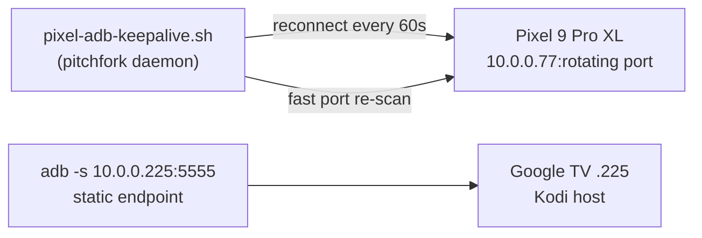

# android-fleet — ADB-managed Android devices on the LAN
 

Your Androids, on a leash. Canonical home of the ADB scripts that keep the
Pixel phone and the bedroom Google TV reachable from yote — `/home/toxic/bin/`
holds symlinks for PATH/supervisor compatibility; the repo source stays canonical.

## Why this exists

Wireless debugging ports **rotate**. Without a keepalive, the Pixel vanishes
from `adb devices` every time the phone feels like it — and the bedroom TV
is the Kodi host. This fleet keeps both sessions pinned to the LAN.

## Devices

| device | endpoint | access | notes |
| ------ | -------- | ------ | ----- |
| Pixel 9 Pro XL (phone) | `10.0.0.77:44933` (rotates) | wireless debugging, paired | keepalive holds the session |
| Google TV "SmartTV 4K FFM" (bedroom) | `10.0.0.225:5555` | ADB authorized 2026-09-18 | Kodi host .225 |

Device details: [`docs/devices.md`](docs/devices.md)



## Features

- **Self-healing Pixel session** — `bin/pixel-adb-keepalive.sh` reconnects every
  60s and rediscovers the wireless-debugging port via fast scan when it rotates
- **Supervisor-compatible layout** — scripts live here canonically; `/home/toxic/bin/`
  symlinks keep PATH and pitchfork happy
- **Run line in `pitchfork.toml`** — `daemons.pixel-adb-keepalive` points at the
  keepalive script, so the fleet survives reboots

## Quick start

```bash
adb devices                       # verify both endpoints answer
bash bin/pixel-adb-keepalive.sh   # hold the Pixel session (pitchfork normally does this)
ls -la /home/toxic/bin/ | grep adb  # confirm symlinks
```

## Architecture

- `bin/pixel-adb-keepalive.sh` — the only script: reconnect loop + port rediscovery
- `docs/devices.md` — device inventory (endpoints, pairing dates, notes)
- Pitchfork daemon `pixel-adb-keepalive` keeps the loop alive on yote; when it
  isn't running, invoke the script directly

## Config

No config files. The Pixel's connect port rotates — never hardcode it; the
keepalive rediscovers it. TV endpoint `10.0.0.225:5555` is static.

## Dev / contributing

Edit `bin/pixel-adb-keepalive.sh` here (canonical source), then re-link or
re-copy into `/home/toxic/bin/`. Keep `docs/devices.md` current when pairing
changes — the fleet health audit reads it.

## License & security

Unlicensed — internal estate tooling in the private
[toxicwind/sovereign-projects](https://github.com/toxicwind/sovereign-projects) repo.
Security: ADB keys and pairing state stay on the authorized hosts; never commit
`~/.android/adbkey*` or device serials beyond what's already in `docs/devices.md`.

---
*Up: [projects/](../README.md) · [fleet knowledgebase](../../docs/fleet-knowledgebase.md)*
