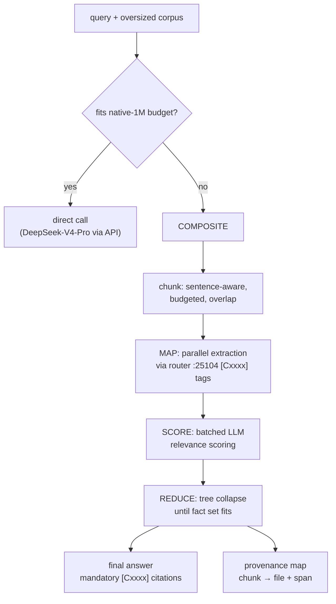

# auto1m — virtual 1M-context composite route
 

No ceiling: an automatic composite that operates over ~1M tokens using the **whole
model fleet**, instead of treating one model's native window as the limit.
Chunked map-reduce with query-aware extraction, batched relevance scoring, and
tree-collapse reduction — every claim cites its chunk.

**Status 2026-09-21:** implemented, committed (`projects/auto1m/` on
toxicwind/sovereign-projects main), 30/30 unit tests green on yote. Full proof
green pending a capable worker (see Worker model).

## Why this exists

Some questions need the whole corpus, not a window. auto1m gives you a million
tokens of effective context by fanning extraction across the fleet and reducing
the results — with provenance on every fact, so nothing is hallucinated away.

## Features

- **Query-aware chunking** — sentence-aware, token-budgeted, overlapping chunks
  ranked by query-term overlap; most relevant maps first
- **Parallel map** — extractions fan out over the sovereign router (`:25104`),
  one fact per line with `[Cxxxx]` tags; fail-fast per call (120s), errors
  recorded, never retried
- **Batched relevance scoring** — ExtAgents-style scoring with keyword fallback
- **Tree-collapse reduce** — LLMxMapReduce-style collapse loop until the fact set
  fits, then a final answer with mandatory `[Cxxxx]` citations
- **Provenance map** — chunk id → source file + char span; citations that don't
  resolve fail closed



## Quick start

```bash
python3 auto1m.py --query "..." --corpus /path/to/docs --force-composite --out result.json
python3 test_unit.py          # 30 pure-function unit tests, no router needed
AUTO1M_MODEL=<worker> python3 test_auto1m.py   # full proof over ~740k-token corpus
```

## Architecture

- `auto1m.py` — the composite: chunk → map → score → reduce → cite
- `test_auto1m.py` — proof test over a real ~740k-token corpus
  (`docs/fleet-knowledgebase.md` Q1/Q2, `corpus/completions-internal.md` Q3
  per `corpus/SOURCE.md`, plus `docs/` + `projects/tau/docs/` as weight).
  Three cross-document questions; every EXPECT needle is grep-verified in the
  actual corpus files; self-validates (non-zero exit before any LLM call if a
  file or needle is missing)
- `test_unit.py` — 30 pure-function unit tests (no router needed)

**Design lineage (code-read on yote, not paper-skimmed):**

- `projects/llm-mapreduce/LLMxMapReduce_V1/Generator.py` — `chunk_docs`
  (budget = window − prompt − max_tokens), `mr_map` thread-pool fan-out,
  `mr_collapse` tree loop, `mr_reduce` with chunk provenance labels
- `projects/extagents/src/pipeline.py` — info scoring + score-sorted selection,
  exponential candidate counts, early exit

(Paper-only candidates — Parallel Context Compaction, the Divide-and-Conquer
cautionary paper — were dropped: no code repos.)

## Worker model

Map/score/reduce calls default to `sovereign/free` (the Sovereign Router picks the
worker and fails over). Override with `AUTO1M_MODEL`, e.g.
`AUTO1M_MODEL=beellama/qwen-flash-256k python3 test_auto1m.py`.

Measured, not assumed (2026-09-21, live probes on yote):

- `sovereign/free` on `:25104` served local **EXAONE-4.0-1.2B** (1.6s/call) —
  perfect mini-extraction on a toy chunk, but echoed schema words instead of
  extracting on real doc chunks. Not a proof-capable worker
- `deepseek/deepseek-v4-pro-0813` listed on `:25104/v1/models` but 503'd
  (OpenRouter 429 / provider outage wave)
- Local herd models (qwen-flash-256k/64k, gemma-128k) returned HTTP 200 with
  **empty** content (broken backend); only EXAONE-4.0-1.2B produced text
- `gemini/gemini-3.5-flash` briefly routed to the real keyed
  nvidia/nemotron-3-super-120b-a12b (truncated, then flapping 503); that lane
  passed a genuine 1M needle retrieval the same day (1m-prober, 41.4s) — real
  lane, flapping router circuit

`sovereign/free` stays the DEFAULT because it is the router's auto-pick lane
(Elo + health) — but the proof test names the worker that actually served, in
`test-evidence.json`. Never claim a model that doesn't serve — probe first.

## Config

| Var | Default | Meaning |
| --- | ------- | ------- |
| `AUTO1M_ROUTER` | `http://127.0.0.1:25104` | OpenAI-compatible chat endpoint (sovereign router on yote) |
| `AUTO1M_MODEL` | `sovereign/free` | map/score/reduce worker |
| `AUTO1M_DIRECT_MODEL` | `deepseek/deepseek-v4-pro-0813` | native-1M direct lane (must serve via router) |
| `AUTO1M_WORKERS` | `8` | parallel map threads |
| `AUTO1M_RETRIES` | `3` | bounded retry on transient 503/429 only |

## Dev / contributing

- `python3 test_unit.py` — fast, no router, must stay 30/30 green
- `AUTO1M_MODEL=<honest-worker> python3 test_auto1m.py` — the full proof;
  evidence lands in `test-evidence.json` (router, serving model, per-question stats)
- Non-goals: does not modify `sovereign-router-ts`, herd, or any live config —
  it is a consumer of the routers. No local 1M inference: DeepSeek-V4-Pro is
  1.6T MoE — the direct lane is API-only. Token estimates are chars/4
  (no tiktoken on yote); budgets stay conservative

## License & security

Unlicensed — internal estate code in the private
[toxicwind/sovereign-projects](https://github.com/toxicwind/sovereign-projects) repo.
Security: router endpoint is yote-local; never point `AUTO1M_ROUTER` at a remote
host without auth, and never commit API keys alongside corpora or evidence files.

---
*Up: [projects/](../README.md) · [fleet knowledgebase](../../docs/fleet-knowledgebase.md)*
