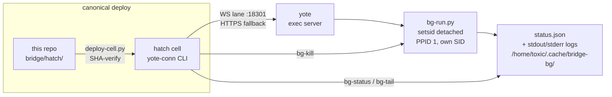

# bridge — hatch→yote bridge exec maximal layer
  

The control plane between **hatch** (the cell) and **yote** (the heavy box):
multitask dispatch, detached background dispatch, and the canonical deploy path
for the `yote-conn` operator CLI. Built maximal by **bridge-max** (2026-09-20).

**Policy:** the live copies on the hatch cell (`~/workspace/yote-connector/connector.py`,
`~/workspace/bin/yote-conn`) are deployed **FROM this repo**. Edit here, deploy —
never the reverse.

## Why this exists

The cell can't do heavy work — 2 vCPUs, saturated tool path. Everything big runs
on yote (16 cores, 62 GB). The bridge is how the cell reaches yote: one canonical
lane with concurrency, detachment, and status truth that lives in files, not
in someone's memory.

## Features

- **Multitask dispatch** — up to 8 commands concurrently (cap 16, max 64/batch)
  over the WS lane with HTTPS fallback per command; tagged results with per-command ms
- **Detached background dispatch** — fire and forget; jobs survive the launching
  exec session (PPID 1, own SID). Status truth is yote-side `status.json`
- **Reaping on read** — dead/stale runners are detected and marked `"stale"` on
  the next `bg-status` query (pid verified via `/proc/<pid>/cmdline`, so a reused
  pid can never false-positive). Event-driven, never a timer
- **Incremental attach** — `bg-tail <handle> [soff] [eoff]` byte-offset log tails;
  negative offset = last N bytes
- **Atomic deploy** — `hatch/deploy-cell.py` pulls connector + CLI from this repo,
  SHA-verifies, installs atomically, restarts, health-checks



## Quick start

```bash
handle=$(yote-conn bg "long-running-cmd")   # dispatch detached
yote-conn bg-status "$handle"               # status truth from yote-side status.json
yote-conn bg-tail "$handle" -4000 -4000     # last 4000 bytes of each stream
```

## Layout

| Path | What |
| ---- | ---- |
| `bin/bg-run.py` | Yote-side detached background runner. Launched via `setsid nohup … &` with the exec workdir set to its state dir so `&` binds only to the runner. Writes `status.json` atomically + `stdout.log`/`stderr.log` under `/home/toxic/.cache/bridge-bg/<handle>/` |
| `bin/bg-status.py` | Yote-side status probe: reads `status.json`, **reaps stale runners on read**, returns status + log tails as one JSON doc. Optional `[soff] [eoff]` byte offsets add incremental-attach chunks (`stdout_b64`/`stdout_soff`, `stderr_b64`/`stderr_eoff`; negative = last N bytes) — backs `yote-conn bg-tail` |
| `bin/bg-kill.py` | Yote-side kill: verifies `/proc/<pid>/cmdline` is still our `bg-run.py` for the handle (a reused pid is never signaled), then SIGTERMs the whole process group |
| `bin/bg-ctl.py` | Local control wrapper for the bg-* trio |
| `bin/bridge-open.sh` | Convenience opener for the bridge lane |
| `hatch/connector.py` | Canonical source of the cell-side yote-connector daemon (`127.0.0.1:18301`). v2.0 adds `POST /exec-multi`, `POST /exec-bg`, `GET /bg`, `GET /bg/<handle>`; v2.1 routes status through `bg-status.py` (reap-on-query) + `POST /bg/<handle>/kill`; v2.2 honors `timeout_s` and forwards `workdir` to `bg-run.py`, plus `GET /bg/<handle>?soff=N&eoff=M` incremental attach |
| `hatch/yote-conn` | Canonical source of the CLI: `multi`, `bg` (`[workdir] [timeout_s]`), `bg-status`, `bg-tail <handle> [soff] [eoff]`, `bg-list`, `bg-kill` |
| `hatch/deploy-cell.py` | Canonical cell deploy script: pulls `connector.py`, `yote-conn` (this dir) and `gear/awrawr-mcp/bin/exec.py` from the yote tree onto the cell, SHA-verifies, installs atomically, restarts the connector, health-checks |
| `hatch/supervise-connector.py` | Connector supervision helper |
| `yote/` | Yote-side MCP patch tooling (`awrawr_mcp.py`, patch helpers) |

## API

### Multitask — one lane, N commands, concurrent

```bash
yote-conn multi cmds.json
# cmds.json: [{"cmd": "…", "workdir"?: "…", "timeout"?: 120, "tag"?: "…"}, …]
# or a plain ["cmd1", "cmd2"] string list
```

### Background — dispatch and forget, check later

```bash
handle=$(yote-conn bg "long-running-cmd")
yote-conn bg-status "$handle"
yote-conn bg-tail "$handle" 0 0        # incremental attach from byte 0
yote-conn bg-tail "$handle" -4000 -4000 # last 4000 bytes of each stream
yote-conn bg-list
yote-conn bg-kill "$handle"   # SIGTERM the job's process group
```

## Canonical path policy

- **Operator path:** `yote-conn` is the single canonical command for cell→yote
  exec, background dispatch, and service proxying. The legacy
  `awrawr-bridge/exec.py` direct path is the transport layer, not the operator
  interface: `bexec` is a thin compatibility shim over `yote-conn exec`, and
  operational tooling (`fleet-classify`) calls `yote-conn`
- **Deliberate exceptions:** the emergency circuit-breakers
  (`hatch/bin/swarm-eject`, `swarm-resume`, `swarm-watchdog`) keep raw
  `exec.py` on purpose — they must work when the 18301 connector daemon itself
  is down or the cell is overloaded. Their comments say so; do not
  "canonicalize" them

## Durability

Everything here is committed source. It survives a full bridge restart and a
yote power-cycle: no in-memory state (the bg registry is a JSON file, status
truth lives in files on yote), no monkeypatching, no `/tmp` dependencies.

## License & security

Unlicensed — internal estate code in the private
[toxicwind/sovereign-projects](https://github.com/toxicwind/sovereign-projects) repo.
Security: the bridge is Chris's own hands on his own boxes — the connector
listens on `127.0.0.1` only; never expose `:18301` beyond the cell, and never
commit credentials beside `deploy-cell.py` or the CLI.

---
*Up: [projects/](../README.md) · [fleet knowledgebase](../../docs/fleet-knowledgebase.md)*
