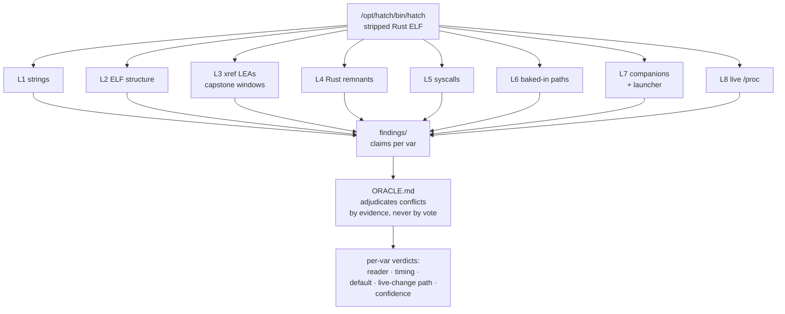

# hatch-decode — oracle forward decoding of the hatch runtime binary
  

**Target:** `/opt/hatch/bin/hatch` — stripped ELF, 341 MB, x86-64, Rust, imports
`getenv@GLIBC_2.2.5`. The daemon that owns this runtime cell.

**Goal:** for every `JARVIS_*` env knob, determine **what reads it**, **when**
(startup-once into a config struct vs lazily per use), the **compiled default**,
and whether a value change can take effect **without a daemon restart**.

## Why this exists

The cell's behavior is driven by ~150 compiled-in env knobs, and the knob list
is a platform launch parameter — not session-mutable, not documented anywhere.
Decode the binary, find the readers, stop guessing. What actually happened
outranks what the docs claim.

## The 8 orthogonal lanes

| Lane | Script | Method | Question answered |
| ---- | ------ | ------ | ----------------- |
| L1 | `lanes/lane1_strings.sh` | strings-context mining, one pass | per-var adjacent evidence: defaults, log lines, error text |
| L2 | `lanes/lane2_elf.sh` | ELF/dynamic structure | imports, sections, `.rustc`, build-id |
| L3 | `lanes/lane3_xref.py` | fast-xref: byte-scan `.text` for RIP-relative LEAs targeting each var string + capstone windows | instruction-level read sites per var |
| L4 | `lanes/lane4_rust.sh` | Rust remnants | module paths (`hatch::`), panic sites, lazy-init markers (`OnceLock`, `get_or_init`) |
| L5 | `lanes/lane5_syscalls.sh` | syscall/import surface | inotify/fanotify/signal/epoll — any reload mechanism? |
| L6 | `lanes/lane6_paths.sh` | path-constant sweep | every baked-in `/etc /run /opt /var` path — what files it touches |
| L7 | `lanes/lane7_companions.sh` | companion binaries + launcher scripts | does `spawnd` read the vars? who sets what, when? |
| L8 | `lanes/lane8_live.sh` | live observation without ptrace | `/proc/67` cmdline/maps/fd, sockets, `/etc/hatch` mtimes |

Each lane writes to `findings/`. Run: `cd lanes && chmod +x lane* && ./lane1_strings.sh` …



## Features

- **8 lanes, zero overlap** — strings, ELF, instruction xrefs, Rust metadata,
  syscalls, path constants, companion binaries, live `/proc` — each answers a
  distinct question
- **Oracle adjudication** — lanes emit *claims* into `findings/`; `ORACLE.md`
  resolves lane conflicts with evidence, never by vote
- **Forward decoding** — binary → meaning. Reader, timing, default, live-change
  path, confidence per var
- **Passes build on passes** — `pass2/` and `pass3/` are the refined static
  inventories (see [`pass3/README.md`](pass3/README.md): 158 exact names,
  reader-shape discipline)

## Quick start

```bash
cd lanes && chmod +x lane* && ./lane1_strings.sh   # lane 1 → ../findings/
python3 -c "import capstone"                       # lane 3 needs it (pip install capstone)
cat findings/jarvis_vars.txt                       # 131 unique JARVIS_* strings (2026-09-20)
```

## Tooling notes

- Cell: binutils + `pip install capstone` (done 2026-09-20). No `paru` here
- yote (Arch/CachyOS, `paru`): for deeper lanes — `paru -S radare2 ghidra`
  (ghidra headless decompile); `x64dbg`-class work stays manual
- Repos: capstone (PyPI) for disasm windows; anything heavier gets its own lane doc

## Standing findings

- 2026-09-20: 131 unique `JARVIS_*` strings in the binary (`findings/jarvis_vars.txt`)
- 2026-09-20: `/etc/hatch/env.override` is **not** a durable ops surface — the
  host re-provisioned `/etc/hatch` wholesale at 19:26 MDT, wiping a staged
  `JARVIS_AVOCADO_COMPACTION_TRIGGER_TOKENS=170000`. The durable path must be
  wherever the host renders it from (host-side, outside the cell)

## License & security

Unlicensed — internal estate research in the private
[toxicwind/sovereign-projects](https://github.com/toxicwind/sovereign-projects) repo.
Security: this is static analysis of a binary you own on your own box — read
only, no ptrace, no runtime patching. Findings about env knobs are operational
notes, not credentials; nothing here leaves the estate.

---
*Up: [projects/](../README.md) · [fleet knowledgebase](../../docs/fleet-knowledgebase.md)*
