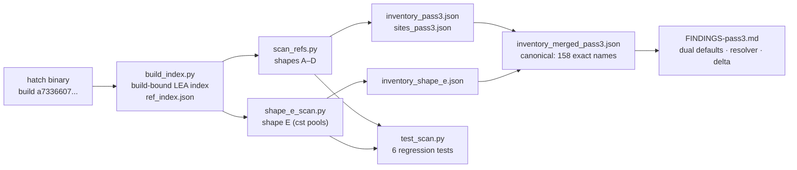

# hatch-decode pass 3 — exact JARVIS_* inventory from the binary
 

Static decode of `/opt/hatch/bin/hatch` (`hatch 0.1.0 (e86e3030628)`, build ID
`a733660761e017bf523cc4be3e467cddf3c4e639`), continuing pass 1 (`0734b5ca`) and
pass 2 (`76fed7d2`). Recovers the exact `JARVIS_*` environment-variable inventory
with **reader-supplied-length discipline** — no packed-symbol fusion — plus
compiled defaults, reader addresses, and call-site shapes.

## Why this exists

Passes 1–2 counted strings; pass 3 counts *reads*. Knowing a name exists in
`.rodata` isn't enough — you need the instruction that loads it, the length it
loads with, and the default it falls back to. That's what the reader shapes give you.

## Reader shapes

- **A** — RIP-relative `lea` into `.rodata` + exact supplied length (+ optional
  default immediate), verified with Capstone
- **B** — absolute immediates
- **C** — static `&str {ptr,len}` records in `.data.rel.ro`
- **D** — length-less LEAs resolved through voted exact names
- **E** *(new in pass 3)* — SIMD constant pools `.rodata.cst16` / `.rodata.cst32`
  with the new `(name, name_len, default)` reader idiom



## Files

| file | purpose |
| ---- | ------- |
| `build_index.py` | build-ID-bound persistent LEA/absolute-ref index of the binary |
| `scan_refs.py` | shapes A/B/C/D scanner → `inventory_pass3.json`, `sites_pass3.json` |
| `shape_e_scan.py` | shape-E scanner → `inventory_shape_e.json` |
| `inventory_merged_pass3.json` | **canonical: 158 exact names** |
| `FINDINGS-pass3.md` | full findings (dual defaults, resolver, inventory delta) |
| `rodata_strings.json` | raw string inventory feeding the scanners |
| `test_scan.py` | regression tests (`python3 test_scan.py`) |
| `requirements.txt` | pinned `capstone==5.0.7` |

## Quick start

```bash
pip install -r requirements.txt
python3 build_index.py     # ~10s, writes ref_index.json (build-bound)
python3 scan_refs.py       # ~70s on the hatch cell
```

Every artifact records the binary build ID; the index is rejected when the
binary is rebuilt (addresses go stale across builds).

## Key results

- **158 exact names** — the 8 vars pass 2 thought removed (incl.
  `JARVIS_COMPACTION_HEARTBEAT_SECS`, default still 30) had moved to the
  cst-pool idiom. Nothing was removed
- `JARVIS_MODEL_STREAM_CHUNK_IDLE_TIMEOUT_MS` dual defaults adjudicated:
  90000 (interactive) / 180000 (cron), flag-selected in fn 0xda0f7b0
- Avocado trigger resolver live at 0x9a5bdc0 (200000/150000, fail-fast intact);
  dispatch is once-per-process lazy (`lock cmpxchg`)
- Eager compaction module source-attributed:
  `hatch-engine/crates/hatch-agent/src/session/impl_session/eager_compaction.rs`

## License & security

Unlicensed — internal estate research in the private
[toxicwind/sovereign-projects](https://github.com/toxicwind/sovereign-projects) repo.
Security: static analysis of your own binary, read-only. Build-bound artifacts
are keyed to build ID `a7336607…` — rerun `build_index.py` after any binary
update; stale addresses are rejected, never silently trusted.

---
*Up: [hatch-decode/](../README.md) · [projects/](../../README.md) · [fleet knowledgebase](../../../docs/fleet-knowledgebase.md)*
