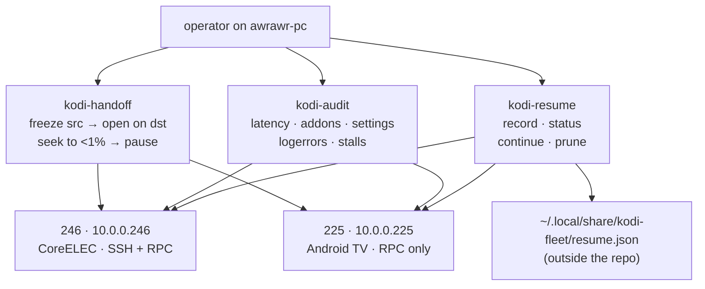

# kodi-fleet — one-shot Kodi tooling + audit for the two-box fleet
  

One-shot Kodi tooling + audit for the two-box fleet. Lives in the sovereign
repo; runs from awrawr-pc (has the LAN route + SSH). Deployed copies:
`/home/toxic/bin/kodi-handoff` (symlink or copy of `bin/` source) — keep the
repo source canonical; re-deploy after edits.

## Why this exists

Two rooms, two Kodi boxes, one problem: playback dies at the door between them.
Kodi only keeps resume bookmarks for library items — but both fleet boxes stream
mostly via addons (empty video libraries), so resume vanishes. `kodi-resume`
keeps a tiny state file on awrawr-pc instead. Reference box is **246**
("it has correct"): dupes go 246 → 225, except tv/audio settings, which stay
per-box.

## Boxes

| box | host | platform | access |
| --- | ---- | -------- | ------ |
| 246 | 10.0.0.246 | CoreELEC (living room) | SSH `root:coreelec`, JSON-RPC :8080 (no auth) |
| 225 | 10.0.0.225 | Android / Google TV (bedroom) | JSON-RPC :8080 only (no SSH) |



## Features

- **`kodi-handoff`** — one-shot playback transfer: `kodi-handoff <src> <dst> [--play]`.
  Freezes source, opens the same stream URL on the destination, waits for a real
  duration, retries seek to <1%, leaves dst paused (or playing with `--play`).
  Safe rehearsal: `kodi-handoff --dry-run <src> <dst>`, `kodi-handoff --selftest <ip>`
  (no-op seek, 0.00% drift)
- **`kodi-audit`** — fleet audit: `latency [246|225|all]` (JSON-RPC round-trip,
  10x Ping); `addons [--diff]` (inventory + 246/225 diff, report-only by design);
  `settings [--diff]`; `settings --dupe` (246 → 225, safe allowlist only);
  `logerrors 246` / `stalls 246` (246's `kodi.log` via SSH)
- **`kodi-resume`** — cross-box playback resume ("continue in the other room"):
  `record` (snapshot active players on 246+225, read-only; 30s minimum, dedupes
  same stream within 60s) · `status` (saved sessions: box, title, position, age) ·
  `continue <246|225> [--apply] [--play]` (opens the newest session from the
  *other* box at the exact saved position; defaults to `--dry-run`, prints the
  RPCs; refuses if the target is already playing) · `prune [--keep N]` (default 20) ·
  `--selftest <ip>` (read-only RPC path check). 18 unit tests:
  `python3 -m unittest discover -s tests` (0.07s)
- **Parked work** — `bin/parked/` holds `kodi-sync` + `NOTE.md` (not active)
- **Forensics** — `forensics/246-20260919/` captured a 246 diagnosis session

## Quick start

```bash
kodi-audit latency all          # JSON-RPC round-trip stats, both boxes
kodi-resume record              # snapshot what's playing (read-only)
kodi-handoff --dry-run 246 225  # rehearse a transfer without touching playback
```

## Docs (`docs/`)

- `menu-latency.md` — UI-sluggishness diagnosis (both boxes)
- `box-inventory.md` — hardware/platform/filesystem notes

## Kodi JSON-RPC gotchas (learned live)

- `Player.Seek` value must be a wrapped object: `{"value": {"percentage": x}}`.
  Bare numbers and raw time objects are rejected (-32602)
- `Player.GetItem` has no `label` field on Kodi 21 — request `file`, `title`
- First seek after `Player.Open` often lands ~0%: retry until within 1%
- `Player.Seek` can throw -32100 during transitions: retry on RPC error
- Re-fetch the video playerid after open; never assume 1

## License & security

Unlicensed — internal estate tooling in the private
[toxicwind/sovereign-projects](https://github.com/toxicwind/sovereign-projects) repo.
Security: 246's SSH creds (`root:coreelec`) are LAN-local and never leave the
estate; `resume.json` lives outside the repo at `~/.local/share/kodi-fleet/` so
playback history is never committed.

---
*Up: [projects/](../README.md) · [fleet knowledgebase](../../docs/fleet-knowledgebase.md)*
