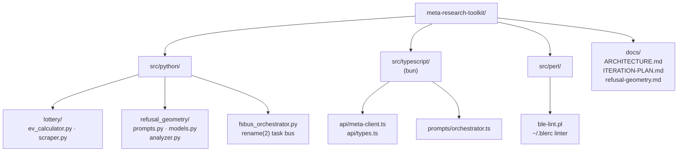

# Meta-Research Toolkit — lottery EV, refusal geometry, shell tooling
   

A polyglot research scaffold: lottery scratch-off EV analysis, LLM
refusal-geometry meta-analysis, and shell tooling. Built with Bun + Python +
Perl. See `docs/ARCHITECTURE.md` for how the pieces fit and
`docs/ITERATION-PLAN.md` for what's next.

## Why this exists

Three independent research threads, one scaffold: a real EV model for Colorado
scratch-offs (including a positive-EV anomaly worth money), a grounded
meta-analysis of how LLMs route refusals, and the glue tooling to keep a
shell honest. All prompts are meta-analytical — they study routing behavior,
never request harmful content.

## Tracks

- **Lottery EV** (`src/python/lottery/`) — finite-population,
  without-replacement EV model for Colorado scratch-offs. `ev_calculator.py`
  computes baseline EV, top-prize-lag-adjusted dynamic EV, and house edge for
  four audited games (September 2026 snapshot), including the Casino Ca$h Chips
  positive-EV "jackpot lag anomaly". `scraper.py` parses Colorado Lottery
  guideline PDFs and remaining-prize pages (PDF URL heuristic documented in-code)
- **Refusal geometry** (`src/python/refusal_geometry/`, `src/typescript/`) —
  meta-analysis toolkit for LLM refusal routing behavior, grounded in published
  2026 findings (see `docs/refusal-geometry.md`). Five orthogonal prompt
  strategies (`citation_activation`, `self_report_audit`, `mechanistic_steering`,
  `trilemma_argument`, `rule_of_two_framework`) maintained in parallel in Python
  (`prompts.py`) and TypeScript (`prompts/orchestrator.ts`); pydantic models
  (`models.py`) and subspace vector math (`analyzer.py`) on the Python side,
  zod-validated API client (`api/meta-client.ts`) and report interfaces
  (`api/types.ts`) on the TS side
- **Shell tooling** (`src/perl/ble-lint.pl`) — dynamic ble.sh option linter:
  discovers valid options by scanning the installed ble.sh source, lints
  `~/.blerc`, `--fix` comments out invalid lines with a timestamped backup
- **Filesystem message bus** (`src/python/fsbus_orchestrator.py`) — stdlib-only
  dual-track task bus: atomic claim via `rename(2)`, 30s leases, 3 attempts,
  append-only `manifest.jsonl` audit log. Currently has no wired consumers
  (see iteration plan)



## Quick start

```bash
python -m venv .venv && source .venv/bin/activate && pip install -r requirements.txt
make test    # 12 pytest + 5 bun suites
make lint    # ruff check src/python && tsc --noEmit
```

## Structure

- `src/python/lottery/` — EV calculator + scraper
- `src/python/refusal_geometry/` — models, analyzer, prompt strategies
- `src/python/fsbus_orchestrator.py` — filesystem message bus
- `src/typescript/` — API client, prompt orchestrator, report types (`index.ts` entry)
- `src/perl/` — ble.sh linter
- `scripts/` — helper scripts
- `tests/` — pytest + Bun test suites
- `docs/` — `refusal-geometry.md` (research notes + citations), `ARCHITECTURE.md`, `ITERATION-PLAN.md`

## Config

- Python: `pyproject.toml` + `requirements.txt` (venv recommended)
- TypeScript: `package.json` + `tsconfig.json`, run on Bun
- The scraper's PDF URL heuristic is documented in-code in `scraper.py`

## Dev / contributing

`make test` runs both suites (12 pytest + 5 bun). `make lint` runs
`ruff check src/python` and `tsc --noEmit`. Keep the five prompt strategies in
sync between `src/python/refusal_geometry/prompts.py` and
`src/typescript/prompts/orchestrator.ts` — they are maintained in parallel by
design. `docs/ITERATION-PLAN.md` is the roadmap; propose there before adding a track.

## License & security

Unlicensed — internal estate research in the private
[toxicwind/sovereign-projects](https://github.com/toxicwind/sovereign-projects) repo.
Security: research data and scraped PDFs stay in the working tree; no credentials
are committed. The refusal-geometry prompts study model behavior meta-analytically
and never request harmful content.

---
*Up: [projects/](../README.md) · [fleet knowledgebase](../../docs/fleet-knowledgebase.md)*
