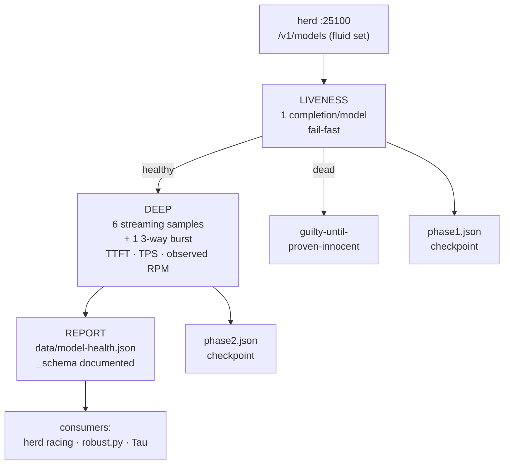

# MODEL-MAX — herd model measurement
 

Sweep harness that measures **every model exposed by the herd gateway**
(llama-swap on yote `127.0.0.1:25100`) with real completions. No advertised
catalog entries, no guessed RPM — every `healthy=true` is an **observed**
completion. Guilty until proven innocent.

## Why this exists

Provider dashboards lie: HTTP 200s carrying "not enough credits", catalog
entries that 404, tokenizers that don't exist. MODEL-MAX replaces the brochure
with measurement — one real completion per model, then deep streaming probes
on the survivors, then a report the routers actually consume.

## Features

- **Liveness** — one real `/v1/chat/completions` call per model. Records HTTP
  status, wall latency, and — critically — *semantic* failures: HTTP 200 bodies
  carrying error text, canned "not enough credits" notices, and empty completions
  are **failures**, not health
- **Reasoning-model aware** — models that return empty with `finish=length` are
  re-probed with a larger token budget (they're usually reasoning models, not
  dead routes); 429s are re-probed serially to distinguish rate-limit from death
- **Deep (healthy only)** — 6 sequential streaming samples + one 3-way burst:
  TTFT, total latency, tokens/sec, and an *observed* valid-RPM (successful
  completions per minute during the probe window)
- **Report** — writes the estate's `data/model-health.json` (`_schema` key
  documents the schema): the artifact consumed by herd racing, `robust.py`, and Tau
- **Resumable** — both phases checkpoint after every model; kill and re-run to
  resume exactly where you left off



## Quick start

```bash
cd projects/model-max && python3 sweep.py --phase=all        # liveness + deep + report
python3 sweep.py --phase=liveness --models=a,b              # subset
python3 sweep.py --phase=liveness --fresh                   # ignore checkpoints
```

## Layout

- `sweep.py` — the harness (stdlib only, no deps)
- `model-ids.json` — model list from the sweep run
- `phase1.json` / `phase2.json` — checkpoints (resume state)
- `sweep-*.log` — run logs
- `.venv/` — GuideLLM venv (for deep load benchmarks on top candidates)

## Lessons baked in

- The herd's `/v1/models` set is **fluid** (peers come and go); the sweep
  records what was exposed at sweep time. Counts have varied 99–102
- `--watch-config` + a bad `${env.VAR}` **kills the herd** (llama-swap exits on
  failed reload instead of keeping the old config). Never edit `herd.yaml` to
  reference an env var the pitchfork daemon doesn't have
- GuideLLM lives here for proper load benchmarks of the top candidates; the
  custom prober handles liveness/semantic triage where GuideLLM doesn't fit

## License & security

Unlicensed — internal estate tooling in the private
[toxicwind/sovereign-projects](https://github.com/toxicwind/sovereign-projects) repo.
Security: the harness only talks to the yote-local herd gateway; no provider
keys are committed or logged — probing "not enough credits" bodies is reading
error text, not touching billing.

---
*Up: [projects/](../README.md) · [fleet knowledgebase](../../docs/fleet-knowledgebase.md)*
