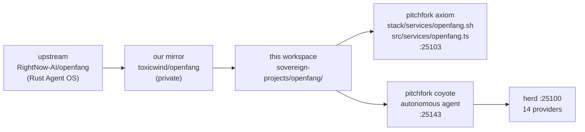

# OpenFang — Agent Operating System
  

**OpenFang** is an open-source **Agent Operating System** written in Rust by
[RightNow-AI](https://github.com/RightNow-AI/openfang) — a full OS for
autonomous agents that work on schedules, 24/7: building knowledge graphs,
monitoring targets, generating leads, managing social media, and reporting to
a dashboard. Not a chatbot framework, not a Python wrapper around an LLM.

- **Upstream:** <https://github.com/RightNow-AI/openfang>
- **Our mirror:** <https://github.com/toxicwind/openfang> (private)
- **Docs:** <https://openfang.sh/docs>

## Why this workspace exists

The OpenFang source lives upstream and in our private mirror — **no OpenFang
source is checked in here**. This directory is the estate's workspace for the
OpenFang deployment: how the daemon is served, how it reaches the herd, and how
our autonomous agent (`coyote`) runs on top of it. The code of record for the
deployment glue lives in the repo tree, not this folder.

## Live estate

- `sovereign-projects/openfang/` — workspace checkout (this directory)
- pitchfork **`axiom`** daemon → `stack/services/openfang.sh` → `src/services/openfang.ts` on **:25103**
- pitchfork **`coyote`** daemon — autonomous agent inference engine on **:25143**,
  an OpenFang agent with Yote integration, routing through herd (`:25100`) across 14 providers



## Quick start (upstream)

```bash
curl -fsSL https://openfang.sh/install | sh
openfang init
openfang start
```

Dashboard live at `http://localhost:4200`.

> **Correction (2026-09-14):** an earlier version of this README described
> OpenFang as a C++ inference-engine fork behind herd with beellama.cpp /
> llama-cpp-turboquant / ik_llama.cpp. That was wrong — those are llama.cpp
> engine builds used by herd's backends. OpenFang is the Rust Agent OS above.

## Contributing

Deployment glue changes go in `stack/services/openfang.sh` and
`src/services/openfang.ts` in the repo root tree — this workspace README just
documents the layout. Daemon changes ride the pitchfork restart path; never
hand-start `axiom` or `coyote` outside the supervisor.

## License & security

OpenFang upstream is open source under its own license (see
[RightNow-AI/openfang](https://github.com/RightNow-AI/openfang)); our mirror
is private. Estate deployment glue is unlicensed internal code in
[toxicwind/sovereign-projects](https://github.com/toxicwind/sovereign-projects).
Security: `coyote` routes inference through herd with the estate's provider
keys from `/home/toxic/.secrets` — never hardcode keys in service files or
commit them to the mirror.

---
*Up: [projects/](../README.md) · [fleet knowledgebase](../../docs/fleet-knowledgebase.md)*
