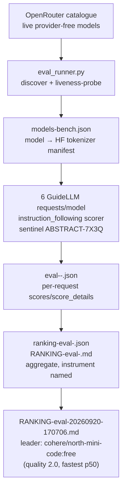

# openrouter-probe — GuideLLM quality-first eval stack
 

Deterministic instruction-following evaluation of provider-free OpenRouter
models, run **through the GuideLLM fork** (`toxicwind/guidellm`), not a parallel
harness. Ranking rule: **quality first, provider-free status second,
GuideLLM-measured performance third.**

## Why this exists

Free-tier leaderboards are mostly vibes and uptime lotteries. This stack
measures one thing deterministically — can the model follow an exact
instruction? — with a fixed sentinel, a real per-model tokenizer, and scoring
semantics that treat silence and exceptions as data instead of aborting the run.
The rankings feed the estate's router decisions.

## Features

- **Deterministic instrument** — 6 synchronous GuideLLM requests per model with
  the `instruction_following` scorer, sentinel `ABSTRACT-7X3Q`, thinking-strip on
- **Real tokenizers** — per-model real HF tokenizers from `models-bench.json`;
  `openrouter/free` has no stable tokenizer (explicitly labelled `gpt2`
  fallback, never ranked, never counted in `results`) — it sits in a separate
  fallback tier
- **Honest scoring semantics** — empty output scores `0.0` (model silence is
  data); scorer exceptions record `0.0` + error metadata, never abort the run;
  quality aggregates cover **completed requests only** (429/overload/
  ResourceExhausted is reliability signal, not instruction-following signal);
  LLM-as-judge is out of scope for this tier
- **Self-describing reports** — every aggregate names its instrument: scorer,
  semantics, tokenizer policy, scope, formality tier, prompt, timestamp



## Components

| File | Role |
| ---- | ---- |
| `eval_runner.py` | **The runner (permanent).** Discovers live provider-free models from the OpenRouter catalogue, liveness-probes each, runs the eval, writes raw per-model JSON + aggregate ranking JSON/Markdown |
| `models-bench.json` | OpenRouter model → HF tokenizer repo manifest |
| `ranking-eval-<ts>.json` / `RANKING-eval-<ts>.md` | Aggregate reports, each naming its instrument |
| `eval-<ts>-<model>.json` | Raw per-model GuideLLM reports (`scores`/`score_details`, `quality`/`quality_instrument`) |
| `probe_abstract.py` | Original abstract probe. Semantics borrowed by the fork's scorer (exact `ABSTRACT-7X3Q` = 2.0, contains = 1.0, missing/empty = 0.0). Kept as reference |
| `ranking_lib.py` | Ranking tier contract shared by the eval tooling |
| `probe_all.py`, `deep_pass.py`, `guidellm_sweep.sh`, `guidellm_herd_sweep.sh` | Legacy sweep tooling (key: `OPENROUTER_API_KEY_FREE`) |
| `ROUTER_PROOF.md`, `RANKING.md` | Router-facing proof and standing ranking notes |

## Quick start

```bash
/home/toxic/.venv-guidellm/bin/python3 eval_runner.py
/home/toxic/.venv-guidellm/bin/python3 eval_runner.py --models "a/b:free,c/d:free" --n 6
# superseded rankings kept: RANKING-eval-20260920-final.md, RANKING-eval-20260920-163541.md
```

Run from this directory on yote. The runner reads `OPENROUTER_API_KEY_FREE`
from the environment (never logged). GuideLLM source:
`/home/toxic/sovereign/projects/guidellm` (remote `toxicwind/guidellm`).

## Latest ranking

`RANKING-eval-20260920-170706.md` — one clean run through committed code
(ranking_lib tier contract), 6 requests/model, prompt
`Output exactly: ABSTRACT-7X3Q. No other text.`
Ranking: 9 tokenizer-valid models quality-first; leader
`cohere/north-mini-code:free` (quality 2.0, fastest p50).
`openrouter/free` sits in a separate fallback tier (gpt2 fallback tokenizer —
never ranked or counted in `results`). Supersedes
`RANKING-eval-20260920-final.md`.

## Links

- Fork: [toxicwind/guidellm](https://github.com/toxicwind/guidellm) —
  pluggable scoring (`src/guidellm/benchmark/scoring/`), README documents the scoring feature
- Upstream: [vllm-project/guidellm](https://github.com/vllm-project/guidellm)
- Eval plan: `GUIDELLM_EVAL_PLAN.md` (in this directory)
- Fleet knowledgebase: `docs/fleet-knowledgebase.md`
  ([canonical](https://github.com/toxicwind/sovereign-projects/blob/main/docs/fleet-knowledgebase.md))
- Papers: Zheng et al. arXiv `2306.05685`; *LLM Judges Have Dark Current*
  arXiv `2606.15610`; *Judging LLM-as-a-Judge* arXiv `2609.02942`;
  *Evaluation Scores Are Perishable Knowledge Claims* arXiv `2607.26191`;
  *RouteBalance* arXiv `2606.17949`; *RouterWise* arXiv `2604.10907`

## License & security

Unlicensed — internal estate research in the private
[toxicwind/sovereign-projects](https://github.com/toxicwind/sovereign-projects) repo.
Security: `OPENROUTER_API_KEY_FREE` comes from the environment only — never
logged, never committed, never pasted into reports. Eval JSONs contain scores
and prompts, not keys.

---
*Up: [projects/](../README.md) · [fleet knowledgebase](../../docs/fleet-knowledgebase.md)*
