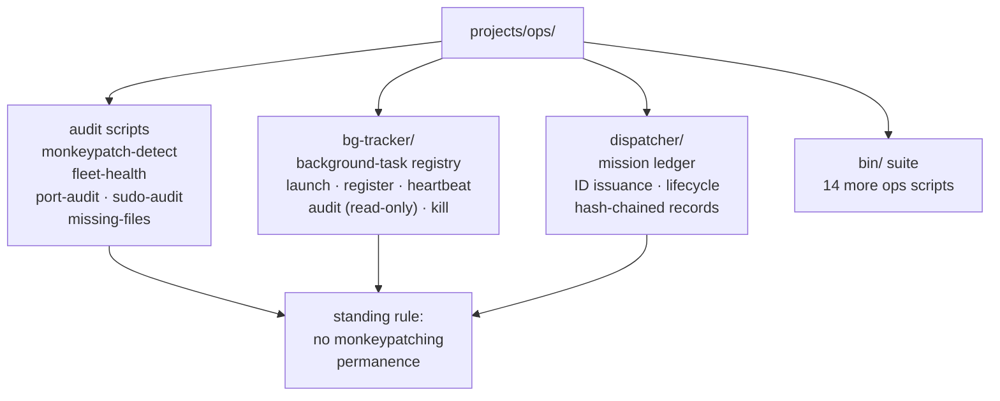

# projects/ops — estate operations tooling
  

Durable, committed home for operations scripts that used to live as `/tmp`
scratch, one-off bridge commands, or hand-applied patches. Standing rules
(Chris, 2026-09-20): **no monkeypatching, permanence rule.** Every fix lives
in real files — code, configs, systemd units — committed in the correct repo,
and must survive a full bridge restart and a full yote reboot. **The script is
the deliverable; running it once is just proof.**

## Why this exists

Ops knowledge was evaporating: a `/tmp` script here, a hand-run bridge command
there, a patch applied and never committed. `projects/ops` is where the estate's
operational memory goes to *stay* — auditable, re-runnable, repo-backed.

## Tools

- **`bin/monkeypatch-detect.sh`** — hunts non-durable fixes across the estate:
  `/tmp` scripts doing production jobs, shell exports that belong in real
  config, hand-started daemons with no unit, patched files outside any repo
  (node_modules patches), symlinks into `/tmp`. Reports each with a suggested
  durable home. Exit 1 on findings, 0 when clean. Read-only — never modifies,
  kills, or restarts anything. Run anytime: `projects/ops/bin/monkeypatch-detect.sh`
- **`bin/fleet-health.sh`** — one-shot fleet channel health audit: flags
  stuck/silent/dead agents (joined but never reported), erroring loops, and
  watchdog template-spam. Exit 1 on findings, 0 when clean. The deliverable; a
  health pass is just its first run. Run anytime:
  `projects/ops/bin/fleet-health.sh [--hours 24]`
- **`bin/bg-launch`, `bin/bg-register`, `bin/bg-heartbeat`, `bin/bg-audit`,
  `bin/bg-kill` + `bg-tracker/`** — **bg-tracker**: the background-task registry.
  Every detached job launches (or retro-registers) through it; who/what/why/pid
  recorded in a durable per-box registry (`bg-tracker/state/`, gitignored
  runtime state). `bg-audit` is read-only: classifies every detached proc
  (KNOWN-SYSTEM / SUPERVISED / REGISTERED-OK / REGISTERED-STALE / REGISTERED-DEAD /
  UNREGISTERED / AMP-VICTIM), exit 1 when anything needs attention, never kills.
  Event-driven — no polling daemons. Full docs: `bg-tracker/README.md`. Kill
  policy: positive orphan confirmation + fleet evidence note at kill time; when
  in doubt, leave running and flag
- **`dispatcher/`** — **fleet dispatcher/ledger (canonical)**: mission /
  coordinator / worker / relay ID issuance, lifecycle + result tracking,
  direct-Chris precedence (chris-direct preempts coordinator/oracle/agent),
  duplicate-admission locks, append-only hash-chained relay records,
  artifact/commit aggregation, automatic relay archival on completion, and
  exactly-four-audit-lanes enforcement (`dispatch`, `lifecycle`, `artifact`,
  `governance`). CLI: `projects/ops/dispatcher/bin/dispatch`
  (`admit-mission`, `admit-worker`, `transition`, `result`, `manifest`,
  `audit`, `intake`). File-based state (`dispatcher/state/`, gitignored) —
  survives restarts and reboots with no daemon. Full docs: `dispatcher/README.md`.
  Tests: `python3 -m unittest discover -s tests` from `projects/ops/dispatcher/`
- **`bin/` audit suite** (see `bin/README.md`): `sudo-audit.sh` (pack action
  posture: passwordless sudo scope, key paths/permissions, shared-tree
  ownership, daemon management without interactive auth) · `missing-files.sh`
  (files the system *references* but that don't exist — systemd units, live
  configs, docs) · `port-audit.sh` (yote fixed-port sprawl vs SSOT
  `config/ports.env`, pitchfork ready_http claims, Tailscale Serve backend map)
  · `readme-linkcheck.sh` (no stale links in READMEs) · `rg-scope` ·
  `yote-batch` · `hesitance-scan.sh` · `runner-audit.sh` · `stale-hunter.sh` ·
  `stall-detect.sh` · `watchdog-audit.sh` · `orphan-hunt.sh`
- **`stall-detect/`** — stall detection (`queries.sql`, `README.md`)
- **`RUNNERS.md`, `runner-audit.md`** — runner inventory and audit notes



## Quick start

```bash
projects/ops/bin/fleet-health.sh --hours 24   # is the fleet healthy?
projects/ops/bin/monkeypatch-detect.sh        # any non-durable fixes lurking?
projects/ops/dispatcher/bin/dispatch manifest # current mission ledger
```

## Architecture

Read-only by default: `monkeypatch-detect.sh` and `fleet-health.sh` never
modify, kill, or restart anything — they report with exit 1 on findings.
`bg-audit` classifies but never kills. State (`bg-tracker/state/`,
`dispatcher/state/`) is file-based and gitignored: durable across restarts and
reboots, no daemon required. See the repo master README for the estate map and
`docs/fleet-knowledgebase.md` §2 for the crew registry.

## Config

No central config. Scripts run on yote (CachyOS) against the live estate:
systemd units, `herd.yaml`, `pitchfork.toml`, `config/ports.env`. The dispatcher
CLI is self-contained under `dispatcher/bin/`.

## Dev / contributing

- The script is the deliverable. A one-off `/tmp` run is not done until the
  script is committed here
- New audit scripts: exit 1 on findings, 0 when clean; `--json` where machine
  output is useful (see `sudo-audit.sh`, `port-audit.sh`)
- Dispatcher changes: `python3 -m unittest discover -s tests` from
  `projects/ops/dispatcher/` must stay green
- Kill policy (bg-tracker): positive orphan confirmation + fleet evidence note
  at kill time; when in doubt, leave running and flag

## License & security

Unlicensed — internal estate operations code in the private
[toxicwind/sovereign-projects](https://github.com/toxicwind/sovereign-projects) repo.
Security: these scripts read the estate broadly (units, configs, processes) —
run them on yote only, from this repo, never as copies in `/tmp`. Audit output
can name hosts, ports, and processes: keep it inside the estate, never in public
reports or pastes.

---
*Up: [projects/](../README.md) · [repo master README](../../README.md) · [fleet knowledgebase](../../docs/fleet-knowledgebase.md)*
