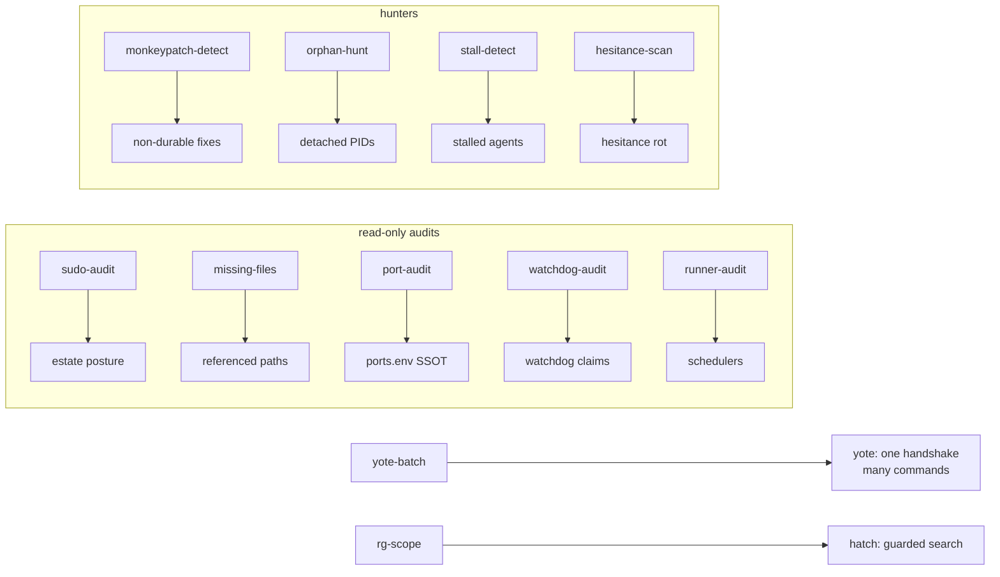

# projects/ops/bin/ 🧰


> **Permanent operations scripts for the fleet.** Runnable by anyone,
> anytime, on yote (CachyOS). **The script is the deliverable**; a one-off
> run is just proof. Audits report claim-vs-reality and exit non-zero on
> findings — they never mutate, never kill.

## Audit scripts (read-only)

| Script | What |
|---|---|
| `sudo-audit.sh` | Verifies the pack's action posture: passwordless sudo scope, key paths + permissions, shared-tree ownership (`/home/toxic/sovereign`, `/home/toxic/.tau`), pitchfork/systemd daemon management without interactive auth. Reports blockers; exit 1 if any. `--json` for machine output. |
| `missing-files.sh` | Finds files the system REFERENCES but that don't exist: greps systemd units (Exec\*/EnvironmentFile/WorkingDirectory), live configs (`herd.yaml`, `pitchfork.toml`, `ports.env`, …), and docs (`*.md`) for paths, then checks each exists. Prints `MISSING <path>` with the referencing file, line number, and line. `--units` / `--configs` / `--docs` / `--quiet`. |
| `port-audit.sh` | Audits yote fixed-port sprawl: snapshots live TCP listeners via `ss`, cross-references `config/ports.env` (SSOT), `pitchfork.toml` ready_http claims, and the Tailscale Serve backend map; flags duplicate holders, rogue listeners, dead claims, dangling backends (502s), duplicate SSOT names, and EADDRINUSE bind failures. Exit 1 on any finding. `--json` for machine output. |
| `monkeypatch-detect.sh` | Hunts non-durable fixes across the estate — Chris's standing rule is NO MONKEYPATCHING: every fix must live in real files. |
| `watchdog-audit.sh` | Claim-vs-reality audit for every watchdog/supervisor/health-check on hatch and yote. A watchdog that reports healthy while its target is dead, idle, or never ran is FAKE. |
| `runner-audit.sh` | Enumerates every task runner/scheduler on hatch + yote, checks alive/claim/reality per runner, reports broken/dead/duplicates in a table. Exit 0 = all healthy, exit 1 = findings. |
| `fleet-health.sh` | One-shot fleet channel health audit — reads the squawk fleet channel on yote and flags problems. |
| `orphan-hunt.sh` | Finds detached PIDs, stale pid/lock files, zombie tmux sessions, dead-but-"running" daemons on hatch and yote. Every finding carries a suggested disposition: CLEAN (safe to remove) or ADOPT (document/keep deliberately). |
| `stale-hunter.sh` | Automatic triage of stale herd worktree/merge litter. |
| `stall-detect.sh` | Diagnose-only stall/idle detector for the agent fleet. HARD RULE: this script NEVER kills, stops, closes, or restarts anything. |
| `hesitance-scan.sh` | Estate hesitance-rot detector — the canonical hesitance guard for the fleet. |
| `readme-linkcheck.sh` | Permanent, re-runnable README link checker for the estate. Scans every README (and the fleet knowledgebase) for Markdown links and reports dead ones. |

## Execution tools

| Script | What |
|---|---|
| `yote-batch` | Runs many yote commands in ONE bridge exec (one WS handshake). Each `yote-conn exec` costs a full python3 + WS round-trip (~250ms+); this pays it once. |
| `rg-scope` | Guarded, deduplicated ripgrep for the 2-vCPU hatch cell. Kills two pathologies seen 2026-09-20: unscoped `rg /` scans and N agents running the SAME search concurrently (cell hit 9x load). |
| `bg-launch` / `bg-register` / `bg-heartbeat` / `bg-audit` / `bg-kill` | The [bg-tracker](../bg-tracker/) background-task registry suite: the ONE correct launcher, retro-registration, task-pushed heartbeats, read-only audit, PID-reuse-guarded kill. |

## Architecture



## Quick Start

```bash
./sudo-audit.sh        # verify the pack can act: sudo, keys, daemon control
./port-audit.sh        # ports vs SSOT: duplicates, rogues, dangling backends
./missing-files.sh     # references that point at nothing
```

## Config

The audit scripts read estate state, not config files: `ss` for listeners,
`config/ports.env` as the port SSOT, `pitchfork.toml` for daemon claims, the
Tailscale Serve backend map, systemd units, and live configs. `--json` on
`suspicion` scripts (`sudo-audit.sh`, `port-audit.sh`) for machine output.

## Dev

Every script is standalone bash with a header comment stating its contract.
Conventions: exit 1 on findings, `--json` for machine output where it
matters, read-only by default (audits never kill, never mutate — `stall-detect.sh`
states its NEVER-kills rule explicitly).

Related docs:

- Estate map, crews, repo index, standing rules: [`docs/fleet-knowledgebase.md`](../../../docs/fleet-knowledgebase.md)
- Hardware audit schema (consumed by `hw-audit.service`): [`docs/HARDWARE_AUDIT_20260914.md`](../../../docs/HARDWARE_AUDIT_20260914.md)
- hw-audit masters: [`../../yote/ops/hw-audit/`](../../yote/ops/hw-audit/)
- Master README: [`../../../README.md`](../../../README.md)

## License & Security

Part of the sovereign estate (see repo root). **Security posture:** the
audit scripts are read-only — they report claim-vs-reality and exit 1 on
findings, never mutate state and never kill processes. `bg-kill` (via
bg-tracker) is the only script here that terminates anything, and only by
registry id with a PID-reuse guard. `yote-batch` multiplexes commands over
one authenticated bridge handshake — it doesn't widen access, it just pays
the handshake cost once.
