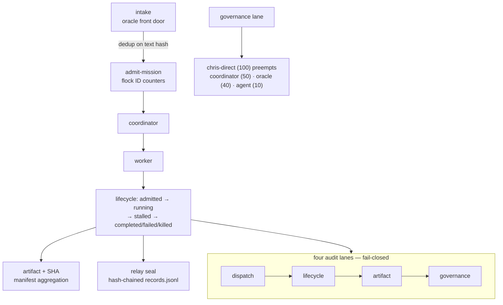

# Fleet dispatcher/ledger 📋


> **The canonical dispatcher and audit ledger for Chris's agent fleet.**
> One place that answers: **who was admitted to do what, what happened,
> what got built, and who overrode whom.** ID issuance, lifecycle + result
> tracking, duplicate-admission locks, hash-chained audit lanes, artifact
> aggregation — all files, no daemon, no timers.

## Features

- 🆔 **Atomic ID issuance** — `mission` / `coordinator` / `worker` / `relay` IDs, flock counters, O_EXCL relay claims (unique, not gapless, by design)
- 📈 **Lifecycle tracking** — `admitted → running → stalled → completed | failed | killed`; results carry success flags, summaries, artifacts, commit SHAs
- ⚖️ **direct-Chris precedence, enforced in code** — `chris-direct` (100) preempts `coordinator` (50), `oracle` (40), `agent` (10)
- 🔒 **Duplicate-admission locks** — a dedup key admits exactly once while its lock is live; stale locks reclaimed, lower-precedence retries refused fail-closed
- ⛓️ **Append-only relay records** — each relay owns a hash-chained `records.jsonl`; writers only append, readers never mutate
- 📦 **Artifact/commit aggregation** — per-result artifact + SHA registration (SHAs validated), mission-level manifests
- 🗄️ **Automatic relay archival** — a worker/coordinator's relay seals the moment its result is recorded. No timers, no sweeps; `archive-sweep` exists only as idempotent repair
- 🛡️ **Exactly-four-audit-lanes enforcement** — `Ledger.append(lane, ...)` raises `LaneViolation` for anything outside the canonical four, fail-closed

## Architecture



## The four audit lanes

| Lane | Records | Answers |
|---|---|---|
| `dispatch` | admissions, assignments, intake decisions/refusals/duplicates | who was told to do what |
| `lifecycle` | transitions, results, relay seals | what happened over time |
| `artifact` | artifact + commit registrations, mission manifests | what got built, where it lives |
| `governance` | lock acquired/refused/preempted/reclaimed, chris-direct overrides, relay archival | who overrode whom, why work was refused |

`Ledger.append(lane, ...)` raises `LaneViolation` for anything else.
`dispatch audit` replays every chain and re-checks every lane.

## ID scheme

```text
mission:     m-<slug>-<yyyymmdd>-<seq>     m-dispatcher-20260921-001
coordinator: c-<name>-<seq>                c-pack-keeper-004
worker:      w-<name>-<seq>                w-stall-slayer-012
relay:       relay-<agent-name>             relay-stall-slayer
             (re-entrant name → relay-<name>-2, claimed atomically)
```

IDs are unique, not gapless: a refused duplicate admission mints an ID and
then refuses it, burning one counter step. The ID is never registered
(no entity file, no ledger record), so gaps are harmless by design.

## Quick Start

```bash
bin/dispatch --state ./state admit-mission --slug demo --origin chris-direct --brief "prove the loop"
bin/dispatch --state ./state admit-worker --name probe --mission m-demo-20260929-001 --origin coordinator --brief "forensics"
bin/dispatch --state ./state audit
```

## State layout

```text
projects/ops/dispatcher/state/        ← runtime state, gitignored
  ledger.jsonl                          fleet ledger (hash-chained)
  entities/<entity-id>.json             one file per mission/coordinator/worker
  locks/<sha1(dedup)>.lock              admission locks (heartbeated)
  counters/*.ctr                        flock-guarded ID counters
  relay-claims/relay-<name>             atomic relay claims
  relays/<relay-id>/records.jsonl      relay's own hash-chained log
  relays/<relay-id>/summary.json        written once at seal
  relays/archive.jsonl                  global archival index
```

Everything is files. Kill the process, reboot the box, construct a new
`Dispatcher` on the same dir — IDs continue, locks hold, the ledger chain
continues. There is no in-memory state that matters and no daemon to restart.

## CLI

```bash
bin/dispatch --state <dir> admit-mission --slug dispatcher \
  --origin chris-direct --brief "build the ledger"
bin/dispatch admit-worker --name stall-slayer --mission m-dispatcher-20260921-001 \
  --origin coordinator --brief "forensics" --coordinator c-pack-keeper-004
bin/dispatch transition --id w-stall-slayer-012 --to running
bin/dispatch result --id w-stall-slayer-012 --success true --summary "done" \
  --artifact projects/ops/stall-detect/queries.sql --commit 0eb76b496d
bin/dispatch status [--id w-stall-slayer-012]
bin/dispatch manifest --mission m-dispatcher-20260921-001
bin/dispatch audit            # verify all chains + lanes; exit 1 on break
bin/dispatch archive-sweep    # idempotent repair for unsealed terminal relays
bin/dispatch intake --from ember --text "probe herd health" --origin agent
```

Exit codes: 0 ok · 3 duplicate-admission · 4 unknown-entity ·
5 illegal-transition · 6 bad-request.

## Intake hook

`intake_submit({"from","text","origin"})` is the admission endpoint for the
oracle front door (see lane-oracle-connector): non-empty requests become
missions deduped on text hash; empties are refused; repeats report the
existing holder. Full triage (TASK/DEBATE/RESEARCH/…) stays in
`agents/oracle-market/bin/oracle_intake.py` — this is the dispatch side.

## Config

One thing: `--state <dir>` (or the equivalent env/config) points at the
runtime state directory. Everything else is committed code — no timers, no
polling; the CLI runs on events and heartbeats are caller-driven.

## Boundaries (borrowed, not duplicated)

- `tools/sovereign-chat/dispatch.ts` — sovereign-chat's **internal** lease queue (bun:sqlite, wedge semantics). Task-level, inside the chat process. This dispatcher is fleet-mission level, above it.
- `fleet/dispatch_fallback.py` — client-side fallback that queues dispatch frames to the directives file when the chat server is unreachable. Complementary transport, not a ledger.
- `agents/oracle-market/` — the oracle market loop: task bidding, intake triage, bidder workers. Its `bin/oracle_loop.py` tracks market tasks; this dispatcher tracks fleet missions/coordinators/workers and their relays. The intake hook above is the seam between them.

## Dev

```bash
cd projects/ops/dispatcher && python3 -m unittest discover -s tests -v
```

Stdlib only. Covers: ID uniqueness (incl. 8-thread races), relay claim
races, duplicate-admission (incl. 12-thread race), chris-direct preemption,
stale-lock reclaim, four-lane enforcement, chain tamper detection,
read-only readers, full worker lifecycle, illegal transitions, stall
recovery, SHA validation, manifest aggregation, archive-sweep repair,
intake dedup, and restart continuity (new `Dispatcher`, same dir).

Durability: no daemons, no timers, no polling — heartbeats are
caller-driven. Restart test: `tests/test_dispatcher.py::TestRestart` proves
a fresh process continues IDs, locks, and the ledger chain on the same state
dir. Survives full yote reboot: state is on disk under `state/`
(gitignored runtime state, like `bg-tracker/state/`); code + tests are
committed.

See also: [`docs/fleet-knowledgebase.md`](../../../docs/fleet-knowledgebase.md) §2 (crew registry),
[`docs/spawn-brief-template.md`](../../../docs/spawn-brief-template.md) (briefs this dispatcher admits),
[`projects/ops/README.md`](../README.md).

## License & Security

Part of the sovereign estate (see repo root). **Security posture:** the
ledger is hash-chained and append-only — tampering is detected by `dispatch
audit`, not silently absorbed. Precedence is enforced in code, not policy
docs: `chris-direct` preempts everything, duplicate admissions fail closed,
and `LaneViolation` rejects any audit write outside the four canonical
lanes. State is gitignored runtime data; the repo carries code + tests only.
