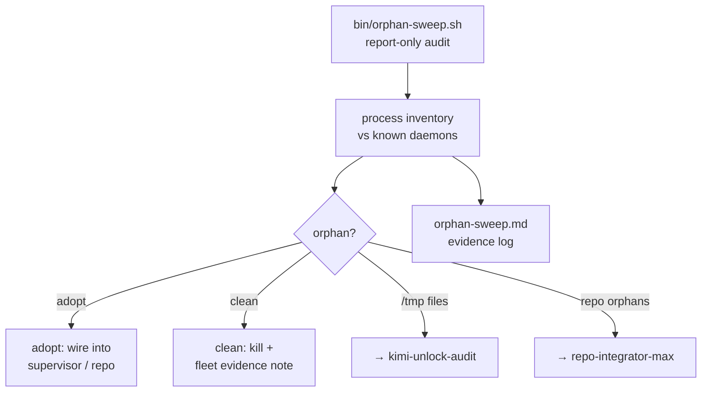

# pack-fix — orphan-hunting crew
 

Orphan-hunting crew: find orphaned stuff on yote and the cell — adopt it or
clean it. Never leave a reorg half-done.

## Why this exists

Reorgs leave bodies: processes nobody owns, pid files pointing at the dead,
`/tmp` triage nobody claimed, repo orphans that never landed anywhere. pack-fix
is the crew that walks the estate with a flashlight — inventory first, then
adopt or clean, never just report.

## Lane

Per Chris: **yote processes only** — process inventory vs known daemons, stale
pid files. `/tmp` file triage → kimi-unlock-audit; repo orphan integration →
repo-integrator-max.



## Features

- **`bin/orphan-sweep.sh`** — permanent, repeatable process-orphan audit.
  **Report-only**; disposition (adopt/kill) is announced in the fleet channel
- **`bin/runner-inventory.sh`** — runner inventory support script
- **`orphan-sweep.md`** — evidence log of the 2026-09-20 sweep
- **`hesitance-patterns.md`** — hesitance pattern notes for the crew
- **`runner-audit.md`** — runner audit notes

## Quick start

```bash
bash bin/orphan-sweep.sh   # report-only orphan audit (disposition goes to fleet)
bash bin/runner-inventory.sh
cat orphan-sweep.md        # evidence from the 2026-09-20 sweep
```

## Architecture

The sweep compares the live process table against the known-daemon inventory
and flags orphans; stale pid files get the same treatment. Findings are written
up in `orphan-sweep.md` as evidence. Triage routing is by kind: `/tmp` files to
kimi-unlock-audit, repo orphans to repo-integrator-max, yote processes handled
here. Kill decisions require positive orphan confirmation and a fleet evidence
note — when in doubt, leave running and flag.

## Config

No config files. The known-daemon inventory is the estate's live supervisor
state (pitchfork/systemd); the sweep reads it, never writes it.

## Dev / contributing

- The sweep stays **report-only**: disposition happens in the fleet channel,
  never inside the script
- Every sweep run appends its evidence to `orphan-sweep.md` — the log is the audit
- Never leave a reorg half-done: adopted orphans get wired into a supervisor
  or a repo in the same pass

## License & security

Unlicensed — internal estate operations code in the private
[toxicwind/sovereign-projects](https://github.com/toxicwind/sovereign-projects) repo.
Security: process tables name everything running on the box — keep sweep output
inside the estate. The sweep is read-only by design; kills need fleet evidence
first.

---
Docs: [sovereign docs](../../docs/) · [master README](../../README.md) ·
[fleet knowledgebase](../../docs/fleet-knowledgebase.md) · Up: [projects/](../README.md)
