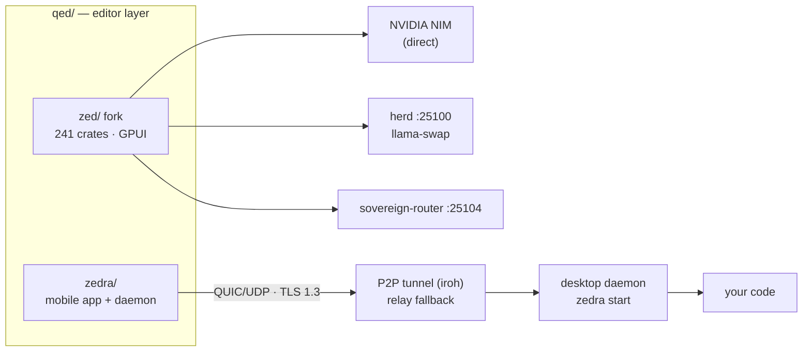

# QED — AI-Native Editor Workspace

<div align="right">


</div>

**The editor layer of the sovereign stack — a customized Zed for the desktop, and Zedra for editing from your phone.** One workspace, two surfaces: the full-power fork where you work at your desk, and a GPU-accelerated mobile editor that reaches your desktop over an encrypted P2P tunnel. If the editor can't talk to your models and your phone can't reach your code, this is the layer that fixes both.

## What's here

- **`zed/`** — the `toxicwind/zed` fork: 241 Rust crates, GPUI rendering, wired to the sovereign provider set
  - Custom providers: **NVIDIA NIM (direct)**, MCP-proxy-hardened **OpenAI-compatible providers**, tool-schema normalizers
- **`zedra/`** — vendored upstream **zedra**: mobile-first remote editor + desktop daemon
  - GPU-accelerated rendering (Zed's GPUI), P2P tunnel over **QUIC/UDP (iroh)**, **TLS 1.3** end-to-end
  - 7 Rust crates (`zedra`, `zedra-osc`, `zedra-rpc`, `zedra-session`, `zedra-telemetry`, `zedra-terminal`, `zedra-host`) + TypeScript packages (biome lint/format)
- **`ZED_SYNC.md`** — the strategy for the embedded zed snapshot ↔ fork sync (subtree graft, not yet executed)

## Architecture



The zed fork speaks to the same inference fabric as the rest of the estate (herd on `:25100`, sovereign-router on `:25104`, NIM direct) — editor settings live in `~/.config/zed/settings.json`, not in this tree. Zedra's Rust workspace resolves against the canonical `qed/zed` tree (no `vendor/` copy); the mobile-only GPUI crates (`gpui_android`, `gpui_wgpu`, `gpui_ios`) exist in no local zed tree and are commented out in `zedra/crates/zedra/Cargo.toml` — host (linux/macos) builds check clean. Re-enable them with a mobile-capable zed vendor checkout for Android/iOS builds.

## Quick Start

```bash
cargo check --manifest-path qed/zed/Cargo.toml --package zed
bun --cwd qed/zedra run check
cargo check --manifest-path qed/zedra/Cargo.toml --workspace
```

## Config

| Surface | Where | Notes |
|---|---|---|
| Zed settings | `~/.config/zed/settings.json` | Provider keys and model picks live here, not in the repo |
| Zedra daemon | `zedra setup` / `zedra start --detach` | Pairs the phone app via QR code; see `zedra/README.md` |
| Mobile GPUI crates | `zedra/crates/zedra/Cargo.toml` | `gpui_android`/`gpui_wgpu`/`gpui_ios` commented out until a mobile-capable zed vendor checkout exists |

## Dev / Contributing

- **Zed fork** — standard Cargo workspace. `cargo check --manifest-path qed/zed/Cargo.toml --package zed` is the fast gate; full builds are heavy (241 crates, GPUI).
- **Zedra TypeScript** — `bun --cwd qed/zedra run check` (biome lint + format, runs `biome ci packages/`).
- **Zedra Rust** — `cargo check --manifest-path qed/zedra/Cargo.toml --workspace` covers all 7 crates.
- Sub-docs: `zedra/README.md` (mobile app + daemon), `zedra/deploy/relay/README.md` (self-hosted relay fleet), `zedra/packages/relay-check/README.md` + `zedra/packages/relay-monitor/README.md` (relay observability), `zedra/examples/webview-tunnel/README.md` (tunnel test app).

## License + Security

- **`zed/`** — GPL-3.0-or-later (`LICENSE-GPL`; Apache-2.0 parts under `LICENSE-APACHE`), same as upstream Zed.
- **`zedra/`** — MIT © Tan Le (`zedra/LICENSE`).
- **Security posture:** zedra traffic is TLS 1.3 end-to-end with a zero-trust model — no credentials leave your device. Relay fallback (see `deploy/relay/`) is only used when direct P2P hole-punching fails behind symmetric NAT/CGNAT. Security concerns about zedra: `tanle@zedra.dev`.
