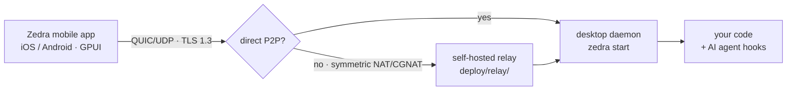

# Zedra

<div align="right">


</div>

**Your code, on your phone, with your desktop doing the work.** Zedra is an experimental remote code editor for mobile with GPU-accelerated rendering powered by Zed's GPUI — read code, view changes, and run AI agents from your phone over a secure P2P tunnel. No cloud in the middle: your phone talks to your desktop directly, encrypted end-to-end.


## Download App

- **iOS** — [AppStore](https://apps.apple.com/vn/app/zedra-code-from-anywhere/id6760534630) or [TestFlight](https://testflight.apple.com/join/1EWe2kRH)
- **Android** — [Google Play](https://play.google.com/store/apps/details?id=dev.zedra.app)

## How It Works



1. `zedra start` runs a lightweight daemon on your desktop
2. Phone and desktop discover each other automatically — direct P2P, relay fallback
3. All traffic is encrypted end-to-end with TLS 1.3. No credentials leave your device

Note: Zedra uses direct P2P connections when possible, but may fall back to relays if blocked by `Symmetric NAT` or `CGNAT` (common in home networks). Works best on LANs and supported relay regions. For high latency issues, please reach out. Learn more: [How NAT traversal works](https://tailscale.com/blog/how-nat-traversal-works)

## Quick Start

```bash
curl -fsSL zedra.dev/install.sh | sh
zedra setup
zedra start --detach
```

Then scan the QR code with the Zedra app. That's it.

### Desktop daemon — full setup

**macOS/Linux**

```shell
curl -fsSL zedra.dev/install.sh | sh
# Install agent hooks for notification
zedra setup
# Start daemon in working directory
zedra start --detach
```

**Windows**

```powershell
irm https://zedra.dev/install.ps1 | iex
zedra start --detach
```

**Claude Code**

```shell
# Config Zedra skills, hooks for Claude
zedra setup claude
# In Claude Code, reload plugins and start Zedra
/zedra-start
```

**Codex**

```shell
# Config Zedra skills, hooks for Codex
zedra setup codex
# In Codex, reload plugins and start Zedra
$zedra-start
```

## Config

| Surface | What | Where |
|---|---|---|
| Daemon pairing | QR code scan in the mobile app | `zedra start --detach` in your working directory |
| Agent hooks | Notifications + skills for your coding agent | `zedra setup` (plain), `zedra setup claude`, `zedra setup codex` |
| Relay fleet | Self-hosted iroh-relay for NAT fallback | [`deploy/relay/README.md`](deploy/relay/README.md) |
| Relay observability | SSH health CLI + Docker sidecar monitor | [`packages/relay-check/README.md`](packages/relay-check/README.md), [`packages/relay-monitor/README.md`](packages/relay-monitor/README.md) |

## Dev / Contributing

- **TypeScript** — `bun run check` (biome lint + format; `biome ci packages/`).
- **Rust** — `cargo check --manifest-path Cargo.toml --workspace` (7 crates: `zedra`, `zedra-osc`, `zedra-rpc`, `zedra-session`, `zedra-telemetry`, `zedra-terminal`, `zedra-host`).
- Host (linux/macos) builds check clean; the mobile-only GPUI crates (`gpui_android`, `gpui_wgpu`, `gpui_ios`) are commented out in `crates/zedra/Cargo.toml` until a mobile-capable zed vendor checkout exists.
- Tunnel testing — [`examples/webview-tunnel/README.md`](examples/webview-tunnel/README.md): a self-contained localhost app that proves the in-app webview's SOCKS tunnel forwards real TCP streams.

## Status

Zedra is under active development. Core features are stable and in use — bugs, rough edges, and breaking changes should be expected. Feedback and issues are welcome on [GitHub](https://github.com/tanlethanh/zedra/issues).

## License + Security

MIT © [Tan Le](https://github.com/tanlethanh) — see [`LICENSE`](LICENSE).

**Security note:** Zedra is early, but it is designed around the most secure approach available: end-to-end encryption, direct connection, zero-trust model. If you have any security concern, email [tanle@zedra.dev](mailto:tanle@zedra.dev) — support is offered to bring Zedra into your workflow with trust.
