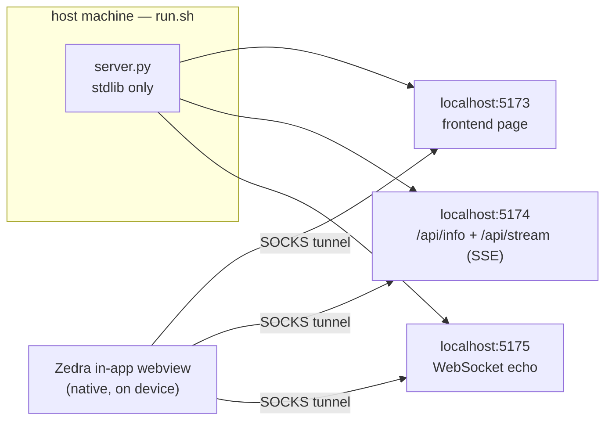

# Webview tunnel test app

<div align="right">


</div>

**A self-contained localhost web app for manually testing the Zedra in-app webview and its SOCKS tunnel.** One page proves the tunnel forwards real TCP streams across ports — not just simple HTTP. It runs three loopback servers, so a single test run exercises HTTP, SSE streaming, and long-lived WebSocket echo through the tunnel. Pure Python standard library, no dependencies (Python 3.8+).

| Port | What |
|---|---|
| `http://localhost:5173` | Frontend page (the URL you open in Zedra) |
| `http://localhost:5174` | Backend API — `/api/info` (JSON) and `/api/stream` (SSE) |
| `ws://localhost:5175` | WebSocket echo |

## Architecture



## Quick Start

```bash
./examples/webview-tunnel/run.sh
printf 'http://localhost:5173\n'
```

On the host machine the Zedra app connects to, run `run.sh`. Then from a Zedra terminal on the device, print the URL — tap the underlined link and the page opens in the in-app webview through the tunnel.

## What to check

- **Page loads** in the native webview (Safari-style bottom bar: back / forward / address pill with lock + reload / share / close).
- **Backend API**: the "BACKEND API" card turns `ok` after tapping *Call /api/info* — proves a second localhost port is reachable.
- **SSE**: the "SERVER-SENT EVENTS" card shows a rising tick count — proves streaming responses survive the tunnel.
- **WebSocket**: the "WEBSOCKET ECHO" card shows `connected`, and *Send* echoes your text back — proves long-lived bidirectional streams.
- **Navigation**: the internal link loads Page 2 and back works.
- **Address bar**: tap the address pill, type a host (e.g. `localhost:5174/api/info`), press Go — it navigates; the field lifts above the keyboard.

## Native JS bridge (optional)

The page also probes `window.zedra` / `window.webkit.messageHandlers.zedra`. The plain tunnel does **not** wire a bridge, so the "NATIVE JS BRIDGE" card shows `absent` — that is expected.

To see the bridge light up (`present`, messages posted to Rust, `window.zedraSetStatus` driven from `eval_js`), open this page from a webview configured with `on_message`/`inject_js` — see the **Settings → Developer → Webview** test item and `docs/WEBVIEW.md`.

## Dev / Contributing

- `server.py` is stdlib-only by design — no `pip install` step, no venv, runs on any Python 3.8+.
- `run.sh` starts all three loopback servers; keep the port triple (5173/5174/5175) stable — the tunnel tests assume it.

## License + Security

MIT (see [`LICENSE`](../../LICENSE)).

**Security posture:** everything binds loopback only — the test app is unreachable from the network by construction. It exists to exercise the tunnel, not to serve traffic.
