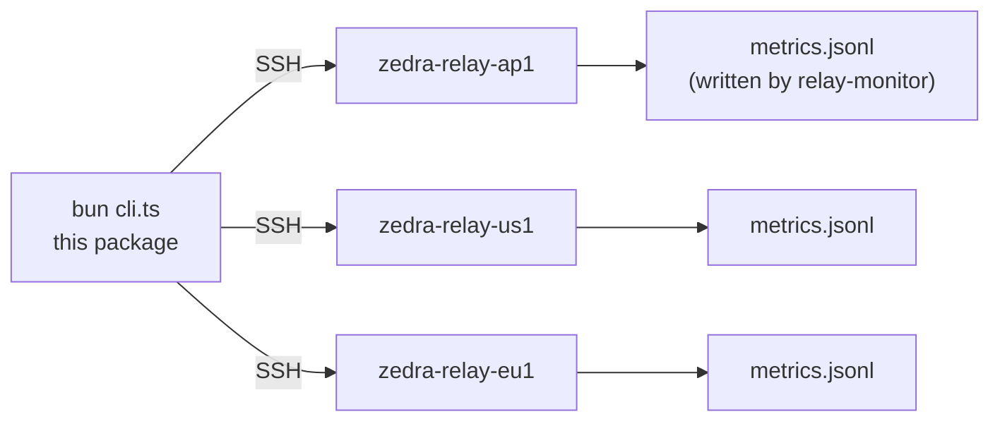

# relay-check

<div align="right">


</div>

**Run on your machine — SSH to the relay VMs and print live metrics or history.** The relay fleet lives on cloud instances; this is the laptop-side CLI that reaches into each one over SSH and shows you what's happening right now (or the last 24h from the metrics log). History is written by the [`relay-monitor`](../relay-monitor/README.md) sidecar.

## Architecture



Each instance must resolve as SSH host `zedra-relay-<instance>` in `~/.ssh/config` (see [`deploy/relay/README.md`](../../deploy/relay/README.md) for the alias setup).

## Quick Start

```bash
INSTANCES=sg1,us1,eu1 bun cli.ts
INSTANCES=sg1,us1,eu1 bun cli.ts ap1
INSTANCES=sg1,us1,eu1 bun cli.ts --history
```

## Usage

```bash
INSTANCES=sg1,us1,eu1 bun cli.ts          # live metrics, all instances
INSTANCES=sg1,us1,eu1 bun cli.ts ap1      # live metrics, one instance
INSTANCES=sg1,us1,eu1 bun cli.ts --history       # last 24h from metrics.jsonl
INSTANCES=sg1,us1,eu1 bun cli.ts ap1 --history 6 # last 6h, one instance
```

## Config

| Env / arg | Purpose |
|---|---|
| `INSTANCES` | Comma-separated instance list (`sg1,us1,eu1`); each becomes SSH host `zedra-relay-<instance>` |
| `<instance>` positional | Check a single instance |
| `--history [hours]` | Read `metrics.jsonl` history instead of live metrics (default 24h) |

## Dev / Contributing

- Bun + TypeScript (`cli.ts`, `package.json`, `tsconfig.json` in this package).
- Keep this package laptop-only — it must never end up in the deploy bundle (see `deploy/relay/README.md` directory structure).

## License + Security

MIT (see [`LICENSE`](../../LICENSE)).

**Security posture:** this tool only *reads* — SSH in, print metrics, leave. It uses your existing `~/.ssh/config` identities and never stores credentials. The instances it touches are the same ones `deploy/relay/deploy.sh` manages.
