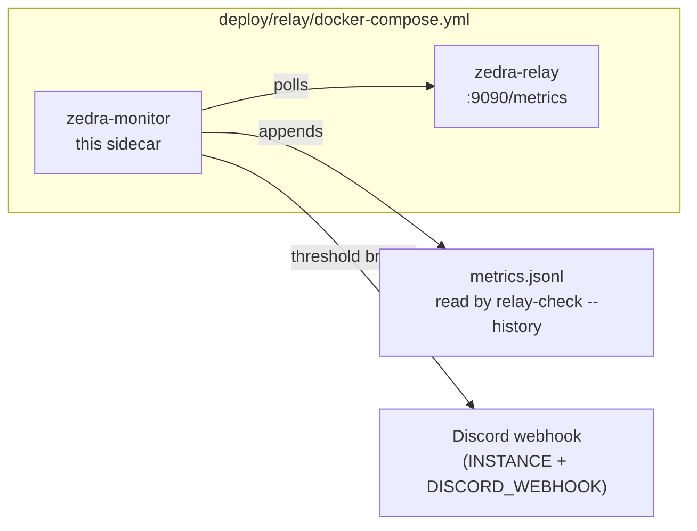

# relay-monitor

<div align="right">


</div>

**Docker-only long-running poller shipped beside `zedra-relay` on each relay VM.** It watches the relay container, appends metrics to `metrics.jsonl`, and fires Discord alerts when thresholds break — so a sick relay pages you instead of silently degrading P2P fallback. Uses `INSTANCE` + `DISCORD_WEBHOOK` from the merged `.env`.

**Local SSH checks from your laptop** (multi-instance CLI) live in [`packages/relay-check`](../relay-check/README.md).

## Architecture



## Quick Start

```bash
docker build -f Dockerfile -t zedra-monitor:latest ../..
./deploy/relay/deploy.sh --instance ap1 --service monitor
INSTANCES=sg1,us1,eu1 bun packages/relay-check/cli.ts ap1
```

## Build

The relay stack image is built by `deploy/relay/deploy.sh` (see [`deploy/relay/README.md`](../../deploy/relay/README.md)).

```bash
docker build -f Dockerfile -t zedra-monitor:latest ../..
# context: repo root; Dockerfile copies this package only
```

Or redeploy just the monitor sidecar to one instance without touching the relay container:

```bash
./deploy/relay/deploy.sh --instance ap1 --service monitor
```

## Config

| Env var | Purpose | Source |
|---|---|---|
| `INSTANCE` | Hostname suffix (`${INSTANCE}.relay.zedra.dev`) and alert identity | Injected by `deploy.sh` into the merged `.env` |
| `DISCORD_WEBHOOK` | Where threshold-breach alerts go | Your local `deploy/relay/.env` (gitignored) |

Alert thresholds are tuned in the monitor code — after changing them, redeploy with `--service monitor`.

## Dev / Contributing

- Source: `monitor.ts`, `lib.ts` in this package (Bun + TypeScript).
- The image build context is the repo root but the `Dockerfile` copies this package only — keep it that way so relay image builds stay hermetic.
- Test alerting end-to-end by temporarily lowering a threshold in your local `deploy/relay/.env`, redeploying `--service monitor`, and watching the Discord channel for the heartbeat.

## License + Security

MIT (see [`LICENSE`](../../LICENSE)).

**Security posture:** the monitor's only secret is `DISCORD_WEBHOOK`, which arrives via the merged `.env` that `deploy.sh` pushes to `/opt/zedra/deploy/relay/` on the instance — never committed, never in the image layers. It polls the relay's metrics endpoint from inside the Compose network; no inbound ports of its own.
