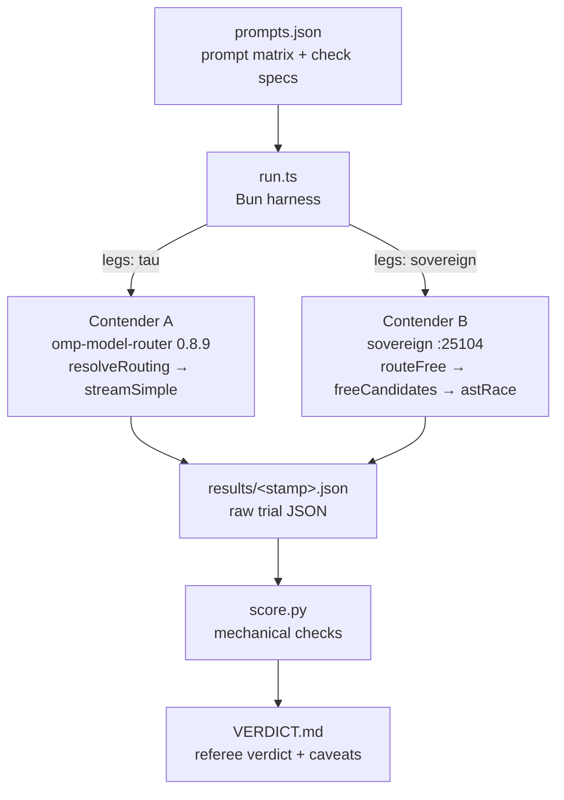

# Bake-off: TAU omp-model-router vs Sovereign router

   

> Two routers, one prompt matrix, zero hand-waving — a fair, reproducible head-to-head between TAU's routing extension and the Sovereign router, with raw JSON as the record.

## The contenders

- **Contender A — TAU/oh-my-pi's actual routing extension** (`@cakriwut/omp-model-router` 0.8.9, canonical at `/home/toxic/sovereign/tau-extensions/omp-model-router`). The bench exercises the extension's REAL routing core (`src/routing/compose.ts` `resolveRouting`: heuristic → context promotion → adaptive classifier attempt → image upgrade → tier mapping) and serves the chosen tier model through pi-ai's `streamSimple` — the same provider path the extension's own `provider.ts` uses. The only stubs are the model registry (maps `herd/*` refs to the estate's real routers) plus a Bun loader stub for `getAgentDir()`; no routing logic is stubbed or replaced.
- **Contender B — Sovereign router** (`:25104`, model `sovereign/free`): `routeFree` → `freeCandidates` → `astRace`, first-substantive-wins, with circuit breakers and local llama-swap fallback roles.



## Quick Start

```bash
cd /home/toxic/sovereign/projects/routing/bench
/home/toxic/.bun/bin/bun run.ts --prompts prompts.json --out results/$(date +%s).json --legs tau,sovereign --retries 3
python3 score.py results/<stamp>.json
```

**Bun version:** the repo pins bun 1.1.38 via `/home/toxic/sovereign/mise.toml`, but the extension's transitive `embedded-client.generated.txt` is zero bytes and older Bun loaders reject it. Run the harness with bun ≥ 1.4 (`/home/toxic/.bun/bin/bun`). This is a loader compatibility note, not a routing-code change — nothing measured is altered.

## What gets measured

Per prompt, per contender: routing decision (tier/provider/model for TAU), HTTP status + serving model (Sovereign), serve latency, time-to-first-token (TAU), raw output text, token usage, and every retry attempt. Raw JSON is the record; `score.py` applies mechanical checks (`exact`, `contains_any`, `python_fib` execution, …) and flags the rest for rubric scoring.

## Known environment substitutions (disclosed, not hidden)

- The extension's default classifier/tier models are Anthropic (`claude-haiku` etc.); no Anthropic key exists here. Tiers map to live herd models:
  high → `herd/gemini/gemini-3-flash-preview`,
  medium → `herd/beellama/qwen-flash-128k`,
  low → `herd/beellama/exaone-4-0-1-2b-iq4xs`.
- The extension's adaptive classifier was attempted with every available model and is non-functional in this environment (reasoning models burn the hardcoded 200-token budget on thinking tokens; exaone mangles the two-line verdict format). The extension's designed heuristic fallback engages — which is exactly what a user here would get. See VERDICT.md.

## Files

- `run.ts` — the runner (durable; parametrize via flags)
- `prompts.json` — the prompt matrix with check specs
- `score.py` — mechanical scoring + manual-review dump
- `failover-probe.ts` — failure injection: configures the LOW tier to a nonexistent model and observes whether the extension fails over, errors, or degrades (recon says: no failover)
- `results/` — raw trial JSON (committed; the record of what actually happened)
- `VERDICT.md` — the referee's verdict with dimensions, caveats, and score

## License and security

This harness lives in the sovereign-projects monorepo and follows its licensing; the verdict and raw results are committed as the durable record.

Security notes:

- `results/` JSON contains raw model outputs — review before sharing outside the estate.
- The harness only talks to local routers (herd `:25100`, sovereign `:25104`); no credentials leave the box.
