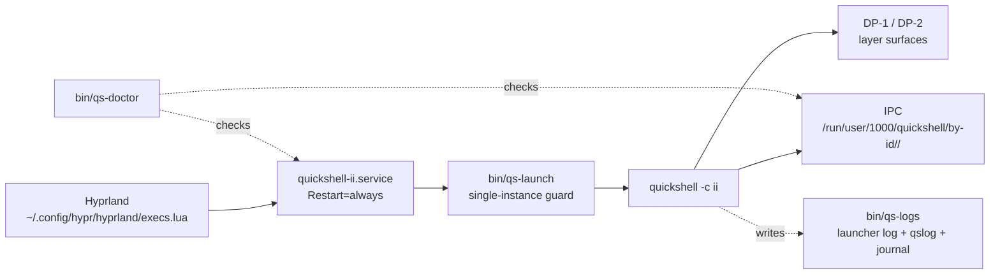

# Quickshell home — `ii`

<div align="right">


</div>

**The canonical home for Chris's `ii` quickshell desktop — the fork plus the operations layer that keeps the bar alive.** A pretty Wayland bar is worthless if it silently dies at 2am; this tree pairs the `ii` fork of end-4's illogical-impulse with a launcher, a doctor, and a systemd unit that refuses to let it stay down. Every quickshell operation goes through `bin/` — never raw commands.

## What's here

- **`bin/`** — user entrypoints. All quickshell operations go through these:
  - `qs-launch [-c ii] [--systemd]` — canonical launcher (env auto-detect, single-instance guard, detached; `--systemd` = foreground mode for the unit)
  - `qs-restart`, `qs-stop` — bounce/stop, systemd-aware
  - `qs-doctor [--repair]` — health: binary, config resolution + sha256 vs canonical repo, wayland socket, hyprland instance, process, **IPC reachability**, unit state, DP-1/DP-2 layer surfaces
  - `qs-logs [n]` — launcher log + quickshell qslog + unit journal
  - `qs-install` — idempotent install: config symlink, systemd unit, hyprland entries
  - `qs-version` — binary + config + repo pins
- **`lib/qs-common.sh`** — shared env/pid/unit helpers (sourced by `bin/*`)
- **`deploy/quickshell-ii.service`** — systemd `--user` unit (`Restart=always`, `RestartSec=2`); installed by `qs-install` to `~/.config/systemd/user/`
- **`quarantine/`** — legacy material, parked never deleted (see `quarantine/MANIFEST.md`)
- **`evidence/`** — grim DP-1/DP-2 captures per verification run
- **`AUDIT.md`** — structural inventory + IPC anomaly root cause (2026-09-19)
- **`ii/`** — the fork (submodule, remote `toxicwind/sovereign-end4`). QML/config work lives here; this redo does not touch its content. Empty in a fresh worktree until the submodule is initialized.

On the box, `/usr/local/bin/qs` delegates to `bin/qs-launch` (the old hand-rolled version is parked in `quarantine/`).

## Architecture



## Quick Start

```bash
./bin/qs-doctor
./bin/qs-restart
./bin/qs-logs
```

## Config

- **Live config** — `~/.config/quickshell` → `ii/dots/.config/quickshell` (dotbot symlink, `ii/install.conf.yaml:18`). Edits in the repo reach the live shell immediately.
- **Supervision** — Hyprland (`~/.config/hypr/hyprland/execs.lua`) starts the `quickshell-ii.service` unit on session start — idempotent, no-op when already running. The unit restarts quickshell on crash. Manual `qs -c ii` launches are single-instance guarded and converge on the same path.
- **Install / reinstall** — `bin/qs-install` is idempotent: config symlink, systemd unit, hyprland entries.

## IPC

Instance registration lives at `/run/user/1000/quickshell/by-id/<id>/`. If `qs-doctor` reports "IPC: No running instances" while the bar renders, the registration dir was lost — restart via `qs-restart` (recreates it). `qs-doctor` checks this on every run.

## Dev / Contributing

- All new entrypoints go in `bin/` and source `lib/qs-common.sh` for env/pid/unit helpers — no hand-rolled launchers (the old one is parked in `quarantine/` as a cautionary tale).
- QML and theme work belongs in `ii/` (the fork), never in the ops layer.
- Verification artifacts (grim captures) land in `evidence/` per run; structural findings go in `AUDIT.md`.

## License + Security

- The `ii/` fork tracks end-4's **illogical-impulse** (submodule `toxicwind/sovereign-end4`) — its license terms live in the submodule; check them there after init.
- The ops layer (`bin/`, `lib/`, `deploy/`) is this tree's own scripting.
- **Security posture:** scripts run as your user, hold no secrets, and touch only your own config paths. The single-instance guard prevents duplicate bars; `qs-doctor --repair` is the sanctioned remediation path — legacy material is quarantined, never deleted, so every change is reversible via `quarantine/MANIFEST.md`.
