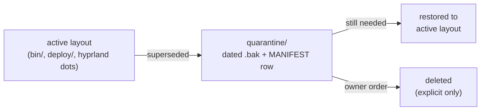

# quarantine/

<div align="right">


</div>

**The holding pen for items removed from the active layout during the 2026-09-19 redo.** Nothing here is deleted — it's parked for review before any destructive call. A quarantine with no policy is just a junk drawer; this one has exactly two exits and a manifest.

## Policy

- An item lands here with a **dated note**: what it is, why it was parked, where it came from.
- It leaves quarantine by either **(a)** being restored to the active layout, or **(b)** explicit owner order to delete.
- Every parked item is recorded in [`MANIFEST.md`](MANIFEST.md) — the manifest is the source of truth, this README is the policy.

## Currently parked

| File | Origin | Why parked |
|---|---|---|
| `qs.bak-20260919` | `/usr/local/bin/qs` before the redo (112 bytes, root-owned) | Hand-rolled pre-redo launcher (`export XDG_RUNTIME_DIR/WAYLAND_DISPLAY; exec /usr/bin/quickshell "$@"`). Superseded by the delegating wrapper → `bin/qs-launch`. Kept for provenance. |
| `execs.lua.bak-20260918T201147` | `~/.config/hypr/hyprland/execs.lua` (via ii dots) | Pre-redo Hyprland start hook: one-shot `qs -c $qsConfig`. Superseded by `systemctl --user start quickshell-ii.service`. |
| `keybinds.lua.bak-20260918T201147` | `~/.config/hypr/hyprland/keybinds.lua` (via ii dots) | Pre-redo CTRL+SUPER+R: `killall ydotool qs quickshell; qs -c $qsConfig &`. Superseded by `qs-restart -c $qsConfig`. |

## Lifecycle



## Quick Start

```bash
ls projects/shell/quarantine/
cat projects/shell/quarantine/MANIFEST.md
mv <stale-file> projects/shell/quarantine/<name>.bak-$(date +%Y%m%dT%H%M%S)
```

## Config

- **Naming** — `<original-name>.bak-<UTC timestamp>` (`%Y%m%dT%H%M%S`), matching the files already here.
- **Manifest row** — every parked file gets a row in `MANIFEST.md`: file, origin, why parked. A `.bak` without a manifest row is a policy violation.

## Dev / Contributing

- Never park a file by deleting it elsewhere first — move it, keep the bytes.
- The prior policy doc (`README.md` before this rewrite) is superseded by this file; `MANIFEST.md` stays as-is.

## License + Security

- Quarantine holds inert config backups and a retired launcher script — nothing here executes as part of the live setup; the systemd unit and `bin/qs-launch` never reference this directory.
- **Security posture:** nothing leaves quarantine without the owner. Deletion requires explicit owner order — automation may park, never purge.
