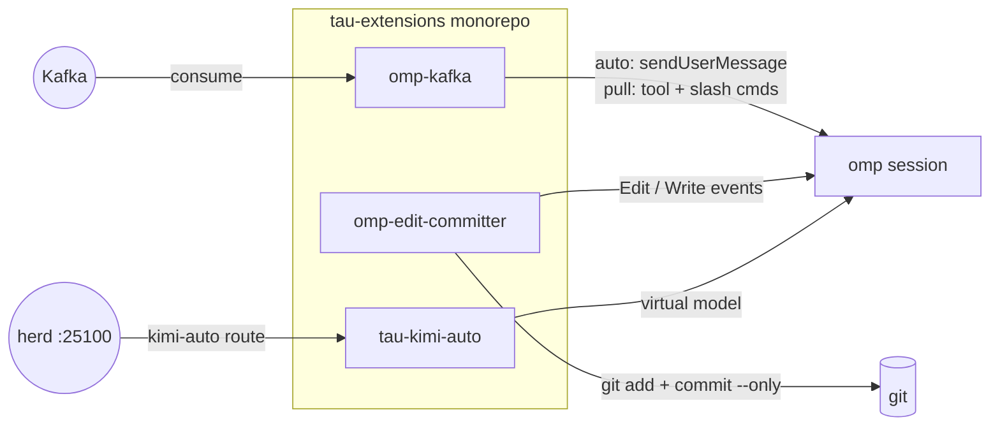

# tau-extensions

   

> Drop-in superpowers for your Tau agent session — stream Kafka topics into the conversation, or auto-commit every edit with a proper message.

[`toxicwind/tau-extensions`](https://github.com/toxicwind/tau-extensions) is a Bun-workspace monorepo of [Tau](https://github.com/can1357/oh-my-pi) (`omp`) extensions: small, sharp tools that plug straight into an agent session and disappear into the workflow. No servers to run, no daemons to babysit — link the package and the capability is just *there*.

## What's inside

- **omp-kafka** — subscribe to Apache Kafka topics and surface messages in the session: auto-push straight into the conversation, or buffer silently and pull on demand with `/kafka-*` slash commands and a `kafka_consume` LLM tool.
- **omp-edit-committer** — auto-commit every Edit/Write with a descriptive Conventional-Commits message (intent, trade-offs, ASCII diagram) and surface the SHA as a badge under the tool result. Pairs with [`modem-dev/hunk`](https://github.com/modem-dev/hunk) for rich diff review.
- **tau-kimi-auto** — registers the `kimi-auto` virtual model: herd resolves it to the best healthy Kimi model per request, Kimi-only by design (503 rather than a silent non-Kimi fallback).
- **omp-model-router** — vendored upstream copy of [`@cakriwut/omp-model-router`](https://github.com/cakriwut/omp-model-router) 0.8.9, the cost-optimized tier router used as the contender in our routing bake-off.



## Quick Start

```bash
git clone --depth 1 --filter=blob:none --sparse https://github.com/toxicwind/tau-extensions ~/.tau/agent/extensions/tau-extensions
cd ~/.tau/agent/extensions/tau-extensions/packages/omp-kafka && bun install && omp plugin link .
```

Requires `omp >= 17.0.0`. Swap `omp-kafka` for `omp-edit-committer` (or `tau-kimi-auto`) to install a different extension — same three steps.

## Packages

| Package | Status | What it does |
|---|---|---|
| [`packages/omp-kafka`](packages/omp-kafka) | ships | Kafka topics into the session — auto (push) and pull modes, `/kafka-*` commands, `kafka_consume` LLM tool |
| [`packages/omp-edit-committer`](packages/omp-edit-committer) | ships | Auto-commit every Edit/Write with intent + trade-offs + ASCII diagram; SHA badge under the tool result |
| [`packages/tau-kimi-auto`](packages/tau-kimi-auto) | in development | `kimi-auto` virtual model for Tau sessions; Tau entry declared at `src/extension.ts` |
| [`omp-model-router`](omp-model-router) | vendored upstream | `@cakriwut/omp-model-router` 0.8.9 — heuristic + LLM-calibrated tier routing with session budget tracking |

## Install options

### A — clone the monorepo and link (recommended)

```bash
git clone --depth 1 --filter=blob:none --sparse https://github.com/toxicwind/tau-extensions ~/.tau/agent/extensions/tau-extensions
cd ~/.tau/agent/extensions/tau-extensions
git sparse-checkout set packages/omp-kafka
cd packages/omp-kafka
bun install
omp plugin link .
```

Drop `--filter=blob:none --sparse` and the `sparse-checkout` lines to clone the whole monorepo.

### B — install via npm (once published)

```bash
bun add -g @toxicwind/omp-kafka
bun add -g @toxicwind/omp-edit-committer
```

Then add to `~/.tau/agent/config.yml`:

```yaml
extensions:
  - @toxicwind/omp-kafka
  - @toxicwind/omp-edit-committer
```

### C — load once for a single session

```bash
omp --extension /path/to/tau-extensions/packages/omp-kafka
omp --extension /path/to/tau-extensions/packages/omp-edit-committer
```

## Architecture

Each package is a self-contained Tau extension: a `package.json` declaring its Tau entry point, TypeScript sources, and its own tests. The monorepo root wires them together with Bun workspaces — `bun install` at the root, then `bun run --workspaces test` / `bun run --workspaces typecheck` across everything. `node_modules/` stays minimal: only declared dependencies, no transitive junk.

Extensions hook the agent lifecycle (tool events, session messages, slash commands, status widgets) — they never run as separate processes.

## Configuration

Per-extension configuration lives in each package's README:

- `packages/omp-kafka` — a single `kafka.yml` (consumers, brokers, topics, auto/pull mode); resolution order `$KAFKA_CONFIG` → `<cwd>/kafka.yml` → `<cwd>/.tau/kafka.yml` → `~/.tau/agent/kafka.yml`
- `packages/omp-edit-committer` — `OMP_EDIT_COMMITTER_DISABLED=1` / `OMP_EDIT_COMMITTER_DEBUG=1` env overrides
- `packages/tau-kimi-auto` — `KIMI_AUTO_HERD` (default `http://127.0.0.1:25100`), `KIMI_AUTO_STATE`
- `omp-model-router` — `~/.omp/agent/model-router.json` (profiles, rules, calibration, budget)

## Development

```bash
bun install
bun run --workspaces test
bun run --workspaces typecheck
```

All packages typecheck and test cleanly. Root scripts also include `lint` (`biome check packages/*/src`) and `clean`. PRs welcome — keep extensions dependency-light and document every new slash command and env var in the package README.

## License and security

MIT — see [LICENSE](./LICENSE).

Security notes:

- `omp-kafka` SASL credentials live in `kafka.yml` — treat it like a secrets file (0600, never commit a populated one).
- `omp-edit-committer` never pushes, never amends, and commits only the Edit/Write target paths (`git commit --only`), so pre-existing staged work is never swept in.
