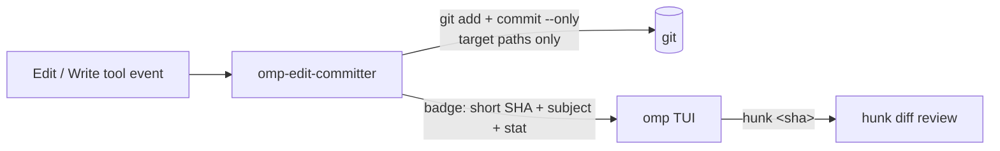

# omp-edit-committer

   

> Every agent edit, committed the moment it lands — with a message worth reading and the SHA right under the tool result.

Part of [`toxicwind/tau-extensions`](https://github.com/toxicwind/tau-extensions). An [oh-my-pi (`omp`)](https://github.com/can1357/oh-my-pi) extension that **commits every Edit and Write** the agent performs, with a descriptive Conventional-Commits message, and surfaces the resulting commit SHA directly under the tool result in the TUI. Designed to be used with [`modem-dev/hunk`](https://github.com/modem-dev/hunk) for rich diff review.



## Quick Start

```bash
git clone --depth 1 --filter=blob:none --sparse https://github.com/toxicwind/tau-extensions ~/.tau/agent/extensions/tau-extensions
cd ~/.tau/agent/extensions/tau-extensions/packages/omp-edit-committer && bun install && omp plugin link .
```

Requires `omp >= 17.0.0` and a working `git`.

## What you get

After every successful Edit or Write (subject to the [safety rules](#safety-rules)) the agent will have:

1. Created a single git commit with a message containing:
   - a `type(scope): subject` first line (Conventional-Commits-flavored),
   - an **Intent** section — what the change is meant to do,
   - a **Trade-offs** section — what was deliberately *not* done,
   - a **Diagram** section — a small ASCII scaffold for complex diffs (multi-file, multi-hunk, create/delete/rename),
   - a **Refs** footer with the file list and `+/-/hunks` counts,
   - a `hunk: yes` marker footer so reviewers can grep auto-commits at a glance (the live SHA lives in the TUI badge — see [Trade-offs](#trade-offs) for why it isn't in the body).
2. Rendered a small **commit badge** in the TUI, right below the Edit tool result — short SHA, subject, stat line, and a hint to view the commit with `hunk <sha>`:

```
Edit:  src/agent/kafka.rs
────────────────────────────────────────────
   @@ -12,7 +12,9 @@
   -    return old_helper(x);
   +    const y = new_helper(x);
   +    if (!y.ok) throw new Error('nope');
   +    return y.value;
────────────────────────────────────────────
● committed abc1234 via edit (~/repos/foo)
  edit(kafka): swap to failure-aware helper
  +3 / -1 · 1 hunk · 1 file
  view with: hunk abc1234 (primary: src/agent/kafka.rs)
```

LLMs can supply a richer intent by passing `intent: "..."` (or `commit_message: "..."`) on the `Edit` / `Write` input — the committer uses it as the Intent section, falling back to the first added line when absent.

## Commit message format

A single-file edit produces:

```text
edit(kafka): swap to failure-aware helper

Intent
- swap to failure-aware helper

Trade-offs
- kept the diff shape minimal; no refactor / no rename / no formatting churn

Refs: src/agent/kafka.rs, +3/-1, 1 hunks
hunk: yes
```

A multi-file refactor adds the **Diagram** block:

```text
refactor(auth): split token validation into a dedicated module

Intent
- split token validation into a dedicated module

Trade-offs
- spans multiple files; reviewer should confirm coupling between sites
- many hunks; consider splitting the commit before review

Diagram
Edit shape:
  before           after
  ───────          ─────
  src/auth/jwt.ts  ──►  edit (+12/-8)
  src/auth/claims.ts  ──►  edit (+4/-2)
  src/auth/mod.ts  ──►  edit (+1/-1)

Refs: src/auth/jwt.ts, src/auth/claims.ts, src/auth/mod.ts, +17/-11, 9 hunks
hunk: yes
```

## Trade-offs

Deliberate non-goals, in case any surprise you:

- **`hunk: <sha>` does not go in the commit body.** The body's `hunk:` line is a static marker, not the SHA — embedding the post-commit SHA would require an amend that orphans the SHA just written. The live SHA lives in the TUI badge where it's actually useful. Use the badge.
- **Auto-commits are constrained to the target paths.** The committer runs `git add -- <paths>` then `git commit --only -- <paths>`, so a user's pre-existing staged work is never swept into an auto-commit (regression-tested in `scripts/smoke.test.ts`).
- **The diff stat comes from `git diff --cached`, not the tool event.** The `write` tool's `tool_result` event carries no diff details, so an event-derived stat would always be `0/0/0` for writes. The committer asks git instead, which sees what's actually on disk.
- **Pre-commit hooks and GPG signing are skipped** (`--no-verify`, `--no-gpg-sign`) — user hooks are tuned for interactive commits, not a firehose of edits, and GPG prompts would block the session. Amends, force pushes, rebases, and pushes are all out of scope.

## Safety rules

The committer is conservative. It **no-ops silently** when any of these hold:

- `cwd` is not inside a git working tree
- `git config user.name` / `user.email` is unset (the commit would fail anyway)
- the Edit/Write tool returned `isError === true` (the change didn't apply)
- the index has no changes for the target paths (no empty commits; protects against writes that don't mutate the file)
- `OMP_EDIT_COMMITTER_DISABLED=1` is set

When it *does* act, it never amends, never force-pushes, never rebases, never pushes.

## Configuration

| Variable | Effect |
|---|---|
| `OMP_EDIT_COMMITTER_DISABLED=1` | Disable the extension entirely |
| `OMP_EDIT_COMMITTER_DEBUG=1` | Log tool-call/result/commit events to stderr |

## Development

```bash
bun install
bun run typecheck
bun test
```

## License and security

MIT — see [LICENSE](./LICENSE).

Security notes:

- Commits are local-only by default; pushing an auto-commit firehose to a shared branch is your explicit `git push`, never the extension's.
- GPG signing is skipped by design — if your repo policy requires signed commits, don't enable this extension there.
- The extension shells out to `git` with path-scoped args (`-- <paths>`); it never interpolates tool output into shell strings.
